# Awesome Research Figure Prompts 🧬🎨 [](https://awesome.re)

<p align="center">
  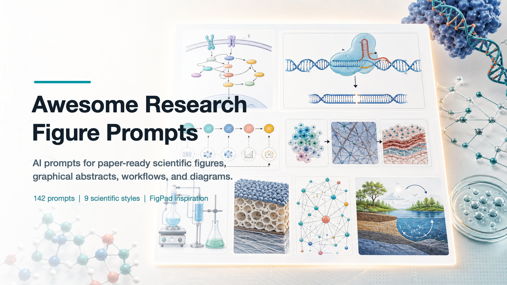
</p>

<div align="center">

[](LICENSE)
[](README.md)
[](README.md)
[](https://figpad.ai/inspiration)

</div>

<div align="center">

**言語:** [🇺🇸 EN (既定)](README.md) | [🇨🇳 ZH](README.zh.md) | [🇰🇷 KO](README.ko.md) | **🇯🇵 JA** | [🇪🇸 ES](README.es.md) | [🇩🇪 DE](README.de.md) | [🇫🇷 FR](README.fr.md) | [🇧🇷 PT](README.pt.md) | [🇷🇺 RU](README.ru.md) | [🇹🇭 TH](README.th.md)

</div>

<a id="contents"></a>

## 目次

- 🍌 [はじめに](#introduction)
- 🧬 [メカニズムと経路](#mechanisms-pathways)
- 🔄 [プロセスとワークフロー](#process-workflow)
- 📊 [グラフィカルアブストラクト](#graphical-abstracts)
- 🧪 [実験装置](#lab-apparatus)
- 🔬 [微細構造](#micro-structures)
- 🕸️ [システムとネットワーク](#systems-networks)
- 🎨 [ジャーナルカバー](#journal-covers)
- 🧱 [断面とレイヤー](#cross-sections-layers)
- 🌍 [環境と生態系](#environments-ecologies)
- 🖼️ [ギャラリープレビュー](#gallery-preview)
- 📁 [リポジトリ構成](#repository-layout)
- 🚀 [使い方](#how-to-use)
- 🔄 [同期](#sync)
- 📄 [ライセンス](#license)

<a id="introduction"></a>

## 🍌 はじめに

**Awesome Research Figure Prompts** リポジトリへようこそ！🤗

**研究図、科学ダイアグラム、グラフィカルアブストラクト、論文向けビジュアル、学術発表グラフィック**のための高品質な AI プロンプト集です。

ジャーナル論文、学会ポスター、博士・修士審査、研究費申請、研究発表の準備において、複雑な科学的アイデアを明確で正確、かつ魅力的な図へ変換するのに役立ちます。

**ここにあるもの:**

- 🎯 学術図生成のための研究向けプロンプト
- 🧬 複数分野にわたる科学ダイアグラムプロンプト
- 📊 論文図、グラフィカルアブストラクト、ワークフロー、メカニズム、概念図のプロンプト
- 🖼️ 選択されたプロンプトケースの実際の出力例
- ✍️ さまざまな研究シナリオで再利用できるプロンプトテンプレート
- 🌍 学生、研究者、デザイナー、AI 支援の科学コミュニケーション向け公開例

このリポジトリは、AI を使って科学的な説明図をより良く作りたい研究者に特に役立ちます。美しい画像だけでなく、科学的アイデアを明確に伝える図を目指します。

役に立ったら、ぜひスターを付けてください。⭐

[FigPad](https://figpad.ai/generate-figure) で試す。

このリポジトリの画像とプロンプト記録は、公開 [FigPad inspiration library](https://figpad.ai/inspiration) から 2026-05-27 に同期されました。

<a id="gallery-preview"></a>

## ギャラリープレビュー

<a id="mechanisms-pathways"></a>

### メカニズムと経路

<a id="mechanisms-pathways-6c564f8c"></a>

#### Case 001: detailed molecular diagram of the CRISPR-Cas9 gene editing mechanism: sgRNA design with 20nt spacer and scaffold, Cas...

<table>
  <tr>
    <th>Output</th>
  </tr>
  <tr>
    <td></td>
  </tr>
</table>

**Prompt:**

```text
Create a detailed molecular diagram of the CRISPR-Cas9 gene editing mechanism: sgRNA design with 20nt spacer and scaffold, Cas9 protein domains (REC, NUC with RuvC and HNH), PAM recognition (5'-NGG-3'), R-loop formation, double-strand break generation, and two repair pathways — NHEJ (with indel outcomes) and HDR (with donor template integration). Show DNA as double helix with base-pair resolution at the cut site.
```

<a id="mechanisms-pathways-a17254ce"></a>

#### Case 002: figure showing intrinsic and extrinsic apoptosis pathways in parallel: extrinsic pathway with Fas/FasL and TNF/TNFR1,...

<table>
  <tr>
    <th>Output</th>
  </tr>
  <tr>
    <td></td>
  </tr>
</table>

**Prompt:**

```text
Create a figure showing intrinsic and extrinsic apoptosis pathways in parallel: extrinsic pathway with Fas/FasL and TNF/TNFR1, FADD recruitment, caspase-8 activation; intrinsic pathway with cellular stress, BAX/BAK oligomerization, mitochondrial outer membrane permeabilization, cytochrome c release, apoptosome (APAF-1/caspase-9) formation. Show convergence at caspase-3/7 executioner caspases, ICAD cleavage, DNA fragmentation. Include Bcl-2, Bcl-xL, BID, and XIAP regulatory nodes.
```

<a id="mechanisms-pathways-7edac623"></a>

#### Case 003: figure of the JAK-STAT signaling pathway: cytokine receptor dimerization upon ligand binding, JAK1/JAK2/TYK2 trans-ph...

<table>
  <tr>
    <th>Output</th>
  </tr>
  <tr>
    <td></td>
  </tr>
</table>

**Prompt:**

```text
Create a figure of the JAK-STAT signaling pathway: cytokine receptor dimerization upon ligand binding, JAK1/JAK2/TYK2 trans-phosphorylation, STAT (STAT1/3/5) recruitment via SH2 domain, tyrosine phosphorylation, STAT dimerization, nuclear translocation, DNA binding to GAS elements. Include three levels of negative regulation: SOCS proteins, protein tyrosine phosphatases (SHP-1/2), and PIAS. Show as a single continuous vertical flow diagram.
```

<a id="mechanisms-pathways-cdc3d30f"></a>

#### Case 004: figure of the Notch signaling pathway: Notch receptor structure (EGF-like repeats, NRR, transmembrane domain, NICD),...

<table>
  <tr>
    <th>Output</th>
  </tr>
  <tr>
    <td></td>
  </tr>
</table>

**Prompt:**

```text
Create a figure of the Notch signaling pathway: Notch receptor structure (EGF-like repeats, NRR, transmembrane domain, NICD), Delta/Jagged ligand on adjacent cell, mechanical force-induced S2 cleavage by ADAM10, γ-secretase S3 cleavage releasing NICD, NICD nuclear translocation, displacement of co-repressor complex (SMRT/NCoR) from CSL/RBPJ, recruitment of MAML1 and co-activators, activation of HES and HEY gene families. Show cell-cell contact context.
```

<a id="mechanisms-pathways-ac551d8e"></a>

#### Case 005: figure of the TGF-β/SMAD signaling pathway: TGF-β ligand binding to Type II receptor (TβRII), Type I receptor (TβRI/A...

<table>
  <tr>
    <th>Output</th>
  </tr>
  <tr>
    <td></td>
  </tr>
</table>

**Prompt:**

```text
Create a figure of the TGF-β/SMAD signaling pathway: TGF-β ligand binding to Type II receptor (TβRII), Type I receptor (TβRI/ALK5) recruitment and transphosphorylation, R-SMAD (SMAD2/3) C-terminal phosphorylation, complex formation with Co-SMAD (SMAD4), nuclear translocation, interaction with co-activators (p300/CBP) and co-repressors (Ski/SnoN), transcription of target genes. Include I-SMAD (SMAD7) negative feedback and SMURF-mediated receptor degradation.
```

<a id="mechanisms-pathways-6fe42799"></a>

#### Case 006: PI3K-AKT-mTOR signaling axis in cancer cell survival

<table>
  <tr>
    <th>Output</th>
  </tr>
  <tr>
    <td>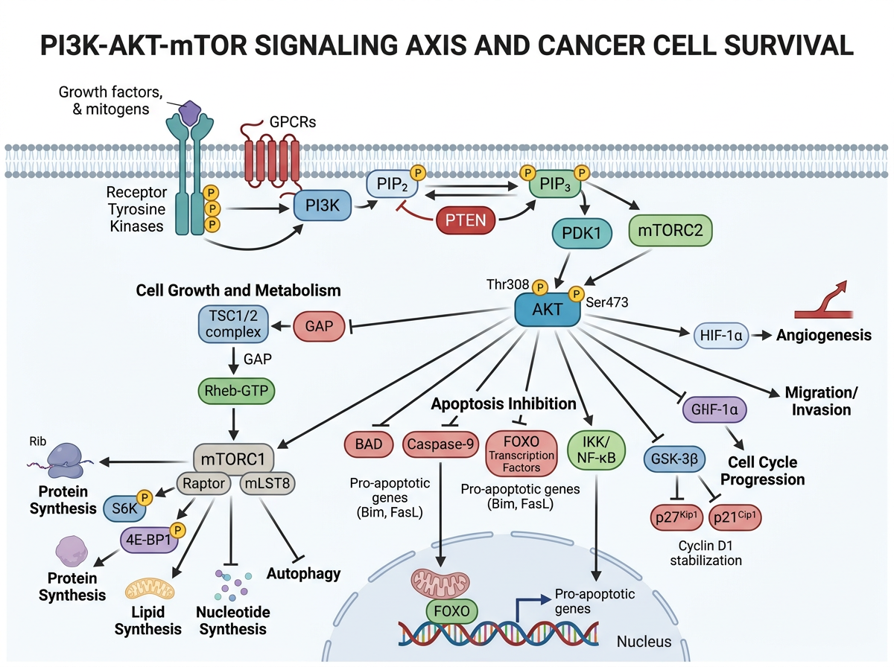</td>
  </tr>
</table>

**Prompt:**

```text
Create a scientific figure about: PI3K-AKT-mTOR signaling axis in cancer cell survival.
Visual style: Clean Vector.
Requirements:
- publication-ready scientific quality
- clear labels and directional arrows where appropriate
- avoid cartoon style, avoid meme style, avoid stock-photo look
- avoid neon glow and over-sharpened CGI look unless explicitly requested
- composition optimized for research papers and academic slides
- category context: mechanisms-pathways
- flat vector look with crisp boundaries and minimal gradients
- white or very light background for publication clarity
- high legibility labels with consistent typography
```

<a id="mechanisms-pathways-8926b636"></a>

#### Case 007: NF-kB inflammatory activation cascade in macrophages

<table>
  <tr>
    <th>Output</th>
  </tr>
  <tr>
    <td>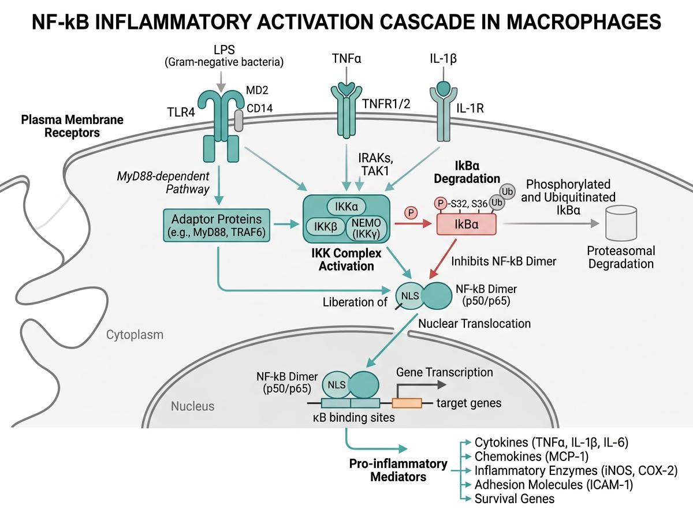</td>
  </tr>
</table>

**Prompt:**

```text
Create a scientific figure about: NF-kB inflammatory activation cascade in macrophages.
Visual style: Schematic Minimal.
Requirements:
- publication-ready scientific quality
- clear labels and directional arrows where appropriate
- avoid cartoon style, avoid meme style, avoid stock-photo look
- avoid neon glow and over-sharpened CGI look unless explicitly requested
- composition optimized for research papers and academic slides
- category context: mechanisms-pathways
- minimal schematic style with reduced visual noise
- strong information hierarchy using line weight and spacing
- few but meaningful colors for process emphasis
```

<a id="mechanisms-pathways-9795e057"></a>

#### Case 008: DNA damage sensing and checkpoint activation by ATM-ATR

<table>
  <tr>
    <th>Output</th>
  </tr>
  <tr>
    <td>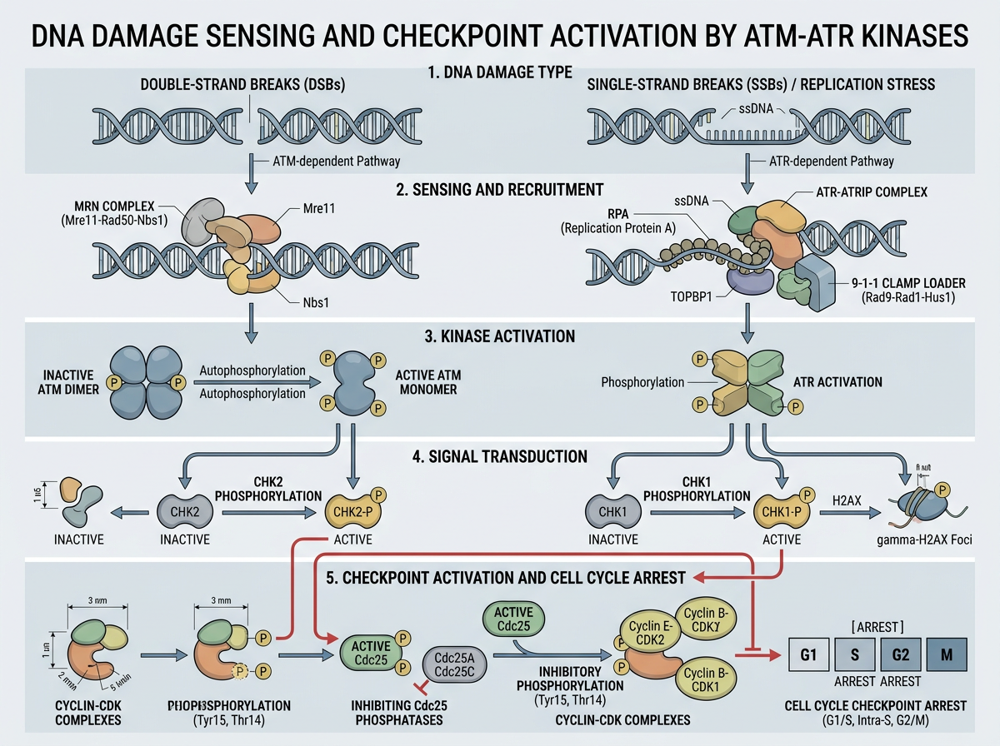</td>
  </tr>
</table>

**Prompt:**

```text
Create a scientific figure about: DNA damage sensing and checkpoint activation by ATM-ATR.
Visual style: Isometric Technical.
Requirements:
- publication-ready scientific quality
- clear labels and directional arrows where appropriate
- avoid cartoon style, avoid meme style, avoid stock-photo look
- avoid neon glow and over-sharpened CGI look unless explicitly requested
- composition optimized for research papers and academic slides
- category context: mechanisms-pathways
- isometric perspective with precise component geometry
- engineering-style callouts and measured spacing
- moderate blue-gray palette with restrained accent colors
```

<a id="mechanisms-pathways-8343cb2e"></a>

#### Case 009: Autophagy initiation and lysosomal degradation pathway

<table>
  <tr>
    <th>Output</th>
  </tr>
  <tr>
    <td>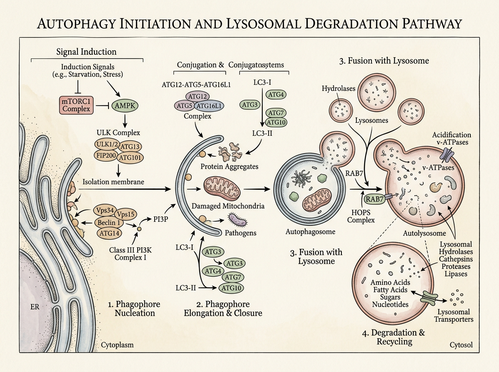</td>
  </tr>
</table>

**Prompt:**

```text
Create a scientific figure about: Autophagy initiation and lysosomal degradation pathway.
Visual style: Watercolor Texture & Ink Line Atlas.
Requirements:
- publication-ready scientific quality
- clear labels and directional arrows where appropriate
- avoid cartoon style, avoid meme style, avoid stock-photo look
- avoid neon glow and over-sharpened CGI look unless explicitly requested
- composition optimized for research papers and academic slides
- category context: mechanisms-pathways
- watercolor texture with precise ink line art, hand-drawn but technically accurate
- muted tones and matte color palette, avoid harsh saturated 3D rendering
- natural science atlas / textbook style with rigorous scientific annotation
- subtle cream paper texture background to achieve premium archival look
```

<a id="mechanisms-pathways-3c2b8ced"></a>

#### Case 010: Mitochondrial apoptosis with BAX-BAK pore formation

<table>
  <tr>
    <th>Output</th>
  </tr>
  <tr>
    <td>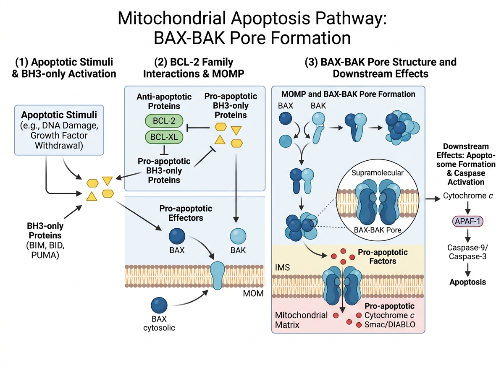</td>
  </tr>
</table>

**Prompt:**

```text
Create a scientific figure about: Mitochondrial apoptosis with BAX-BAK pore formation.
Visual style: Clean Vector.
Requirements:
- publication-ready scientific quality
- clear labels and directional arrows where appropriate
- avoid cartoon style, avoid meme style, avoid stock-photo look
- avoid neon glow and over-sharpened CGI look unless explicitly requested
- composition optimized for research papers and academic slides
- category context: mechanisms-pathways
- flat vector look with crisp boundaries and minimal gradients
- white or very light background for publication clarity
- high legibility labels with consistent typography
```

<a id="mechanisms-pathways-384c0697"></a>

#### Case 011: T cell receptor signaling and downstream transcription factors

<table>
  <tr>
    <th>Output</th>
  </tr>
  <tr>
    <td>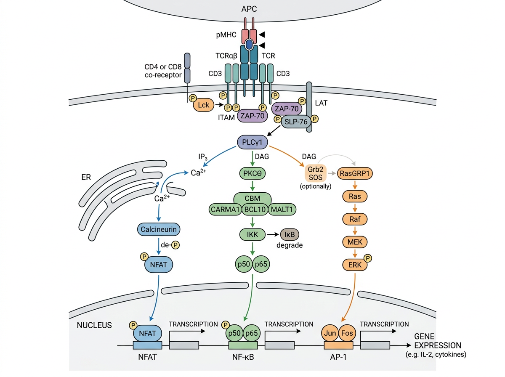</td>
  </tr>
</table>

**Prompt:**

```text
Create a scientific figure about: T cell receptor signaling and downstream transcription factors.
Visual style: Schematic Minimal.
Requirements:
- publication-ready scientific quality
- clear labels and directional arrows where appropriate
- avoid cartoon style, avoid meme style, avoid stock-photo look
- avoid neon glow and over-sharpened CGI look unless explicitly requested
- composition optimized for research papers and academic slides
- category context: mechanisms-pathways
- minimal schematic style with reduced visual noise
- strong information hierarchy using line weight and spacing
- few but meaningful colors for process emphasis
```

<a id="mechanisms-pathways-c0a00aaf"></a>

#### Case 012: PI3K-AKT-mTOR signaling axis in cancer cell survival

<table>
  <tr>
    <th>Output</th>
  </tr>
  <tr>
    <td>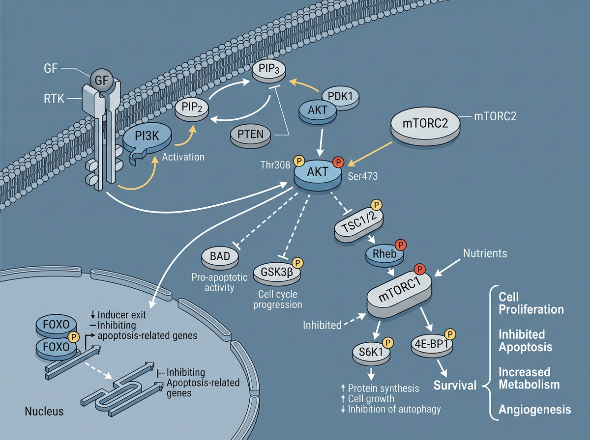</td>
  </tr>
</table>

**Prompt:**

```text
Create a scientific figure about: PI3K-AKT-mTOR signaling axis in cancer cell survival.
Visual style: Isometric Technical.
Requirements:
- publication-ready scientific quality
- clear labels and directional arrows where appropriate
- avoid cartoon style, avoid meme style, avoid stock-photo look
- avoid neon glow and over-sharpened CGI look unless explicitly requested
- composition optimized for research papers and academic slides
- category context: mechanisms-pathways
- isometric perspective with precise component geometry
- engineering-style callouts and measured spacing
- moderate blue-gray palette with restrained accent colors
```

<a id="mechanisms-pathways-933e2c19"></a>

#### Case 013: NF-kB inflammatory activation cascade in macrophages

<table>
  <tr>
    <th>Output</th>
  </tr>
  <tr>
    <td>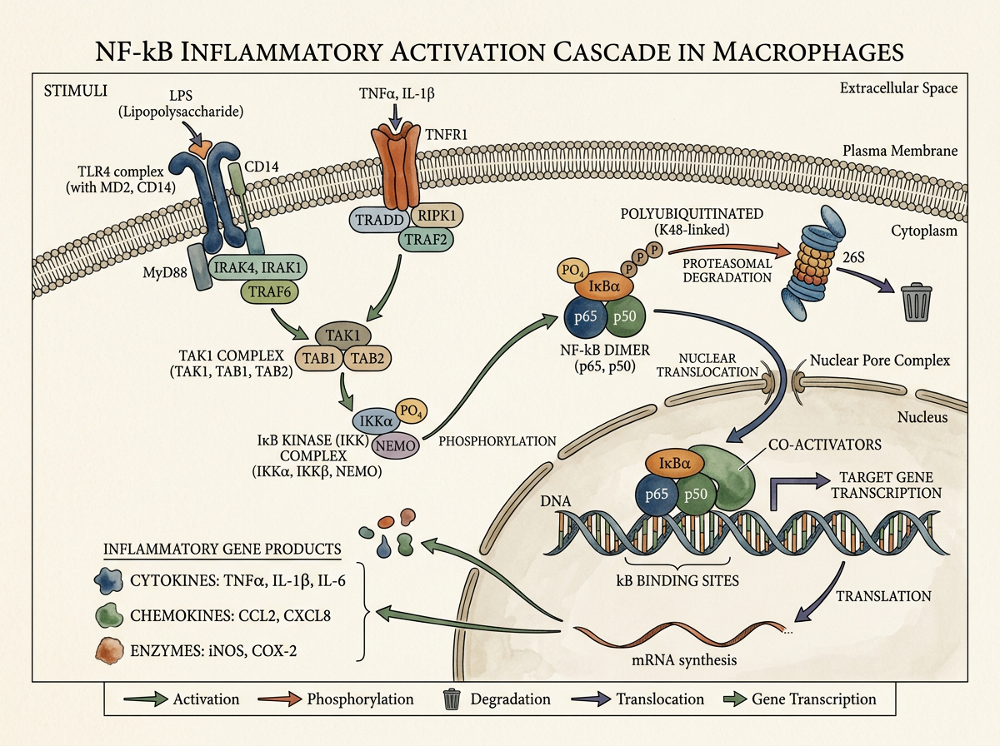</td>
  </tr>
</table>

**Prompt:**

```text
Create a scientific figure about: NF-kB inflammatory activation cascade in macrophages.
Visual style: Watercolor Texture & Ink Line Atlas.
Requirements:
- publication-ready scientific quality
- clear labels and directional arrows where appropriate
- avoid cartoon style, avoid meme style, avoid stock-photo look
- avoid neon glow and over-sharpened CGI look unless explicitly requested
- composition optimized for research papers and academic slides
- category context: mechanisms-pathways
- watercolor texture with precise ink line art, hand-drawn but technically accurate
- muted tones and matte color palette, avoid harsh saturated 3D rendering
- natural science atlas / textbook style with rigorous scientific annotation
- subtle cream paper texture background to achieve premium archival look
```

<a id="mechanisms-pathways-44a3b47e"></a>

#### Case 014: DNA damage sensing and checkpoint activation by ATM-ATR

<table>
  <tr>
    <th>Output</th>
  </tr>
  <tr>
    <td>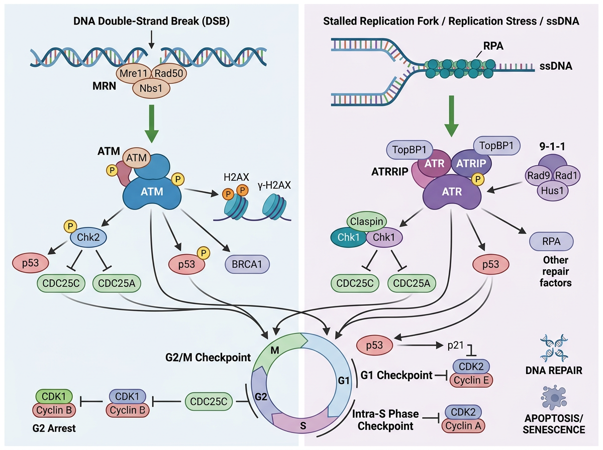</td>
  </tr>
</table>

**Prompt:**

```text
Create a scientific figure about: DNA damage sensing and checkpoint activation by ATM-ATR.
Visual style: Clean Vector.
Requirements:
- publication-ready scientific quality
- clear labels and directional arrows where appropriate
- avoid cartoon style, avoid meme style, avoid stock-photo look
- avoid neon glow and over-sharpened CGI look unless explicitly requested
- composition optimized for research papers and academic slides
- category context: mechanisms-pathways
- flat vector look with crisp boundaries and minimal gradients
- white or very light background for publication clarity
- high legibility labels with consistent typography
```

<a id="mechanisms-pathways-ab656867"></a>

#### Case 015: Autophagy initiation and lysosomal degradation pathway

<table>
  <tr>
    <th>Output</th>
  </tr>
  <tr>
    <td>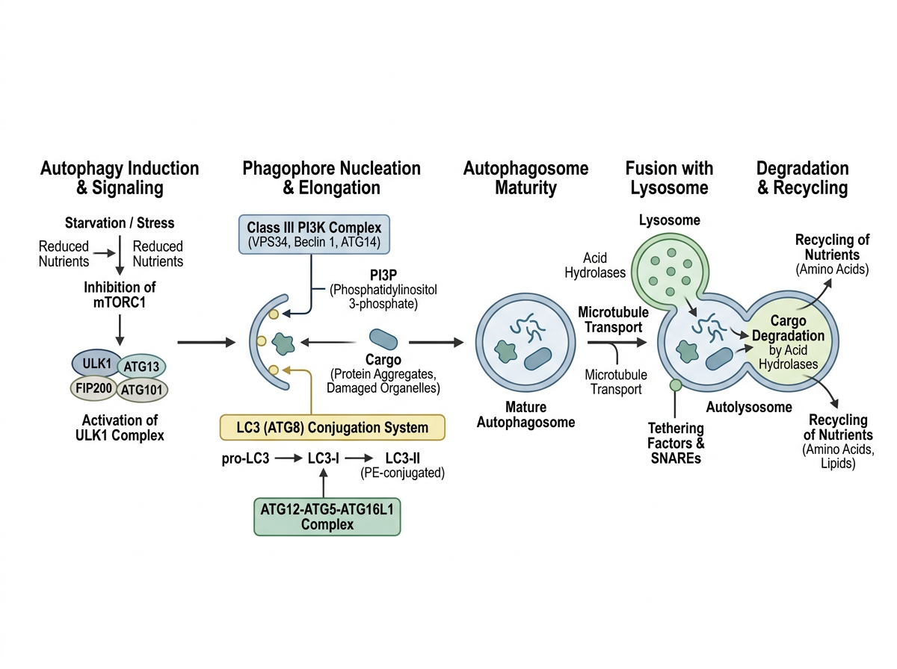</td>
  </tr>
</table>

**Prompt:**

```text
Create a scientific figure about: Autophagy initiation and lysosomal degradation pathway.
Visual style: Schematic Minimal.
Requirements:
- publication-ready scientific quality
- clear labels and directional arrows where appropriate
- avoid cartoon style, avoid meme style, avoid stock-photo look
- avoid neon glow and over-sharpened CGI look unless explicitly requested
- composition optimized for research papers and academic slides
- category context: mechanisms-pathways
- minimal schematic style with reduced visual noise
- strong information hierarchy using line weight and spacing
- few but meaningful colors for process emphasis
```

<a id="process-workflow"></a>

### プロセスとワークフロー

<a id="process-workflow-820936e6"></a>

#### Case 016: workflow diagram of Illumina Next-Generation Sequencing: (1) genomic DNA extraction and fragmentation by sonication,...

<table>
  <tr>
    <th>Output</th>
  </tr>
  <tr>
    <td></td>
  </tr>
</table>

**Prompt:**

```text
Create a workflow diagram of Illumina Next-Generation Sequencing: (1) genomic DNA extraction and fragmentation by sonication, (2) end repair, A-tailing, and adapter ligation, (3) size selection and PCR amplification, (4) cluster generation on flow cell by bridge amplification, (5) sequencing-by-synthesis with fluorescent reversible terminators, (6) base calling and FASTQ generation, (7) bioinformatics pipeline (alignment, variant calling, annotation). Show each step with equipment schematics.
```

<a id="process-workflow-275fc56f"></a>

#### Case 017: detailed workflow of 10x Genomics Chromium single-cell RNA-seq: (1) tissue dissociation to single-cell suspension, (2...

<table>
  <tr>
    <th>Output</th>
  </tr>
  <tr>
    <td></td>
  </tr>
</table>

**Prompt:**

```text
Create a detailed workflow of 10x Genomics Chromium single-cell RNA-seq: (1) tissue dissociation to single-cell suspension, (2) GEM generation with barcoded gel beads in oil emulsion, (3) cell lysis within droplet, (4) reverse transcription with cell barcode and UMI incorporation, (5) cDNA amplification, (6) library construction with sample index, (7) Illumina sequencing, (8) Cell Ranger pipeline: alignment, barcode demultiplexing, UMI counting, (9) Seurat/Scanpy analysis: QC filtering, normalization, clustering, UMAP visualization. Number each step.
```

<a id="process-workflow-22cfbf44"></a>

#### Case 018: pharmaceutical drug development pipeline diagram: Target Discovery (genomics, proteomics) → Hit Identification (HTS,...

<table>
  <tr>
    <th>Output</th>
  </tr>
  <tr>
    <td></td>
  </tr>
</table>

**Prompt:**

```text
Create a pharmaceutical drug development pipeline diagram: Target Discovery (genomics, proteomics) → Hit Identification (HTS, virtual screening) → Hit-to-Lead (SAR optimization) → Lead Optimization (ADMET, selectivity) → Preclinical (in vitro toxicology, rodent/primate PK, GLP studies) → IND Filing → Phase I (safety, healthy volunteers, n=20-80) → Phase II (efficacy, dose-finding, n=100-300) → Phase III (confirmatory, randomized controlled, n=1000-3000) → NDA/BLA → Approval → Phase IV (post-market surveillance). Show timeline and attrition rates.
```

<a id="process-workflow-7aee9b52"></a>

#### Case 019: workflow for CRISPR genome-wide knockout screen: (1) GeCKO/Brunello sgRNA library design (4-6 sgRNAs per gene), (2) l...

<table>
  <tr>
    <th>Output</th>
  </tr>
  <tr>
    <td></td>
  </tr>
</table>

**Prompt:**

```text
Create a workflow for CRISPR genome-wide knockout screen: (1) GeCKO/Brunello sgRNA library design (4-6 sgRNAs per gene), (2) lentiviral packaging in HEK293T, (3) target cell transduction at MOI~0.3, (4) puromycin selection for integration, (5) apply selective pressure (drug treatment vs vehicle control), (6) harvest surviving cells, (7) genomic DNA extraction, (8) PCR amplification of sgRNA cassette, (9) NGS sequencing, (10) MAGeCK/BAGEL2 analysis for gene-level enrichment/depletion scoring. Include representation at each step.
```

<a id="process-workflow-7ee78ea0"></a>

#### Case 020: laboratory workflow for recombinant protein expression and purification: (1) gene synthesis and codon optimization, (...

<table>
  <tr>
    <th>Output</th>
  </tr>
  <tr>
    <td></td>
  </tr>
</table>

**Prompt:**

```text
Create a laboratory workflow for recombinant protein expression and purification: (1) gene synthesis and codon optimization, (2) cloning into pET expression vector with His6-TEV tag, (3) transformation into BL21(DE3), (4) IPTG induction (0.5mM, 18°C, 16h), (5) cell lysis by sonication, (6) Ni-NTA affinity chromatography (wash 20mM imidazole, elute 250mM), (7) TEV protease tag cleavage, (8) reverse Ni-NTA to remove tag, (9) ion exchange chromatography (MonoQ), (10) size exclusion chromatography (Superdex 200). Show SDS-PAGE gel at key QC points.
```

<a id="process-workflow-4fb6e353"></a>

#### Case 021: bioinformatics workflow for bulk RNA-seq differential expression analysis: (1) raw FASTQ quality assessment (FastQC),...

<table>
  <tr>
    <th>Output</th>
  </tr>
  <tr>
    <td></td>
  </tr>
</table>

**Prompt:**

```text
Create a bioinformatics workflow for bulk RNA-seq differential expression analysis: (1) raw FASTQ quality assessment (FastQC), (2) adapter trimming (Trimmomatic/fastp), (3) alignment to reference genome (STAR/HISAT2), (4) BAM file sorting and indexing (SAMtools), (5) feature counting (featureCounts/HTSeq), (6) count matrix normalization (DESeq2 median of ratios), (7) differential expression testing (Wald test, BH-adjusted p-value < 0.05, |log2FC| > 1), (8) visualization (volcano plot, MA plot, heatmap), (9) functional enrichment (GO, KEGG pathway analysis). Show data format at each step.
```

<a id="process-workflow-b11451ba"></a>

#### Case 022: multicolor flow cytometry experimental workflow: (1) sample preparation (blood/tissue), (2) Fc receptor blocking, (3)...

<table>
  <tr>
    <th>Output</th>
  </tr>
  <tr>
    <td></td>
  </tr>
</table>

**Prompt:**

```text
Create a multicolor flow cytometry experimental workflow: (1) sample preparation (blood/tissue), (2) Fc receptor blocking, (3) surface antibody staining panel design (compensation matrix), (4) fixation/permeabilization for intracellular targets, (5) intracellular antibody staining, (6) instrument setup: laser configuration (405nm, 488nm, 561nm, 640nm) and detector arrangement, (7) compensation bead controls, (8) acquisition with optimized voltages, (9) gating strategy: FSC/SSC → singlets → live/dead → lineage markers → functional markers, (10) FlowJo analysis with t-SNE dimensionality reduction.
```

<a id="process-workflow-a2e5a3e7"></a>

#### Case 023: step-by-step Western Blot protocol figure: (1) protein extraction with RIPA buffer + protease/phosphatase inhibitors,...

<table>
  <tr>
    <th>Output</th>
  </tr>
  <tr>
    <td></td>
  </tr>
</table>

**Prompt:**

```text
Create a step-by-step Western Blot protocol figure: (1) protein extraction with RIPA buffer + protease/phosphatase inhibitors, (2) BCA protein quantification with standard curve, (3) SDS-PAGE sample preparation (reducing, boiling 95°C 5min), (4) gel electrophoresis (stacking 4%, resolving 10% polyacrylamide), (5) semi-dry transfer to PVDF membrane (25V, 30min), (6) Ponceau S total protein staining verification, (7) blocking (5% BSA/TBST, 1h RT), (8) primary antibody incubation (4°C overnight), (9) HRP-conjugated secondary antibody (1h RT), (10) ECL detection and digital imaging. Show expected band patterns.
```

<a id="process-workflow-74d256b3"></a>

#### Case 024: workflow for cryo-electron microscopy single-particle analysis: (1) protein sample vitrification on holey carbon grid...

<table>
  <tr>
    <th>Output</th>
  </tr>
  <tr>
    <td></td>
  </tr>
</table>

**Prompt:**

```text
Create a workflow for cryo-electron microscopy single-particle analysis: (1) protein sample vitrification on holey carbon grid (Vitrobot), (2) cryo-EM data collection on 300kV microscope (Titan Krios) with K3 detector, (3) movie frame alignment and CTF estimation (MotionCor2, CTFFIND4), (4) automated particle picking (crYOLO/TOPAZ), (5) 2D classification and class selection, (6) ab initio 3D reconstruction, (7) 3D refinement with gold-standard FSC, (8) CTF refinement and Bayesian polishing, (9) local resolution estimation, (10) atomic model building (Coot) and real-space refinement (Phenix). Show resolution milestones.
```

<a id="process-workflow-c5bf7c4a"></a>

#### Case 025: workflow for untargeted LC-MS/MS metabolomics: (1) biological sample collection (plasma/tissue) with snap freezing, (...

<table>
  <tr>
    <th>Output</th>
  </tr>
  <tr>
    <td></td>
  </tr>
</table>

**Prompt:**

```text
Create a workflow for untargeted LC-MS/MS metabolomics: (1) biological sample collection (plasma/tissue) with snap freezing, (2) metabolite extraction (80% methanol, -80°C), (3) sample reconstitution and QC pool preparation, (4) UHPLC separation (C18 reverse phase and HILIC), (5) ESI-QTOF mass spectrometry (positive and negative ionization), (6) raw data conversion (MSConvert), (7) peak detection and alignment (XCMS/MZmine), (8) feature filtering and normalization, (9) multivariate statistics (PCA, OPLS-DA, VIP scores), (10) metabolite identification (MS/MS spectral matching against HMDB/METLIN, molecular networking). Show data dimensionality reduction.
```

<a id="process-workflow-772e412d"></a>

#### Case 026: Single-cell RNA-seq experiment from sample prep to clustering

<table>
  <tr>
    <th>Output</th>
  </tr>
  <tr>
    <td>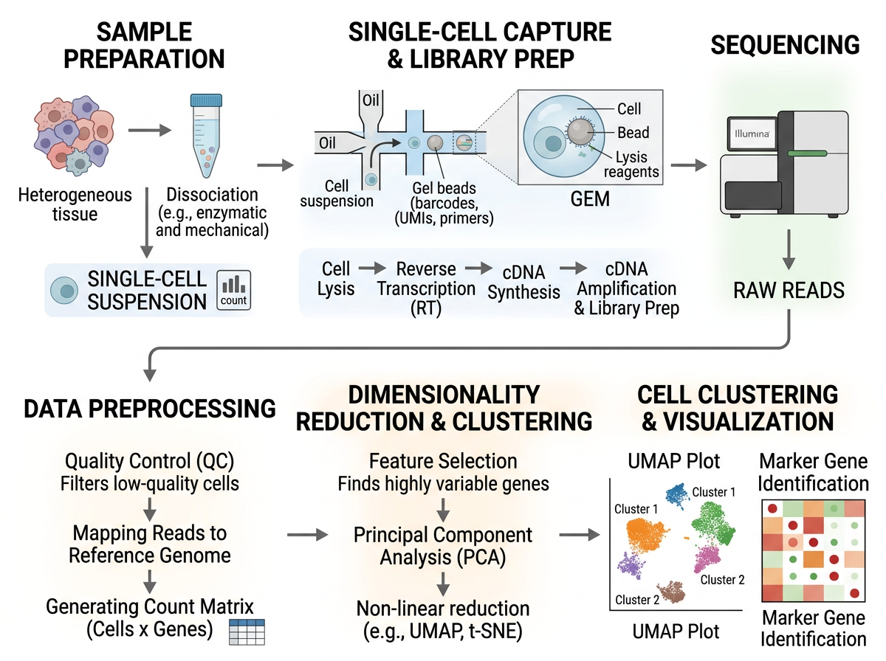</td>
  </tr>
</table>

**Prompt:**

```text
Create a scientific figure about: Single-cell RNA-seq experiment from sample prep to clustering.
Visual style: Schematic Minimal.
Requirements:
- publication-ready scientific quality
- clear labels and directional arrows where appropriate
- avoid cartoon style, avoid meme style, avoid stock-photo look
- avoid neon glow and over-sharpened CGI look unless explicitly requested
- composition optimized for research papers and academic slides
- category context: process-workflow
- minimal schematic style with reduced visual noise
- strong information hierarchy using line weight and spacing
- few but meaningful colors for process emphasis
```

<a id="process-workflow-8c66f348"></a>

#### Case 027: CRISPR pooled screening pipeline with sequencing readout

<table>
  <tr>
    <th>Output</th>
  </tr>
  <tr>
    <td>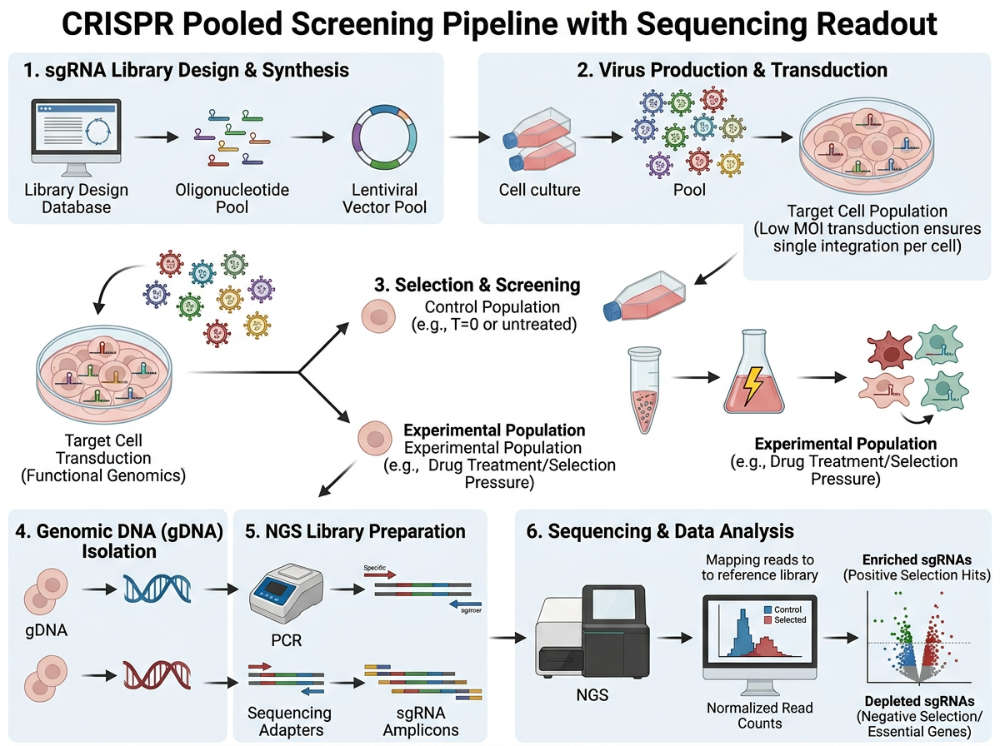</td>
  </tr>
</table>

**Prompt:**

```text
Create a scientific figure about: CRISPR pooled screening pipeline with sequencing readout.
Visual style: Clean Vector.
Requirements:
- publication-ready scientific quality
- clear labels and directional arrows where appropriate
- avoid cartoon style, avoid meme style, avoid stock-photo look
- avoid neon glow and over-sharpened CGI look unless explicitly requested
- composition optimized for research papers and academic slides
- category context: process-workflow
- flat vector look with crisp boundaries and minimal gradients
- white or very light background for publication clarity
- high legibility labels with consistent typography
```

<a id="process-workflow-85f4190d"></a>

#### Case 028: Protein purification and quality-control workflow for structural biology

<table>
  <tr>
    <th>Output</th>
  </tr>
  <tr>
    <td>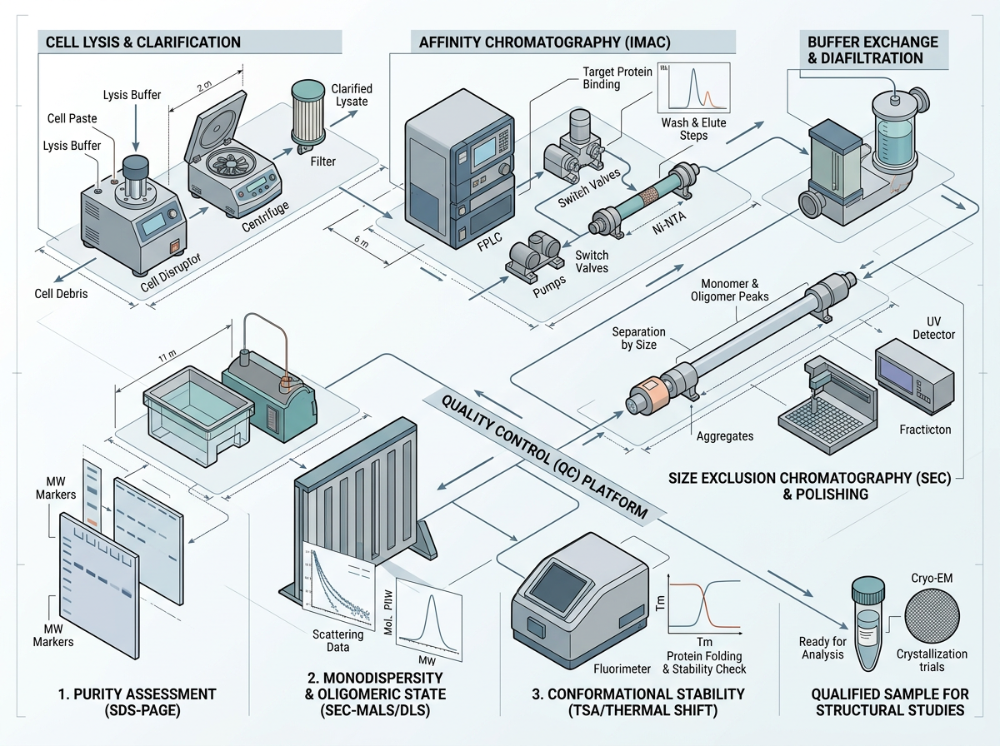</td>
  </tr>
</table>

**Prompt:**

```text
Create a scientific figure about: Protein purification and quality-control workflow for structural biology.
Visual style: Isometric Technical.
Requirements:
- publication-ready scientific quality
- clear labels and directional arrows where appropriate
- avoid cartoon style, avoid meme style, avoid stock-photo look
- avoid neon glow and over-sharpened CGI look unless explicitly requested
- composition optimized for research papers and academic slides
- category context: process-workflow
- isometric perspective with precise component geometry
- engineering-style callouts and measured spacing
- moderate blue-gray palette with restrained accent colors
```

<a id="process-workflow-8c707d30"></a>

#### Case 029: Metabolomics analysis workflow from LC-MS to pathway enrichment

<table>
  <tr>
    <th>Output</th>
  </tr>
  <tr>
    <td>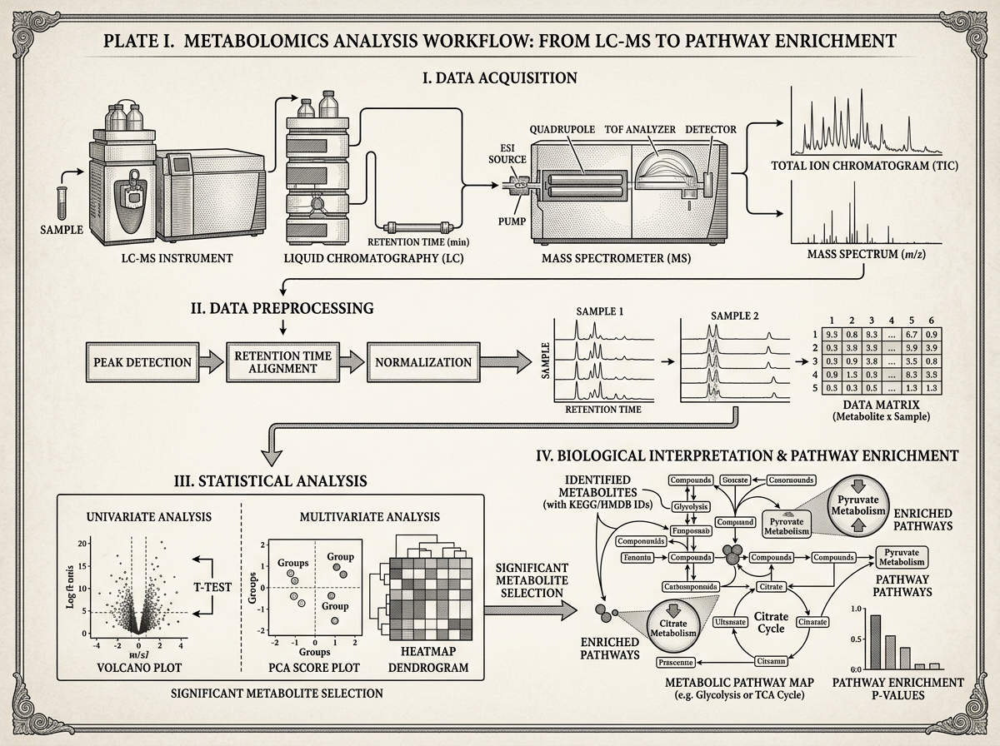</td>
  </tr>
</table>

**Prompt:**

```text
Create a scientific figure about: Metabolomics analysis workflow from LC-MS to pathway enrichment.
Visual style: Scientific Engraving Monochrome.
Requirements:
- publication-ready scientific quality
- clear labels and directional arrows where appropriate
- avoid cartoon style, avoid meme style, avoid stock-photo look
- avoid neon glow and over-sharpened CGI look unless explicitly requested
- composition optimized for research papers and academic slides
- category context: process-workflow
- vintage scientific engraving style with fine hatching and contour lines
- monochrome or near-monochrome gray palette with high structural clarity
- plate-like composition similar to historical scientific references
```

<a id="process-workflow-433d490b"></a>

#### Case 030: Clinical trial data pipeline from enrollment to endpoint analysis

<table>
  <tr>
    <th>Output</th>
  </tr>
  <tr>
    <td>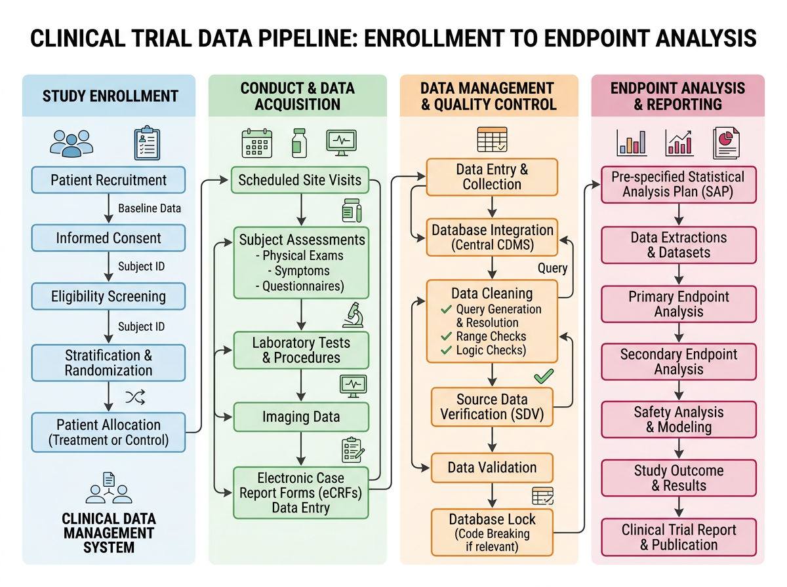</td>
  </tr>
</table>

**Prompt:**

```text
Create a scientific figure about: Clinical trial data pipeline from enrollment to endpoint analysis.
Visual style: Schematic Minimal.
Requirements:
- publication-ready scientific quality
- clear labels and directional arrows where appropriate
- avoid cartoon style, avoid meme style, avoid stock-photo look
- avoid neon glow and over-sharpened CGI look unless explicitly requested
- composition optimized for research papers and academic slides
- category context: process-workflow
- minimal schematic style with reduced visual noise
- strong information hierarchy using line weight and spacing
- few but meaningful colors for process emphasis
```

<a id="process-workflow-252884ae"></a>

#### Case 031: Laboratory automation workflow for high-throughput screening

<table>
  <tr>
    <th>Output</th>
  </tr>
  <tr>
    <td>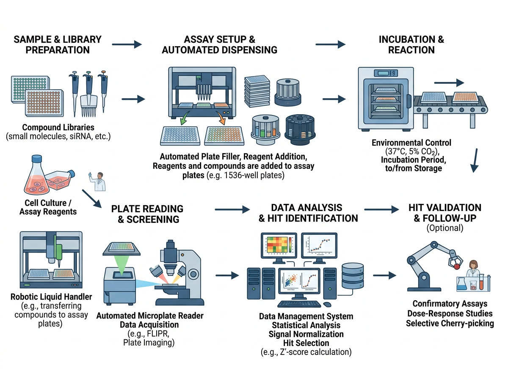</td>
  </tr>
</table>

**Prompt:**

```text
Create a scientific figure about: Laboratory automation workflow for high-throughput screening.
Visual style: Clean Vector.
Requirements:
- publication-ready scientific quality
- clear labels and directional arrows where appropriate
- avoid cartoon style, avoid meme style, avoid stock-photo look
- avoid neon glow and over-sharpened CGI look unless explicitly requested
- composition optimized for research papers and academic slides
- category context: process-workflow
- flat vector look with crisp boundaries and minimal gradients
- white or very light background for publication clarity
- high legibility labels with consistent typography
```

<a id="process-workflow-576e77a5"></a>

#### Case 032: Single-cell RNA-seq experiment from sample prep to clustering

<table>
  <tr>
    <th>Output</th>
  </tr>
  <tr>
    <td>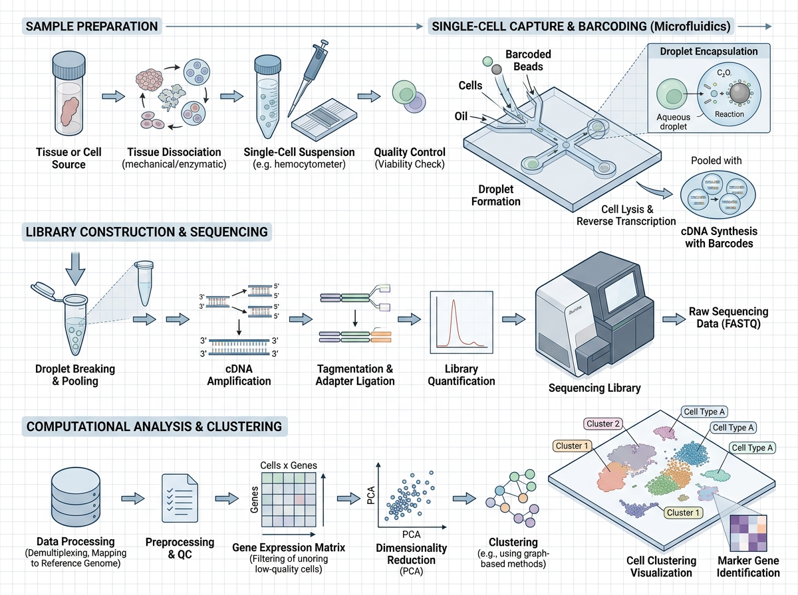</td>
  </tr>
</table>

**Prompt:**

```text
Create a scientific figure about: Single-cell RNA-seq experiment from sample prep to clustering.
Visual style: Isometric Technical.
Requirements:
- publication-ready scientific quality
- clear labels and directional arrows where appropriate
- avoid cartoon style, avoid meme style, avoid stock-photo look
- avoid neon glow and over-sharpened CGI look unless explicitly requested
- composition optimized for research papers and academic slides
- category context: process-workflow
- isometric perspective with precise component geometry
- engineering-style callouts and measured spacing
- moderate blue-gray palette with restrained accent colors
```

<a id="process-workflow-efe73979"></a>

#### Case 033: CRISPR pooled screening pipeline with sequencing readout

<table>
  <tr>
    <th>Output</th>
  </tr>
  <tr>
    <td>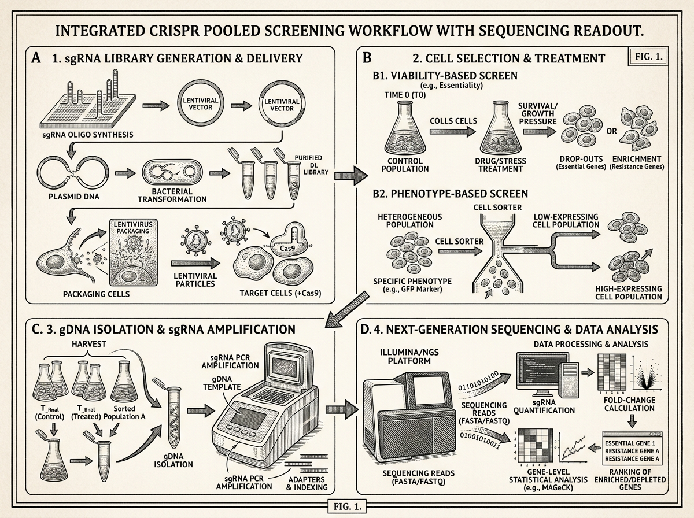</td>
  </tr>
</table>

**Prompt:**

```text
Create a scientific figure about: CRISPR pooled screening pipeline with sequencing readout.
Visual style: Scientific Engraving Monochrome.
Requirements:
- publication-ready scientific quality
- clear labels and directional arrows where appropriate
- avoid cartoon style, avoid meme style, avoid stock-photo look
- avoid neon glow and over-sharpened CGI look unless explicitly requested
- composition optimized for research papers and academic slides
- category context: process-workflow
- vintage scientific engraving style with fine hatching and contour lines
- monochrome or near-monochrome gray palette with high structural clarity
- plate-like composition similar to historical scientific references
```

<a id="process-workflow-61bfd166"></a>

#### Case 034: Protein purification and quality-control workflow for structural biology

<table>
  <tr>
    <th>Output</th>
  </tr>
  <tr>
    <td>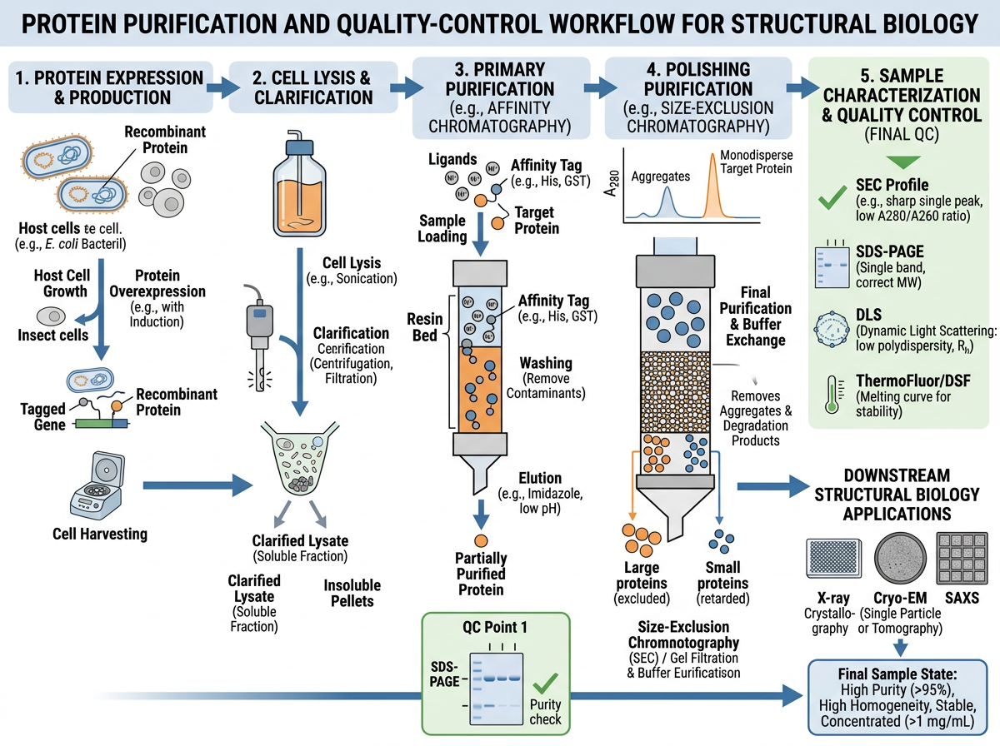</td>
  </tr>
</table>

**Prompt:**

```text
Create a scientific figure about: Protein purification and quality-control workflow for structural biology.
Visual style: Schematic Minimal.
Requirements:
- publication-ready scientific quality
- clear labels and directional arrows where appropriate
- avoid cartoon style, avoid meme style, avoid stock-photo look
- avoid neon glow and over-sharpened CGI look unless explicitly requested
- composition optimized for research papers and academic slides
- category context: process-workflow
- minimal schematic style with reduced visual noise
- strong information hierarchy using line weight and spacing
- few but meaningful colors for process emphasis
```

<a id="process-workflow-db755739"></a>

#### Case 035: Metabolomics analysis workflow from LC-MS to pathway enrichment

<table>
  <tr>
    <th>Output</th>
  </tr>
  <tr>
    <td>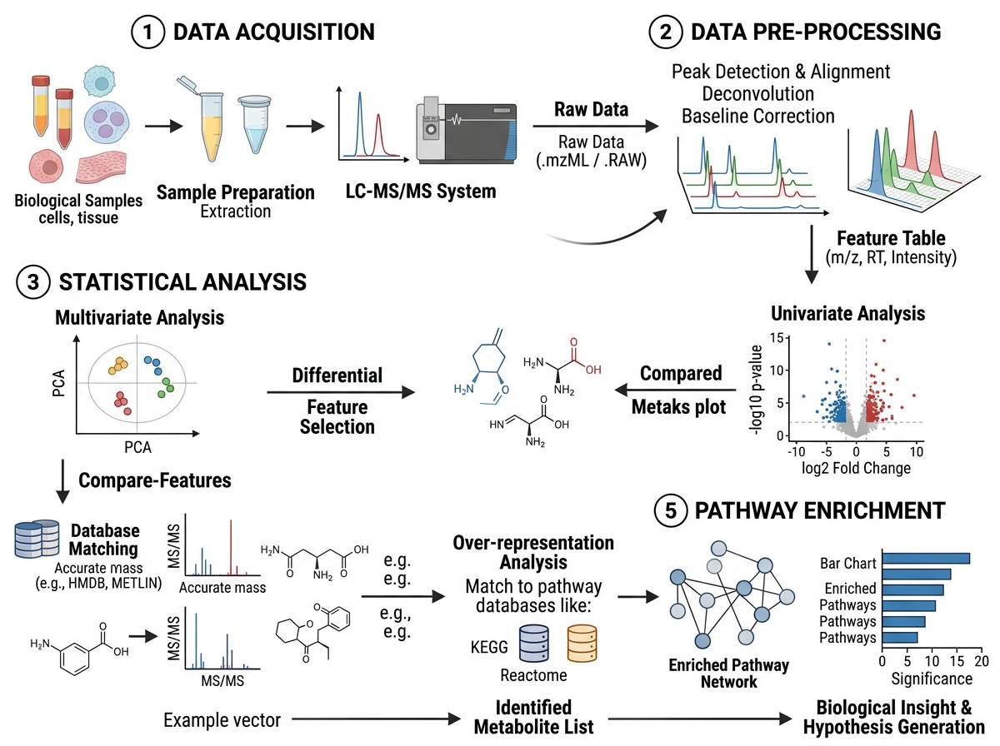</td>
  </tr>
</table>

**Prompt:**

```text
Create a scientific figure about: Metabolomics analysis workflow from LC-MS to pathway enrichment.
Visual style: Clean Vector.
Requirements:
- publication-ready scientific quality
- clear labels and directional arrows where appropriate
- avoid cartoon style, avoid meme style, avoid stock-photo look
- avoid neon glow and over-sharpened CGI look unless explicitly requested
- composition optimized for research papers and academic slides
- category context: process-workflow
- flat vector look with crisp boundaries and minimal gradients
- white or very light background for publication clarity
- high legibility labels with consistent typography
```

<a id="graphical-abstracts"></a>

### グラフィカルアブストラクト

<a id="graphical-abstracts-23a8b84e"></a>

#### Case 036: a CAR-T cell therapy paper: (1) patient leukapheresis and T cell isolation, (2) CAR construct design with anti-CD19 s...

<table>
  <tr>
    <th>Output</th>
  </tr>
  <tr>
    <td></td>
  </tr>
</table>

**Prompt:**

```text
Create a graphical abstract for a CAR-T cell therapy paper: (1) patient leukapheresis and T cell isolation, (2) CAR construct design with anti-CD19 scFv, CD28/4-1BB costimulatory domain, and CD3ζ signaling domain connected by lentiviral transduction, (3) ex vivo T cell expansion in bioreactor, (4) lymphodepletion conditioning, (5) CAR-T cell infusion and in vivo expansion, (6) CD19+ B-cell lymphoma targeted killing with cytokine release. Show tumor regression endpoint with survival curve. Journal-quality single-panel summary figure.
```

<a id="graphical-abstracts-6ccedaf1"></a>

#### Case 037: a lipid nanoparticle mRNA delivery paper: ionizable lipid/DSPC/cholesterol/PEG-lipid self-assembly around mRNA cargo...

<table>
  <tr>
    <th>Output</th>
  </tr>
  <tr>
    <td></td>
  </tr>
</table>

**Prompt:**

```text
Create a graphical abstract for a lipid nanoparticle mRNA delivery paper: ionizable lipid/DSPC/cholesterol/PEG-lipid self-assembly around mRNA cargo using microfluidic mixing, LNP characterization (DLS size ~80nm, PDI, encapsulation efficiency), intramuscular injection, cellular uptake via macropinocytosis, endosomal escape mediated by ionizable lipid protonation at low pH, mRNA release into cytoplasm, ribosomal translation of encoded antigen, MHC-I/II presentation, B cell antibody response and CD8+ T cell activation. Circular layout.
```

<a id="graphical-abstracts-7fb4db4c"></a>

#### Case 038: an organoid-based drug screening paper: patient tumor biopsy, Lgr5+ stem cell isolation, 3D culture in Matrigel with...

<table>
  <tr>
    <th>Output</th>
  </tr>
  <tr>
    <td></td>
  </tr>
</table>

**Prompt:**

```text
Create a graphical abstract for an organoid-based drug screening paper: patient tumor biopsy, Lgr5+ stem cell isolation, 3D culture in Matrigel with defined growth factors (EGF, Noggin, R-spondin), organoid expansion over passages, genomic characterization (WES, RNA-seq) confirming parental tumor fidelity, high-throughput drug screening on 384-well plate, dose-response curves for multiple compounds, identification of personalized effective therapy, clinical correlation. Flow layout with data panels.
```

<a id="graphical-abstracts-6669afbd"></a>

#### Case 039: an AlphaFold protein structure prediction paper: amino acid sequence input, multiple sequence alignment (MSA) constru...

<table>
  <tr>
    <th>Output</th>
  </tr>
  <tr>
    <td></td>
  </tr>
</table>

**Prompt:**

```text
Create a graphical abstract for an AlphaFold protein structure prediction paper: amino acid sequence input, multiple sequence alignment (MSA) construction from UniRef/BFD databases, Evoformer neural network architecture processing MSA and pair representations, structure module generating 3D atomic coordinates, per-residue confidence (pLDDT) color mapping, structural comparison with experimental crystal structure (RMSD < 1Å), application to orphan protein function prediction and drug target discovery.
```

<a id="graphical-abstracts-8b1de0a4"></a>

#### Case 040: a PROTAC targeted protein degradation paper: PROTAC bifunctional molecule design with target protein ligand (warhead)...

<table>
  <tr>
    <th>Output</th>
  </tr>
  <tr>
    <td></td>
  </tr>
</table>

**Prompt:**

```text
Create a graphical abstract for a PROTAC targeted protein degradation paper: PROTAC bifunctional molecule design with target protein ligand (warhead), flexible PEG linker, and E3 ubiquitin ligase recruiter (CRBN/VHL binder). Show ternary complex formation (target-PROTAC-E3), induced proximity, K48-linked polyubiquitination by E2 conjugating enzyme, proteasomal degradation of target protein. Compare with traditional occupancy-driven inhibition: catalytic vs stoichiometric mechanism, DC50 and Dmax parameters.
```

<a id="graphical-abstracts-5c7bbf9e"></a>

#### Case 041: a base editing paper: adenine base editor (ABE) architecture showing nCas9(D10A) fused to evolved TadA adenosine deam...

<table>
  <tr>
    <th>Output</th>
  </tr>
  <tr>
    <td></td>
  </tr>
</table>

**Prompt:**

```text
Create a graphical abstract for a base editing paper: adenine base editor (ABE) architecture showing nCas9(D10A) fused to evolved TadA adenosine deaminase and sgRNA, R-loop formation at target locus, A-to-I (read as G) conversion on non-target strand within editing window (positions 4-8), nick on target strand promoting mismatch repair favoring edited strand, comparison with standard CRISPR nuclease (DSB-dependent) showing reduced indel frequency and higher product purity. Include sequencing chromatogram result.
```

<a id="graphical-abstracts-49979e7d"></a>

#### Case 042: Lipid nanoparticle mediated mRNA delivery and immune activation

<table>
  <tr>
    <th>Output</th>
  </tr>
  <tr>
    <td>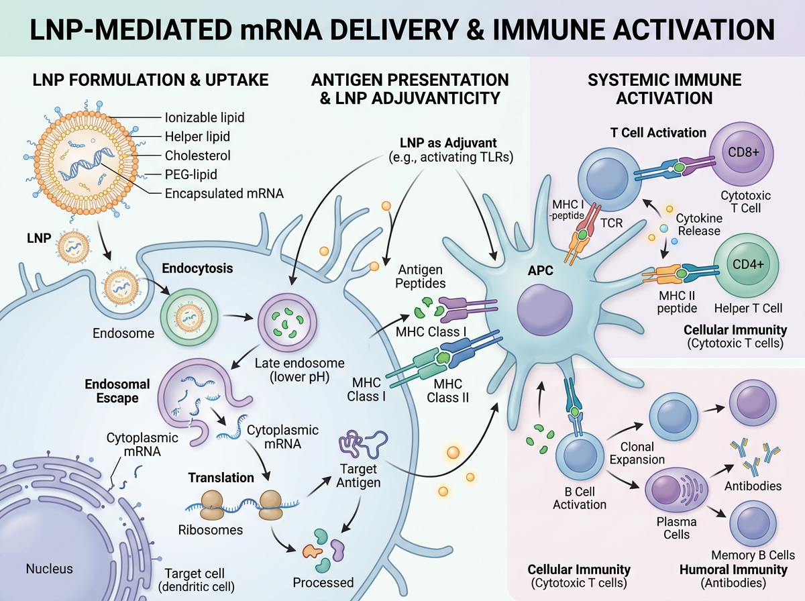</td>
  </tr>
</table>

**Prompt:**

```text
Create a scientific figure about: Lipid nanoparticle mediated mRNA delivery and immune activation.
Visual style: Soft Biomedical.
Requirements:
- publication-ready scientific quality
- clear labels and directional arrows where appropriate
- avoid cartoon style, avoid meme style, avoid stock-photo look
- avoid neon glow and over-sharpened CGI look unless explicitly requested
- composition optimized for research papers and academic slides
- category context: graphical-abstracts
- subtle soft-shaded biomedical rendering without cartoon style
- clean depth cues and organelle/material differentiation
- balanced pastel-accent palette while retaining scientific rigor
```

<a id="graphical-abstracts-390ffcce"></a>

#### Case 043: Organoid-based precision medicine loop for drug response prediction

<table>
  <tr>
    <th>Output</th>
  </tr>
  <tr>
    <td>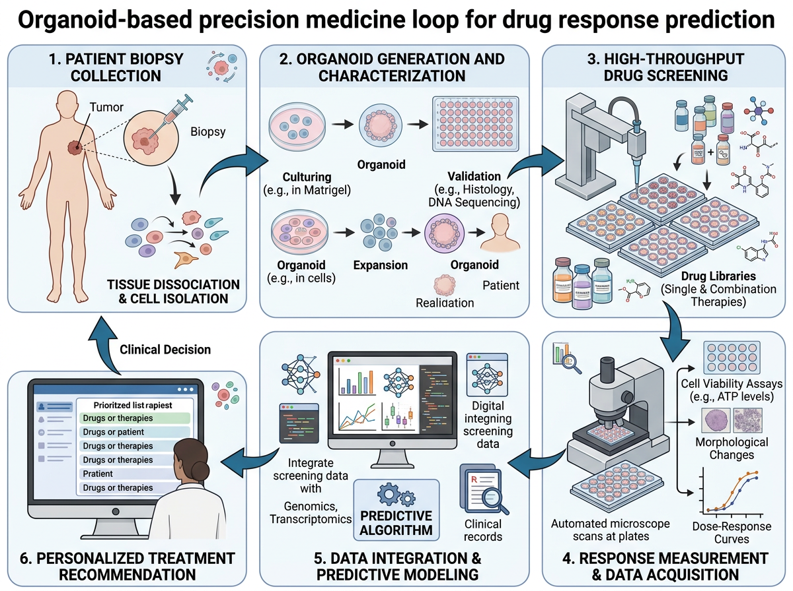</td>
  </tr>
</table>

**Prompt:**

```text
Create a scientific figure about: Organoid-based precision medicine loop for drug response prediction.
Visual style: Clean Vector.
Requirements:
- publication-ready scientific quality
- clear labels and directional arrows where appropriate
- avoid cartoon style, avoid meme style, avoid stock-photo look
- avoid neon glow and over-sharpened CGI look unless explicitly requested
- composition optimized for research papers and academic slides
- category context: graphical-abstracts
- flat vector look with crisp boundaries and minimal gradients
- white or very light background for publication clarity
- high legibility labels with consistent typography
```

<a id="graphical-abstracts-836506d4"></a>

#### Case 044: Microbiome-gut-brain axis effects on neuroinflammation

<table>
  <tr>
    <th>Output</th>
  </tr>
  <tr>
    <td>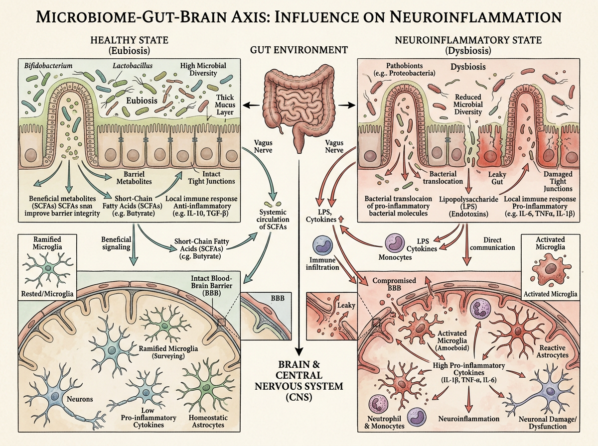</td>
  </tr>
</table>

**Prompt:**

```text
Create a scientific figure about: Microbiome-gut-brain axis effects on neuroinflammation.
Visual style: Watercolor Texture & Ink Line Atlas.
Requirements:
- publication-ready scientific quality
- clear labels and directional arrows where appropriate
- avoid cartoon style, avoid meme style, avoid stock-photo look
- avoid neon glow and over-sharpened CGI look unless explicitly requested
- composition optimized for research papers and academic slides
- category context: graphical-abstracts
- watercolor texture with precise ink line art, hand-drawn but technically accurate
- muted tones and matte color palette, avoid harsh saturated 3D rendering
- natural science atlas / textbook style with rigorous scientific annotation
- subtle cream paper texture background to achieve premium archival look
```

<a id="graphical-abstracts-e4bbfe7a"></a>

#### Case 045: PROTAC-driven targeted protein degradation summary

<table>
  <tr>
    <th>Output</th>
  </tr>
  <tr>
    <td>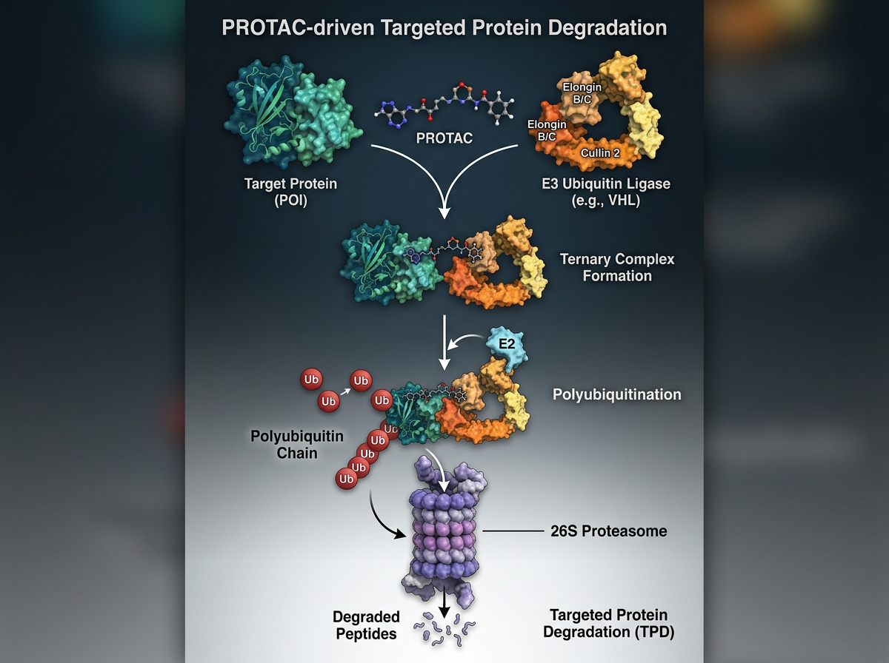</td>
  </tr>
</table>

**Prompt:**

```text
Create a scientific figure about: PROTAC-driven targeted protein degradation summary.
Visual style: Journal Cover Cinematic.
Requirements:
- publication-ready scientific quality
- clear labels and directional arrows where appropriate
- avoid cartoon style, avoid meme style, avoid stock-photo look
- avoid neon glow and over-sharpened CGI look unless explicitly requested
- composition optimized for research papers and academic slides
- category context: graphical-abstracts
- high-impact cinematic lighting with strong focal hierarchy
- dark-to-bright gradient atmosphere and publication cover composition
- scientifically plausible structures and anatomically coherent details
```

<a id="graphical-abstracts-42ba00e7"></a>

#### Case 046: CAR-T treatment lifecycle with tumor burden reduction

<table>
  <tr>
    <th>Output</th>
  </tr>
  <tr>
    <td>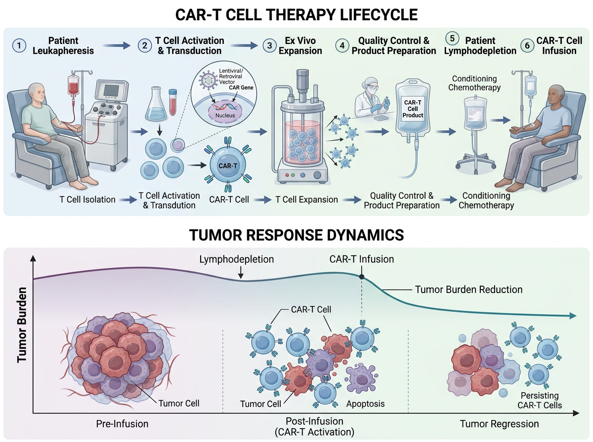</td>
  </tr>
</table>

**Prompt:**

```text
Create a scientific figure about: CAR-T treatment lifecycle with tumor burden reduction.
Visual style: Soft Biomedical.
Requirements:
- publication-ready scientific quality
- clear labels and directional arrows where appropriate
- avoid cartoon style, avoid meme style, avoid stock-photo look
- avoid neon glow and over-sharpened CGI look unless explicitly requested
- composition optimized for research papers and academic slides
- category context: graphical-abstracts
- subtle soft-shaded biomedical rendering without cartoon style
- clean depth cues and organelle/material differentiation
- balanced pastel-accent palette while retaining scientific rigor
```

<a id="graphical-abstracts-ba300cb7"></a>

#### Case 047: Synthetic biology biosensor for rapid pathogen detection

<table>
  <tr>
    <th>Output</th>
  </tr>
  <tr>
    <td>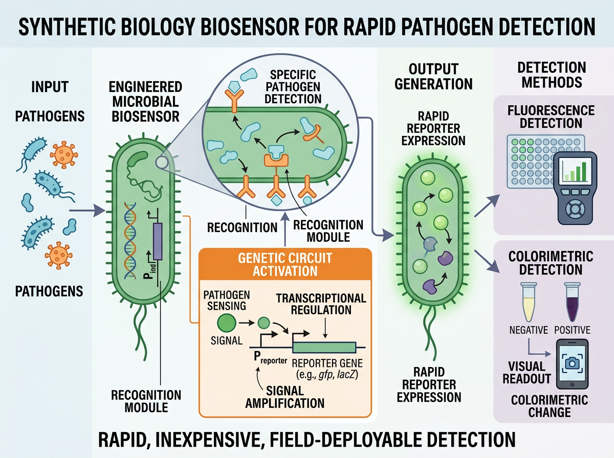</td>
  </tr>
</table>

**Prompt:**

```text
Create a scientific figure about: Synthetic biology biosensor for rapid pathogen detection.
Visual style: Clean Vector.
Requirements:
- publication-ready scientific quality
- clear labels and directional arrows where appropriate
- avoid cartoon style, avoid meme style, avoid stock-photo look
- avoid neon glow and over-sharpened CGI look unless explicitly requested
- composition optimized for research papers and academic slides
- category context: graphical-abstracts
- flat vector look with crisp boundaries and minimal gradients
- white or very light background for publication clarity
- high legibility labels with consistent typography
```

<a id="graphical-abstracts-27341aea"></a>

#### Case 048: Organoid-based precision medicine loop for drug response prediction

<table>
  <tr>
    <th>Output</th>
  </tr>
  <tr>
    <td>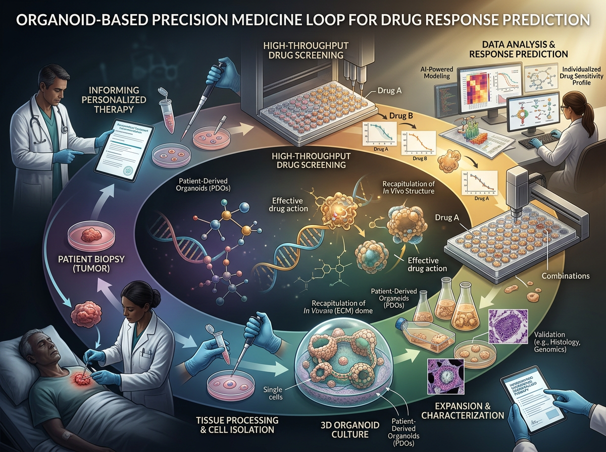</td>
  </tr>
</table>

**Prompt:**

```text
Create a scientific figure about: Organoid-based precision medicine loop for drug response prediction.
Visual style: Journal Cover Cinematic.
Requirements:
- publication-ready scientific quality
- clear labels and directional arrows where appropriate
- avoid cartoon style, avoid meme style, avoid stock-photo look
- avoid neon glow and over-sharpened CGI look unless explicitly requested
- composition optimized for research papers and academic slides
- category context: graphical-abstracts
- high-impact cinematic lighting with strong focal hierarchy
- dark-to-bright gradient atmosphere and publication cover composition
- scientifically plausible structures and anatomically coherent details
```

<a id="graphical-abstracts-d8cbea93"></a>

#### Case 049: Microbiome-gut-brain axis effects on neuroinflammation

<table>
  <tr>
    <th>Output</th>
  </tr>
  <tr>
    <td>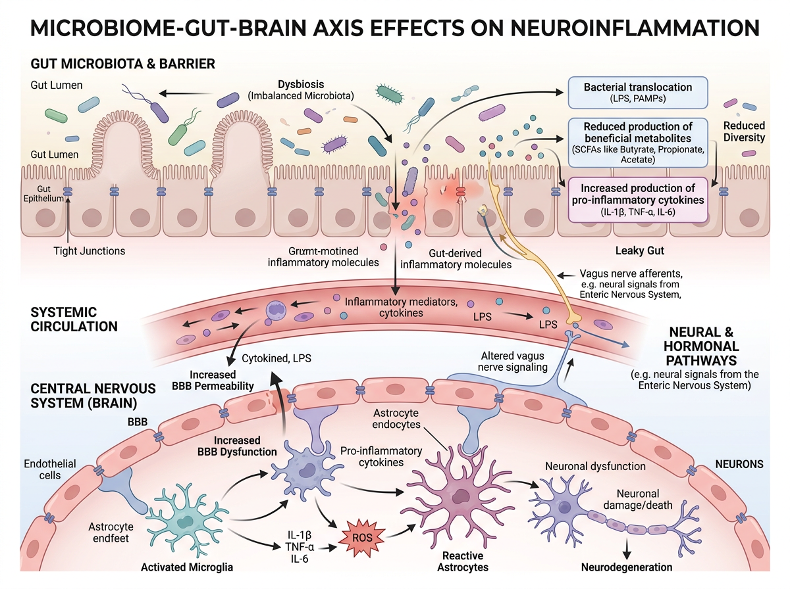</td>
  </tr>
</table>

**Prompt:**

```text
Create a scientific figure about: Microbiome-gut-brain axis effects on neuroinflammation.
Visual style: Soft Biomedical.
Requirements:
- publication-ready scientific quality
- clear labels and directional arrows where appropriate
- avoid cartoon style, avoid meme style, avoid stock-photo look
- avoid neon glow and over-sharpened CGI look unless explicitly requested
- composition optimized for research papers and academic slides
- category context: graphical-abstracts
- subtle soft-shaded biomedical rendering without cartoon style
- clean depth cues and organelle/material differentiation
- balanced pastel-accent palette while retaining scientific rigor
```

<a id="graphical-abstracts-b9adca3a"></a>

#### Case 050: PROTAC-driven targeted protein degradation summary

<table>
  <tr>
    <th>Output</th>
  </tr>
  <tr>
    <td>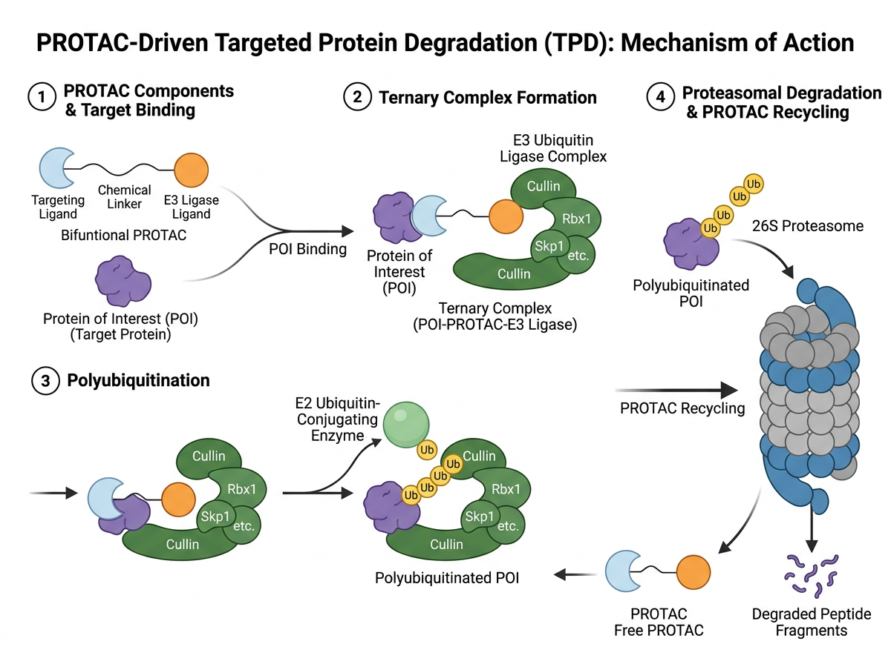</td>
  </tr>
</table>

**Prompt:**

```text
Create a scientific figure about: PROTAC-driven targeted protein degradation summary.
Visual style: Clean Vector.
Requirements:
- publication-ready scientific quality
- clear labels and directional arrows where appropriate
- avoid cartoon style, avoid meme style, avoid stock-photo look
- avoid neon glow and over-sharpened CGI look unless explicitly requested
- composition optimized for research papers and academic slides
- category context: graphical-abstracts
- flat vector look with crisp boundaries and minimal gradients
- white or very light background for publication clarity
- high legibility labels with consistent typography
```

<a id="graphical-abstracts-d85468df"></a>

#### Case 051: Lipid nanoparticle mediated mRNA delivery and immune activation

<table>
  <tr>
    <th>Output</th>
  </tr>
  <tr>
    <td>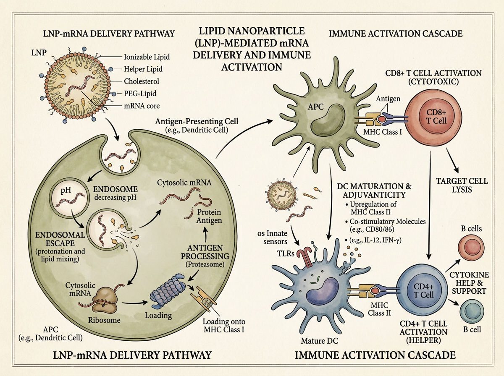</td>
  </tr>
</table>

**Prompt:**

```text
Create a scientific figure about: Lipid nanoparticle mediated mRNA delivery and immune activation.
Visual style: Watercolor Texture & Ink Line Atlas.
Requirements:
- publication-ready scientific quality
- clear labels and directional arrows where appropriate
- avoid cartoon style, avoid meme style, avoid stock-photo look
- avoid neon glow and over-sharpened CGI look unless explicitly requested
- composition optimized for research papers and academic slides
- category context: graphical-abstracts
- watercolor texture with precise ink line art, hand-drawn but technically accurate
- muted tones and matte color palette, avoid harsh saturated 3D rendering
- natural science atlas / textbook style with rigorous scientific annotation
- subtle cream paper texture background to achieve premium archival look
```

<a id="lab-apparatus"></a>

### 実験装置

<a id="lab-apparatus-43e3d710"></a>

#### Case 052: a triple quadrupole mass spectrometer: electrospray ionization (ESI) source with Taylor cone and desolvation gas, hea...

<table>
  <tr>
    <th>Output</th>
  </tr>
  <tr>
    <td></td>
  </tr>
</table>

**Prompt:**

```text
Create a technical cutaway diagram of a triple quadrupole mass spectrometer: electrospray ionization (ESI) source with Taylor cone and desolvation gas, heated capillary inlet, ion funnel, Q1 mass filter (hyperbolic rod electrodes with RF/DC), Q2 collision cell (RF-only hexapole with collision gas inlet, CID fragmentation), Q3 mass filter, electron multiplier detector. Show ion trajectory path, vacuum pump stages (rough pump, turbomolecular), and pressure gradient from atmospheric to 10⁻⁶ Torr.
```

<a id="lab-apparatus-6972b222"></a>

#### Case 053: technical diagram of a Bruker 800 MHz NMR spectrometer: superconducting magnet with persistent mode switch, liquid he...

<table>
  <tr>
    <th>Output</th>
  </tr>
  <tr>
    <td></td>
  </tr>
</table>

**Prompt:**

```text
Create a technical diagram of a Bruker 800 MHz NMR spectrometer: superconducting magnet with persistent mode switch, liquid helium dewar (4.2K) surrounded by liquid nitrogen dewar (77K), room-temperature bore with Z1/Z2 shim coils, cryogenically cooled triple-resonance (¹H/¹³C/¹⁵N) TCI probe with preamplifiers, gradient coil (Z-gradient 50 G/cm), sample spinner and air bearing, pneumatic sample changer, and console (transmitter, receiver, ADC, pulse programmer). Label B₀ field direction.
```

<a id="lab-apparatus-0bae2f4d"></a>

#### Case 054: technical illustration of a modern UHPLC system: quaternary solvent degasser with vacuum membrane, high-pressure grad...

<table>
  <tr>
    <th>Output</th>
  </tr>
  <tr>
    <td></td>
  </tr>
</table>

**Prompt:**

```text
Create a technical illustration of a modern UHPLC system: quaternary solvent degasser with vacuum membrane, high-pressure gradient pump (dual-piston with active pulse dampening, up to 1500 bar), autosampler with temperature-controlled sample tray and needle-in-needle injection, column oven compartment with pre-heater and active post-column cooler, sub-2μm C18 column (2.1×100mm, 1.7μm BEH particles), diode array detector (190-800nm, 80Hz acquisition), fluorescence detector, and fraction collector. Show flow path with pressure monitoring points.
```

<a id="lab-apparatus-e9815671"></a>

#### Case 055: technical diagram of a droplet digital PCR (ddPCR) system: sample partitioning into ~20,000 nanoliter-scale water-in-...

<table>
  <tr>
    <th>Output</th>
  </tr>
  <tr>
    <td></td>
  </tr>
</table>

**Prompt:**

```text
Create a technical diagram of a droplet digital PCR (ddPCR) system: sample partitioning into ~20,000 nanoliter-scale water-in-oil droplets via microfluidic droplet generator, thermal cycling of droplet emulsion in standard 96-well plate, endpoint fluorescence reading of each droplet (FAM and HEX channels), positive/negative droplet classification by amplitude threshold, Poisson statistics for absolute copy number quantification without standard curve. Show the microfluidic chip cross-section and droplet formation mechanism.
```

<a id="lab-apparatus-4fad8250"></a>

#### Case 056: technical diagram of a next-generation DNA sequencer (Illumina NovaSeq 6000): fluidics system with reagent chiller an...

<table>
  <tr>
    <th>Output</th>
  </tr>
  <tr>
    <td></td>
  </tr>
</table>

**Prompt:**

```text
Create a technical diagram of a next-generation DNA sequencer (Illumina NovaSeq 6000): fluidics system with reagent chiller and sipper, patterned flow cell with nanowells, two-channel SBS chemistry, cluster generation station with ExAmp technology, imaging optics with structured illumination and TDI (time-delay integration) line scan camera, thermal control system, on-board FPGA for real-time base calling (RTA), data output module. Cross-section view showing internal layout.
```

<a id="lab-apparatus-691268da"></a>

#### Case 057: technical diagram of a lab-on-a-chip microfluidic device for cell sorting: PDMS/glass hybrid chip fabrication, inlet...

<table>
  <tr>
    <th>Output</th>
  </tr>
  <tr>
    <td></td>
  </tr>
</table>

**Prompt:**

```text
Create a technical diagram of a lab-on-a-chip microfluidic device for cell sorting: PDMS/glass hybrid chip fabrication, inlet ports for sample and sheath fluid, hydrodynamic focusing channel (width 50μm), laser interrogation zone (488nm excitation, forward scatter and fluorescence detection), piezoelectric actuator for deflection-based sorting into collection and waste channels. Show Reynolds number annotation (Re < 1, laminar flow), channel cross-section dimensions, and sorting decision logic. Include bright-field image of sorted droplets.
```

<a id="lab-apparatus-124e4073"></a>

#### Case 058: Confocal microscope optical path and detector modules

<table>
  <tr>
    <th>Output</th>
  </tr>
  <tr>
    <td>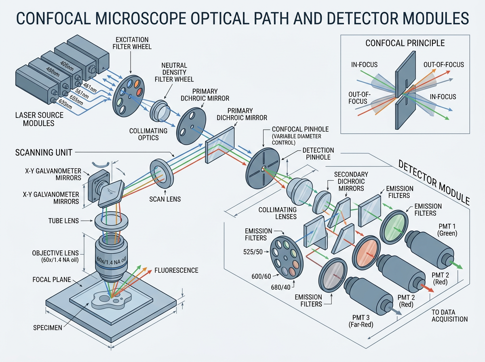</td>
  </tr>
</table>

**Prompt:**

```text
Create a scientific figure about: Confocal microscope optical path and detector modules.
Visual style: Isometric Technical.
Requirements:
- publication-ready scientific quality
- clear labels and directional arrows where appropriate
- avoid cartoon style, avoid meme style, avoid stock-photo look
- avoid neon glow and over-sharpened CGI look unless explicitly requested
- composition optimized for research papers and academic slides
- category context: lab-apparatus
- isometric perspective with precise component geometry
- engineering-style callouts and measured spacing
- moderate blue-gray palette with restrained accent colors
```

<a id="lab-apparatus-2e2ceb96"></a>

#### Case 059: Microfluidic chip layout with mixing and reaction chambers

<table>
  <tr>
    <th>Output</th>
  </tr>
  <tr>
    <td>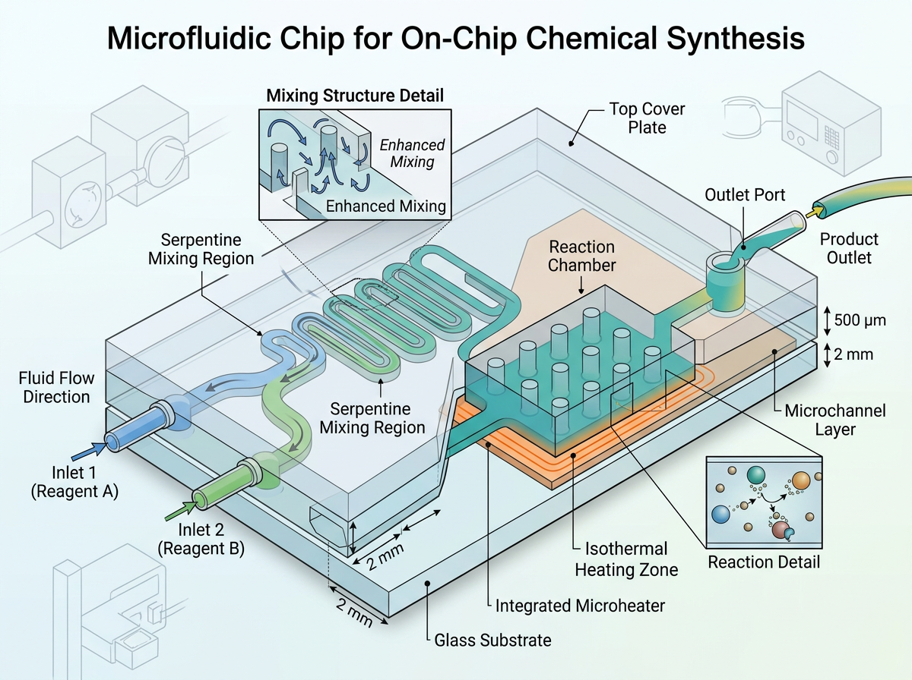</td>
  </tr>
</table>

**Prompt:**

```text
Create a scientific figure about: Microfluidic chip layout with mixing and reaction chambers.
Visual style: 3D Cutaway.
Requirements:
- publication-ready scientific quality
- clear labels and directional arrows where appropriate
- avoid cartoon style, avoid meme style, avoid stock-photo look
- avoid neon glow and over-sharpened CGI look unless explicitly requested
- composition optimized for research papers and academic slides
- category context: lab-apparatus
- semi-3D cutaway rendering with layered transparency
- clear sectional depth and internal component visibility
- avoid photoreal clutter and keep annotation zones clean
```

<a id="lab-apparatus-70f5d710"></a>

#### Case 060: Bioreactor architecture with sensor and gas-control loops

<table>
  <tr>
    <th>Output</th>
  </tr>
  <tr>
    <td>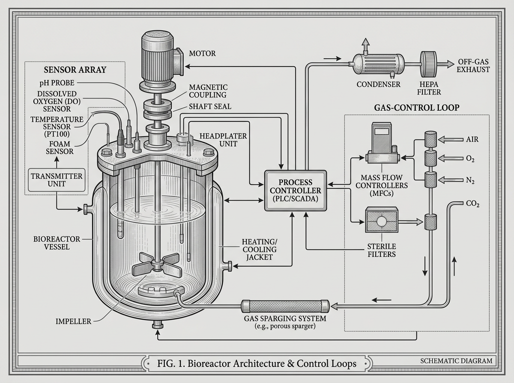</td>
  </tr>
</table>

**Prompt:**

```text
Create a scientific figure about: Bioreactor architecture with sensor and gas-control loops.
Visual style: Scientific Engraving Monochrome.
Requirements:
- publication-ready scientific quality
- clear labels and directional arrows where appropriate
- avoid cartoon style, avoid meme style, avoid stock-photo look
- avoid neon glow and over-sharpened CGI look unless explicitly requested
- composition optimized for research papers and academic slides
- category context: lab-apparatus
- vintage scientific engraving style with fine hatching and contour lines
- monochrome or near-monochrome gray palette with high structural clarity
- plate-like composition similar to historical scientific references
```

<a id="lab-apparatus-152b65dc"></a>

#### Case 061: High-performance liquid chromatography system flow path

<table>
  <tr>
    <th>Output</th>
  </tr>
  <tr>
    <td>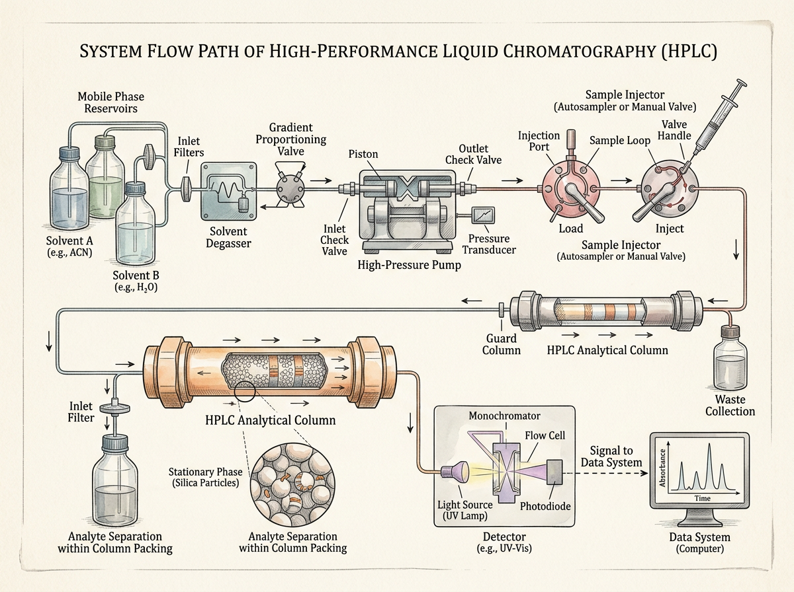</td>
  </tr>
</table>

**Prompt:**

```text
Create a scientific figure about: High-performance liquid chromatography system flow path.
Visual style: Watercolor Texture & Ink Line Atlas.
Requirements:
- publication-ready scientific quality
- clear labels and directional arrows where appropriate
- avoid cartoon style, avoid meme style, avoid stock-photo look
- avoid neon glow and over-sharpened CGI look unless explicitly requested
- composition optimized for research papers and academic slides
- category context: lab-apparatus
- watercolor texture with precise ink line art, hand-drawn but technically accurate
- muted tones and matte color palette, avoid harsh saturated 3D rendering
- natural science atlas / textbook style with rigorous scientific annotation
- subtle cream paper texture background to achieve premium archival look
```

<a id="lab-apparatus-0d7429cc"></a>

#### Case 062: Mass spectrometer triple-quadrupole structure and ion trajectory

<table>
  <tr>
    <th>Output</th>
  </tr>
  <tr>
    <td>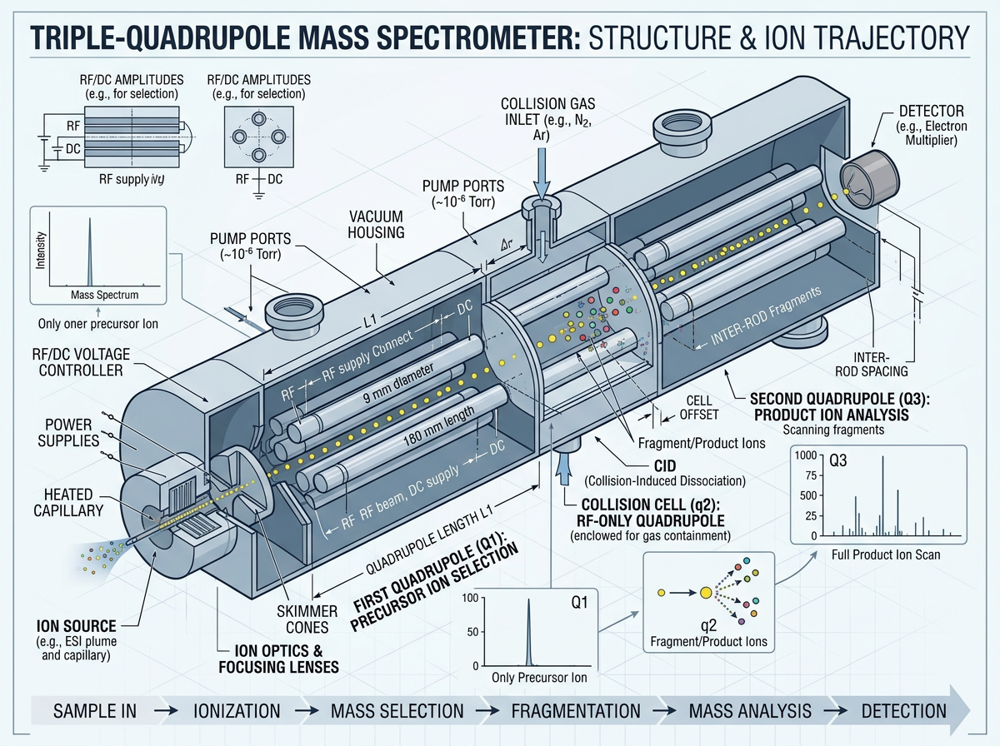</td>
  </tr>
</table>

**Prompt:**

```text
Create a scientific figure about: Mass spectrometer triple-quadrupole structure and ion trajectory.
Visual style: Isometric Technical.
Requirements:
- publication-ready scientific quality
- clear labels and directional arrows where appropriate
- avoid cartoon style, avoid meme style, avoid stock-photo look
- avoid neon glow and over-sharpened CGI look unless explicitly requested
- composition optimized for research papers and academic slides
- category context: lab-apparatus
- isometric perspective with precise component geometry
- engineering-style callouts and measured spacing
- moderate blue-gray palette with restrained accent colors
```

<a id="lab-apparatus-7da92659"></a>

#### Case 063: Cryo-EM instrument section with electron beam direction

<table>
  <tr>
    <th>Output</th>
  </tr>
  <tr>
    <td>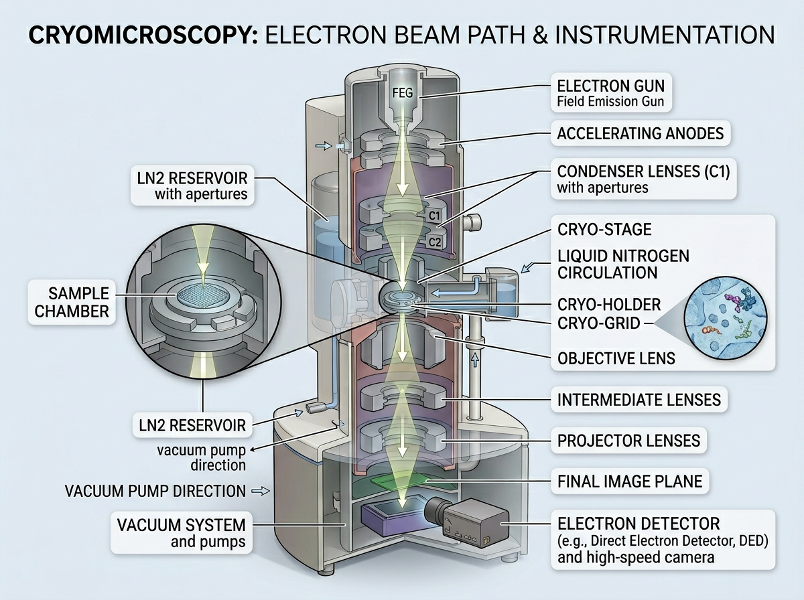</td>
  </tr>
</table>

**Prompt:**

```text
Create a scientific figure about: Cryo-EM instrument section with electron beam direction.
Visual style: 3D Cutaway.
Requirements:
- publication-ready scientific quality
- clear labels and directional arrows where appropriate
- avoid cartoon style, avoid meme style, avoid stock-photo look
- avoid neon glow and over-sharpened CGI look unless explicitly requested
- composition optimized for research papers and academic slides
- category context: lab-apparatus
- semi-3D cutaway rendering with layered transparency
- clear sectional depth and internal component visibility
- avoid photoreal clutter and keep annotation zones clean
```

<a id="lab-apparatus-7b652ad6"></a>

#### Case 064: Confocal microscope optical path and detector modules

<table>
  <tr>
    <th>Output</th>
  </tr>
  <tr>
    <td>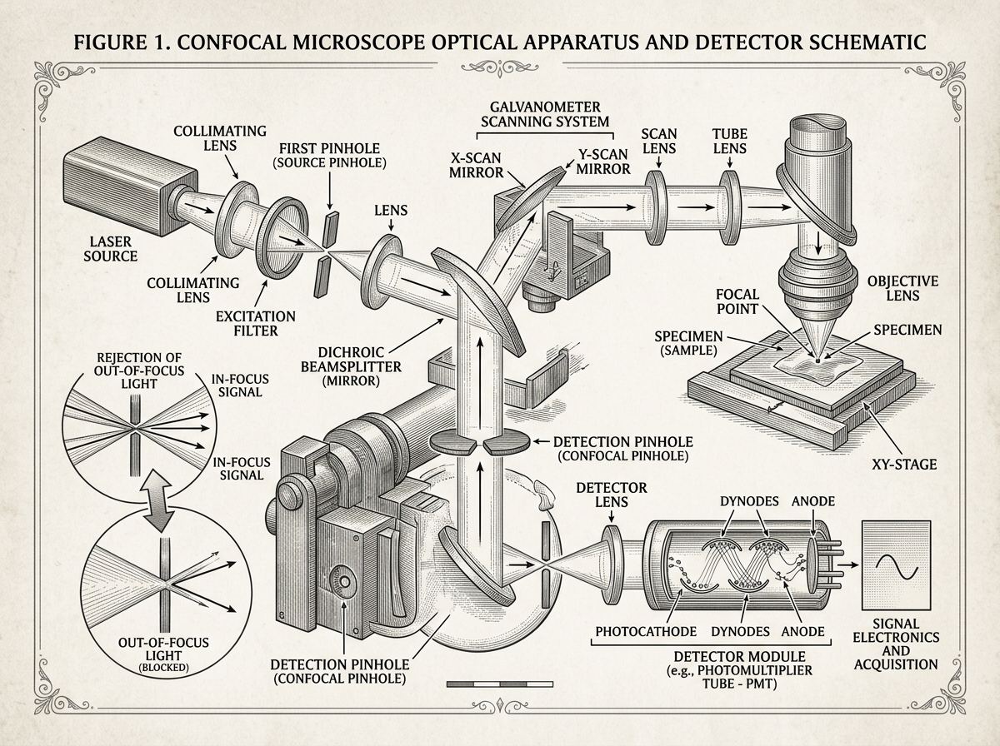</td>
  </tr>
</table>

**Prompt:**

```text
Create a scientific figure about: Confocal microscope optical path and detector modules.
Visual style: Scientific Engraving Monochrome.
Requirements:
- publication-ready scientific quality
- clear labels and directional arrows where appropriate
- avoid cartoon style, avoid meme style, avoid stock-photo look
- avoid neon glow and over-sharpened CGI look unless explicitly requested
- composition optimized for research papers and academic slides
- category context: lab-apparatus
- vintage scientific engraving style with fine hatching and contour lines
- monochrome or near-monochrome gray palette with high structural clarity
- plate-like composition similar to historical scientific references
```

<a id="lab-apparatus-62a11339"></a>

#### Case 065: Microfluidic chip layout with mixing and reaction chambers

<table>
  <tr>
    <th>Output</th>
  </tr>
  <tr>
    <td>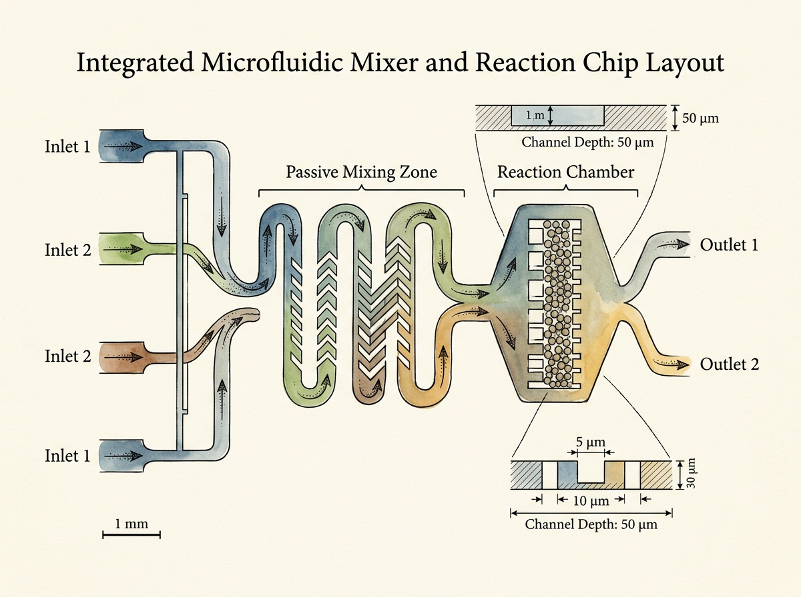</td>
  </tr>
</table>

**Prompt:**

```text
Create a scientific figure about: Microfluidic chip layout with mixing and reaction chambers.
Visual style: Watercolor Texture & Ink Line Atlas.
Requirements:
- publication-ready scientific quality
- clear labels and directional arrows where appropriate
- avoid cartoon style, avoid meme style, avoid stock-photo look
- avoid neon glow and over-sharpened CGI look unless explicitly requested
- composition optimized for research papers and academic slides
- category context: lab-apparatus
- watercolor texture with precise ink line art, hand-drawn but technically accurate
- muted tones and matte color palette, avoid harsh saturated 3D rendering
- natural science atlas / textbook style with rigorous scientific annotation
- subtle cream paper texture background to achieve premium archival look
```

<a id="lab-apparatus-92746c77"></a>

#### Case 066: Bioreactor architecture with sensor and gas-control loops

<table>
  <tr>
    <th>Output</th>
  </tr>
  <tr>
    <td>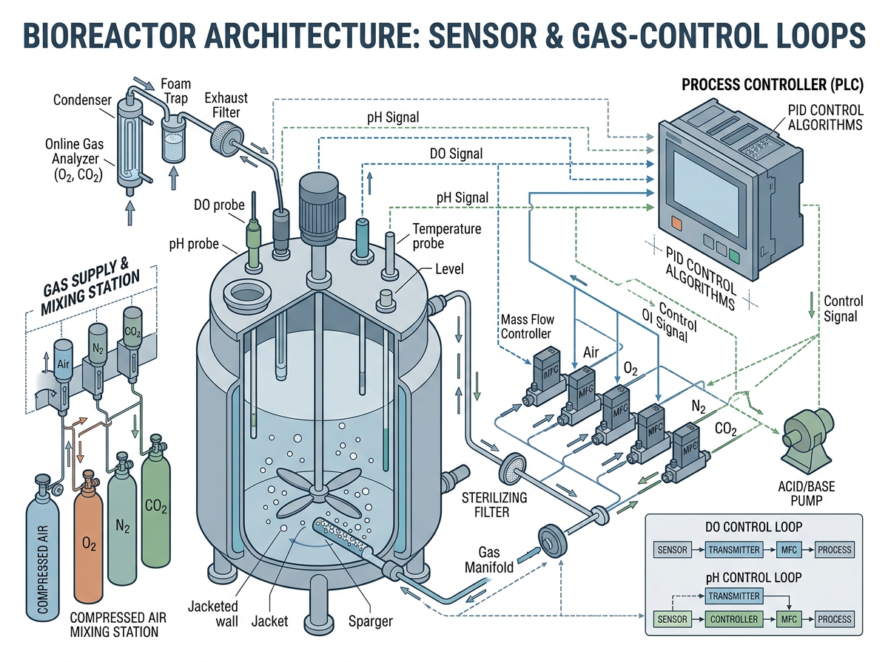</td>
  </tr>
</table>

**Prompt:**

```text
Create a scientific figure about: Bioreactor architecture with sensor and gas-control loops.
Visual style: Isometric Technical.
Requirements:
- publication-ready scientific quality
- clear labels and directional arrows where appropriate
- avoid cartoon style, avoid meme style, avoid stock-photo look
- avoid neon glow and over-sharpened CGI look unless explicitly requested
- composition optimized for research papers and academic slides
- category context: lab-apparatus
- isometric perspective with precise component geometry
- engineering-style callouts and measured spacing
- moderate blue-gray palette with restrained accent colors
```

<a id="lab-apparatus-4acdf44e"></a>

#### Case 067: High-performance liquid chromatography system flow path

<table>
  <tr>
    <th>Output</th>
  </tr>
  <tr>
    <td>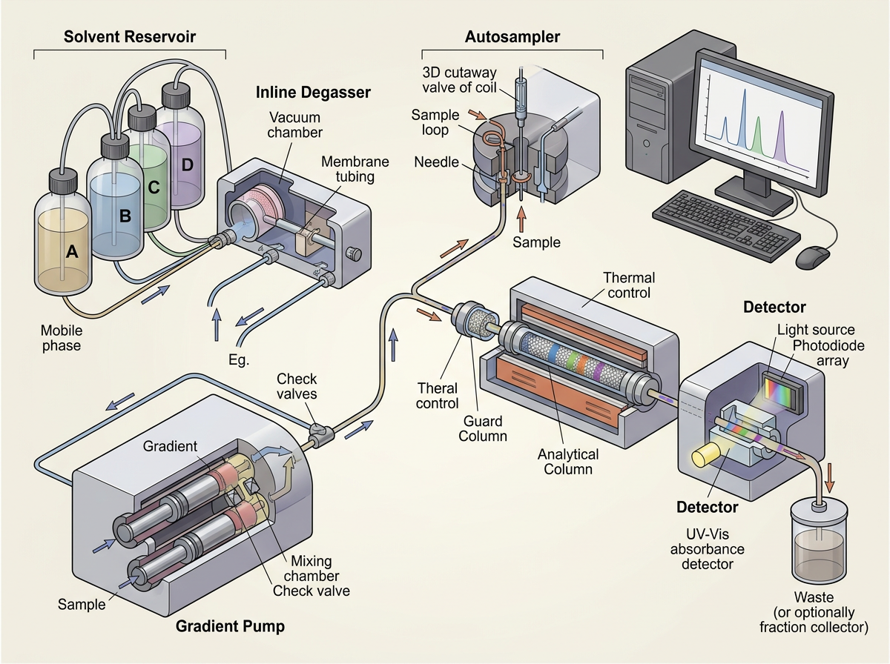</td>
  </tr>
</table>

**Prompt:**

```text
Create a scientific figure about: High-performance liquid chromatography system flow path.
Visual style: 3D Cutaway.
Requirements:
- publication-ready scientific quality
- clear labels and directional arrows where appropriate
- avoid cartoon style, avoid meme style, avoid stock-photo look
- avoid neon glow and over-sharpened CGI look unless explicitly requested
- composition optimized for research papers and academic slides
- category context: lab-apparatus
- semi-3D cutaway rendering with layered transparency
- clear sectional depth and internal component visibility
- avoid photoreal clutter and keep annotation zones clean
```

<a id="micro-structures"></a>

### 微細構造

<a id="micro-structures-587d0066"></a>

#### Case 068: Neuron synapse ultrastructure with vesicles and postsynaptic density

<table>
  <tr>
    <th>Output</th>
  </tr>
  <tr>
    <td></td>
  </tr>
</table>

**Prompt:**

```text
Create a scientific figure about: Neuron synapse ultrastructure with vesicles and postsynaptic density.
Visual style: Soft Biomedical.
Requirements:
- publication-ready scientific quality
- clear labels and directional arrows where appropriate
- avoid cartoon style, avoid meme style, avoid stock-photo look
- avoid neon glow and over-sharpened CGI look unless explicitly requested
- composition optimized for research papers and academic slides
- category context: micro-structures
- subtle soft-shaded biomedical rendering without cartoon style
- clean depth cues and organelle/material differentiation
- balanced pastel-accent palette while retaining scientific rigor
```

<a id="micro-structures-ebe10043"></a>

#### Case 069: Mitochondrial inner membrane cristae and ATP synthase arrangement

<table>
  <tr>
    <th>Output</th>
  </tr>
  <tr>
    <td></td>
  </tr>
</table>

**Prompt:**

```text
Create a scientific figure about: Mitochondrial inner membrane cristae and ATP synthase arrangement.
Visual style: Watercolor Texture & Ink Line Atlas.
Requirements:
- publication-ready scientific quality
- clear labels and directional arrows where appropriate
- avoid cartoon style, avoid meme style, avoid stock-photo look
- avoid neon glow and over-sharpened CGI look unless explicitly requested
- composition optimized for research papers and academic slides
- category context: micro-structures
- watercolor texture with precise ink line art, hand-drawn but technically accurate
- muted tones and matte color palette, avoid harsh saturated 3D rendering
- natural science atlas / textbook style with rigorous scientific annotation
- subtle cream paper texture background to achieve premium archival look
```

<a id="micro-structures-b13bbcdb"></a>

#### Case 070: Plant chloroplast grana and stroma lamellae cross-view

<table>
  <tr>
    <th>Output</th>
  </tr>
  <tr>
    <td></td>
  </tr>
</table>

**Prompt:**

```text
Create a scientific figure about: Plant chloroplast grana and stroma lamellae cross-view.
Visual style: Botanical Field Guide.
Requirements:
- publication-ready scientific quality
- clear labels and directional arrows where appropriate
- avoid cartoon style, avoid meme style, avoid stock-photo look
- avoid neon glow and over-sharpened CGI look unless explicitly requested
- composition optimized for research papers and academic slides
- category context: micro-structures
- field-guide illustration style with disciplined line work and restrained fill color
- taxonomic and anatomical callouts arranged for textbook readability
- natural pigment behavior and paper-friendly texture without painterly chaos
```

<a id="micro-structures-b27bd513"></a>

#### Case 071: Gram-positive versus gram-negative bacterial envelope comparison

<table>
  <tr>
    <th>Output</th>
  </tr>
  <tr>
    <td>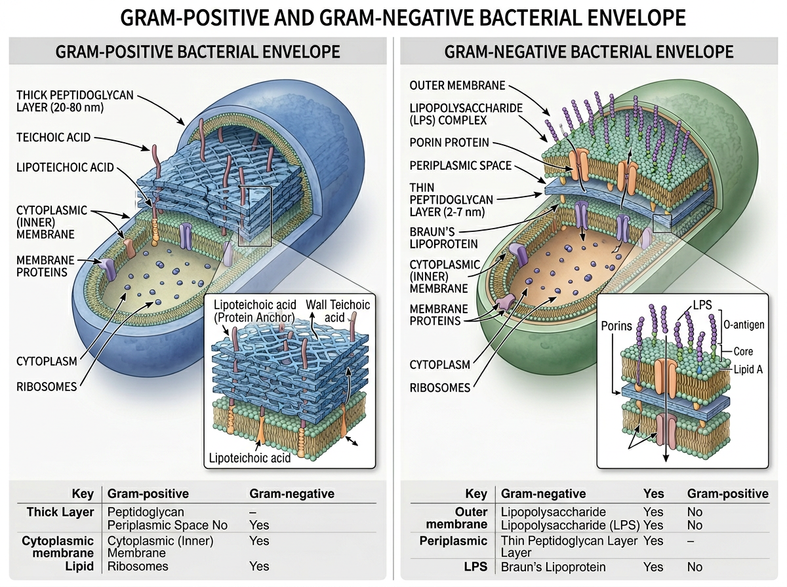</td>
  </tr>
</table>

**Prompt:**

```text
Create a scientific figure about: Gram-positive versus gram-negative bacterial envelope comparison.
Visual style: 3D Cutaway.
Requirements:
- publication-ready scientific quality
- clear labels and directional arrows where appropriate
- avoid cartoon style, avoid meme style, avoid stock-photo look
- avoid neon glow and over-sharpened CGI look unless explicitly requested
- composition optimized for research papers and academic slides
- category context: micro-structures
- semi-3D cutaway rendering with layered transparency
- clear sectional depth and internal component visibility
- avoid photoreal clutter and keep annotation zones clean
```

<a id="micro-structures-25f7c6da"></a>

#### Case 072: Kidney glomerulus filtration barrier microanatomy

<table>
  <tr>
    <th>Output</th>
  </tr>
  <tr>
    <td>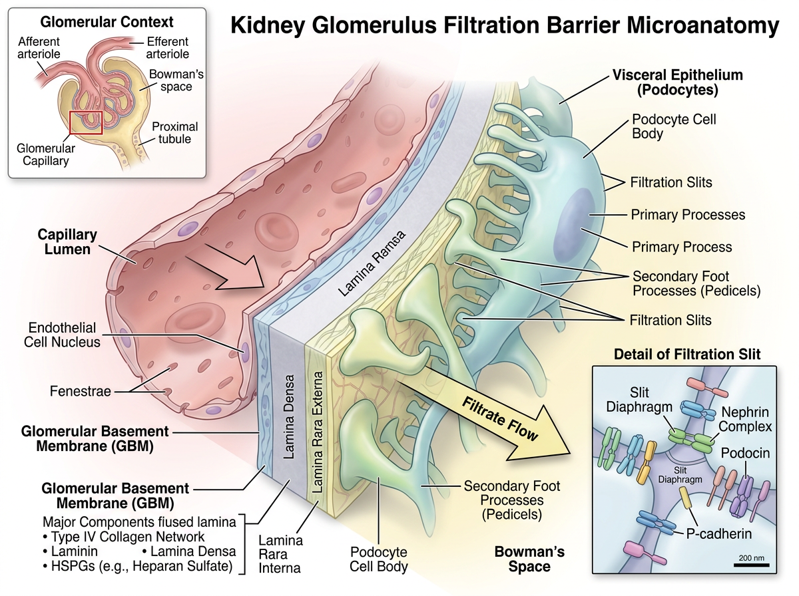</td>
  </tr>
</table>

**Prompt:**

```text
Create a scientific figure about: Kidney glomerulus filtration barrier microanatomy.
Visual style: Soft Biomedical.
Requirements:
- publication-ready scientific quality
- clear labels and directional arrows where appropriate
- avoid cartoon style, avoid meme style, avoid stock-photo look
- avoid neon glow and over-sharpened CGI look unless explicitly requested
- composition optimized for research papers and academic slides
- category context: micro-structures
- subtle soft-shaded biomedical rendering without cartoon style
- clean depth cues and organelle/material differentiation
- balanced pastel-accent palette while retaining scientific rigor
```

<a id="micro-structures-805b4237"></a>

#### Case 073: Composite nanomaterial microstructure with multi-scale grains

<table>
  <tr>
    <th>Output</th>
  </tr>
  <tr>
    <td>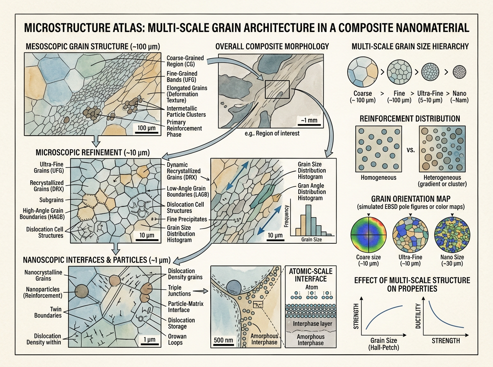</td>
  </tr>
</table>

**Prompt:**

```text
Create a scientific figure about: Composite nanomaterial microstructure with multi-scale grains.
Visual style: Watercolor Texture & Ink Line Atlas.
Requirements:
- publication-ready scientific quality
- clear labels and directional arrows where appropriate
- avoid cartoon style, avoid meme style, avoid stock-photo look
- avoid neon glow and over-sharpened CGI look unless explicitly requested
- composition optimized for research papers and academic slides
- category context: micro-structures
- watercolor texture with precise ink line art, hand-drawn but technically accurate
- muted tones and matte color palette, avoid harsh saturated 3D rendering
- natural science atlas / textbook style with rigorous scientific annotation
- subtle cream paper texture background to achieve premium archival look
```

<a id="micro-structures-2ef905ff"></a>

#### Case 074: Neuron synapse ultrastructure with vesicles and postsynaptic density

<table>
  <tr>
    <th>Output</th>
  </tr>
  <tr>
    <td>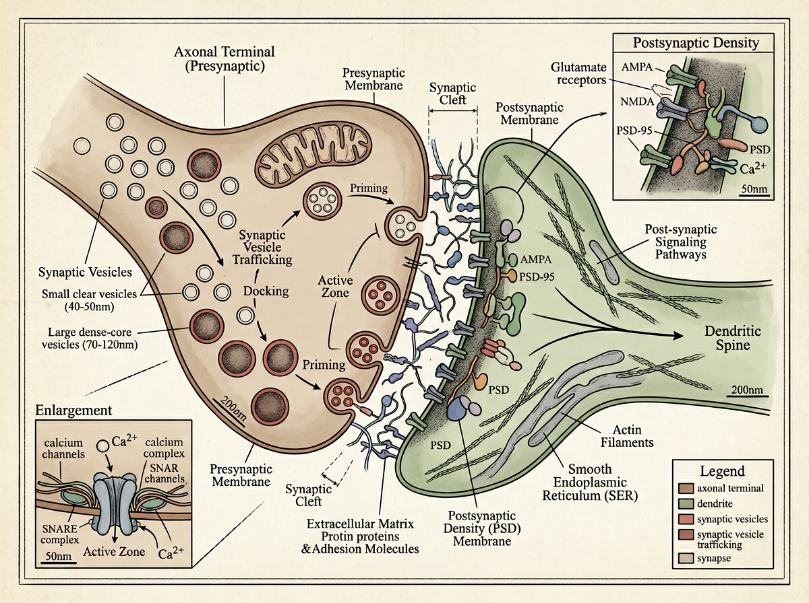</td>
  </tr>
</table>

**Prompt:**

```text
Create a scientific figure about: Neuron synapse ultrastructure with vesicles and postsynaptic density.
Visual style: Botanical Field Guide.
Requirements:
- publication-ready scientific quality
- clear labels and directional arrows where appropriate
- avoid cartoon style, avoid meme style, avoid stock-photo look
- avoid neon glow and over-sharpened CGI look unless explicitly requested
- composition optimized for research papers and academic slides
- category context: micro-structures
- field-guide illustration style with disciplined line work and restrained fill color
- taxonomic and anatomical callouts arranged for textbook readability
- natural pigment behavior and paper-friendly texture without painterly chaos
```

<a id="micro-structures-5689a778"></a>

#### Case 075: Mitochondrial inner membrane cristae and ATP synthase arrangement

<table>
  <tr>
    <th>Output</th>
  </tr>
  <tr>
    <td>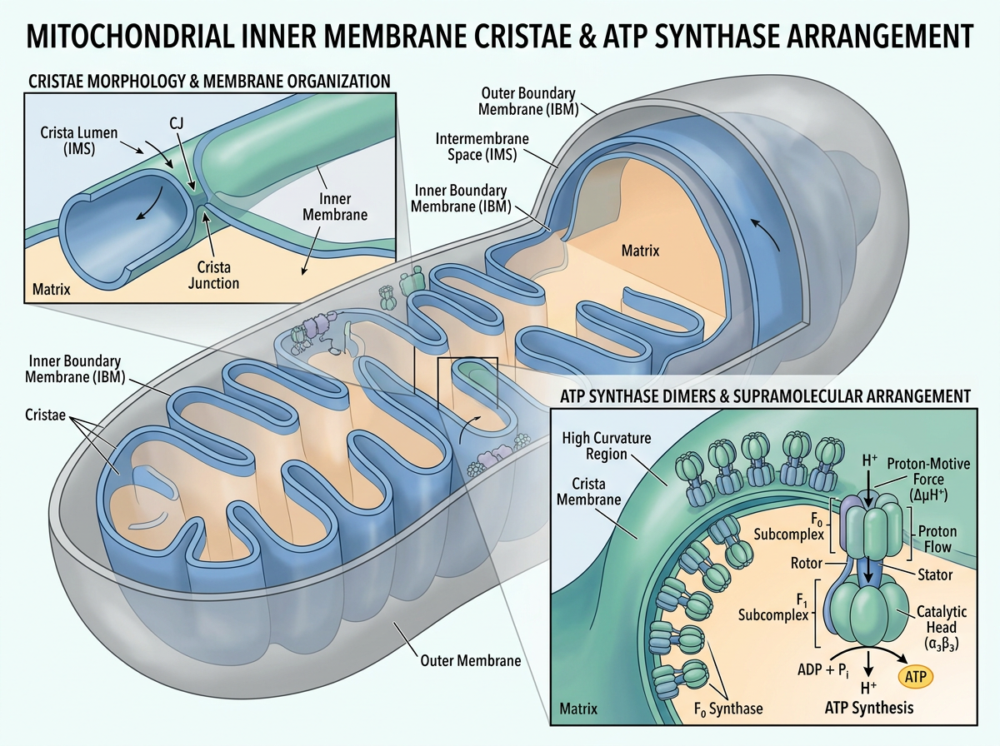</td>
  </tr>
</table>

**Prompt:**

```text
Create a scientific figure about: Mitochondrial inner membrane cristae and ATP synthase arrangement.
Visual style: 3D Cutaway.
Requirements:
- publication-ready scientific quality
- clear labels and directional arrows where appropriate
- avoid cartoon style, avoid meme style, avoid stock-photo look
- avoid neon glow and over-sharpened CGI look unless explicitly requested
- composition optimized for research papers and academic slides
- category context: micro-structures
- semi-3D cutaway rendering with layered transparency
- clear sectional depth and internal component visibility
- avoid photoreal clutter and keep annotation zones clean
```

<a id="micro-structures-e8241c19"></a>

#### Case 076: Plant chloroplast grana and stroma lamellae cross-view

<table>
  <tr>
    <th>Output</th>
  </tr>
  <tr>
    <td>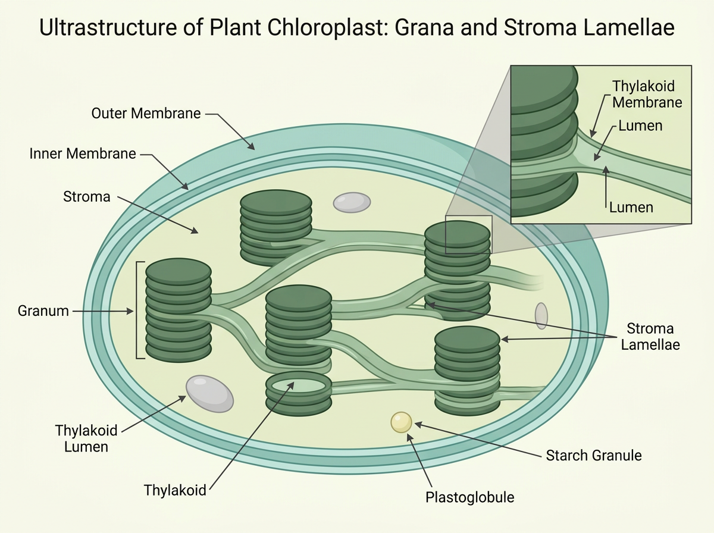</td>
  </tr>
</table>

**Prompt:**

```text
Create a scientific figure about: Plant chloroplast grana and stroma lamellae cross-view.
Visual style: Soft Biomedical.
Requirements:
- publication-ready scientific quality
- clear labels and directional arrows where appropriate
- avoid cartoon style, avoid meme style, avoid stock-photo look
- avoid neon glow and over-sharpened CGI look unless explicitly requested
- composition optimized for research papers and academic slides
- category context: micro-structures
- subtle soft-shaded biomedical rendering without cartoon style
- clean depth cues and organelle/material differentiation
- balanced pastel-accent palette while retaining scientific rigor
```

<a id="micro-structures-9da480ad"></a>

#### Case 077: Gram-positive versus gram-negative bacterial envelope comparison

<table>
  <tr>
    <th>Output</th>
  </tr>
  <tr>
    <td>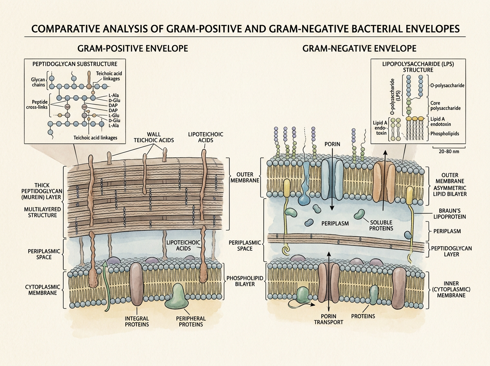</td>
  </tr>
</table>

**Prompt:**

```text
Create a scientific figure about: Gram-positive versus gram-negative bacterial envelope comparison.
Visual style: Watercolor Texture & Ink Line Atlas.
Requirements:
- publication-ready scientific quality
- clear labels and directional arrows where appropriate
- avoid cartoon style, avoid meme style, avoid stock-photo look
- avoid neon glow and over-sharpened CGI look unless explicitly requested
- composition optimized for research papers and academic slides
- category context: micro-structures
- watercolor texture with precise ink line art, hand-drawn but technically accurate
- muted tones and matte color palette, avoid harsh saturated 3D rendering
- natural science atlas / textbook style with rigorous scientific annotation
- subtle cream paper texture background to achieve premium archival look
```

<a id="micro-structures-da236cf5"></a>

#### Case 078: Neuron synapse ultrastructure with vesicles and postsynaptic density

<table>
  <tr>
    <th>Output</th>
  </tr>
  <tr>
    <td>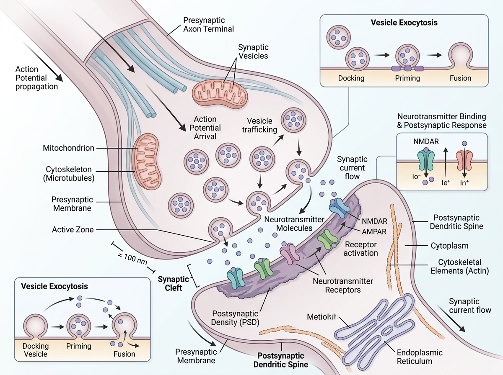</td>
  </tr>
</table>

**Prompt:**

```text
Create a scientific figure about: Neuron synapse ultrastructure with vesicles and postsynaptic density.
Visual style: Soft Biomedical.
Requirements:
- publication-ready scientific quality
- clear labels and directional arrows where appropriate
- avoid cartoon style, avoid meme style, avoid stock-photo look
- avoid neon glow and over-sharpened CGI look unless explicitly requested
- composition optimized for research papers and academic slides
- category context: micro-structures
- subtle soft-shaded biomedical rendering without cartoon style
- clean depth cues and organelle/material differentiation
- balanced pastel-accent palette while retaining scientific rigor
```

<a id="micro-structures-381bd807"></a>

#### Case 079: Mitochondrial inner membrane cristae and ATP synthase arrangement

<table>
  <tr>
    <th>Output</th>
  </tr>
  <tr>
    <td>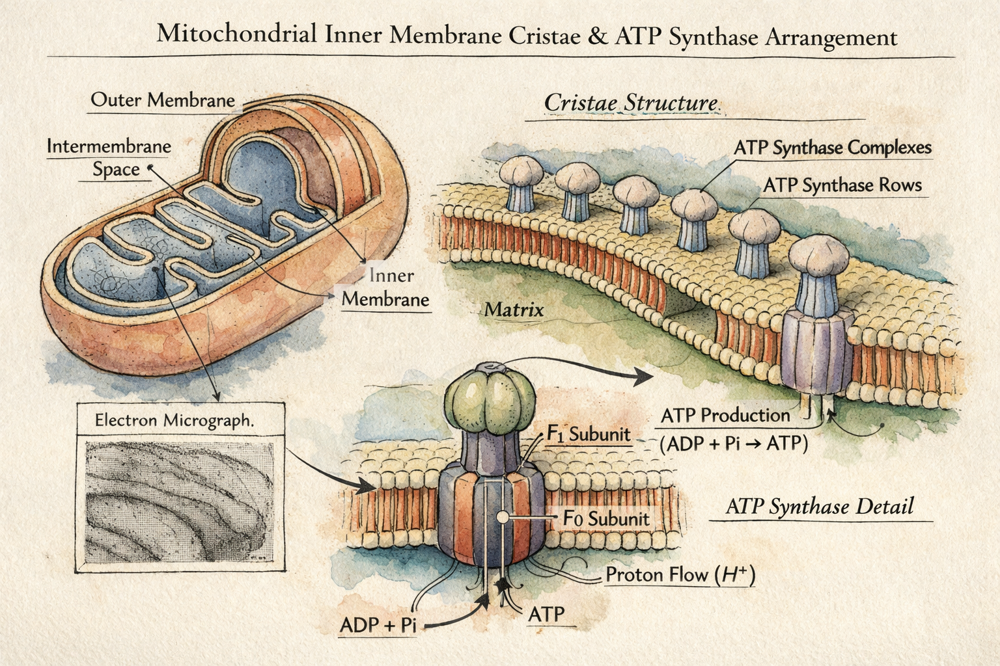</td>
  </tr>
</table>

**Prompt:**

```text
Create a scientific figure about: Mitochondrial inner membrane cristae and ATP synthase arrangement.
Visual style: Watercolor Texture & Ink Line Atlas.
Requirements:
- publication-ready scientific quality
- clear labels and directional arrows where appropriate
- avoid cartoon style, avoid meme style, avoid stock-photo look
- avoid neon glow and over-sharpened CGI look unless explicitly requested
- composition optimized for research papers and academic slides
- category context: micro-structures
- watercolor texture with precise ink line art, hand-drawn but technically accurate
- muted tones and matte color palette, avoid harsh saturated 3D rendering
- natural science atlas / textbook style with rigorous scientific annotation
- subtle cream paper texture background to achieve premium archival look
```

<a id="micro-structures-90b7bcb5"></a>

#### Case 080: Plant chloroplast grana and stroma lamellae cross-view

<table>
  <tr>
    <th>Output</th>
  </tr>
  <tr>
    <td>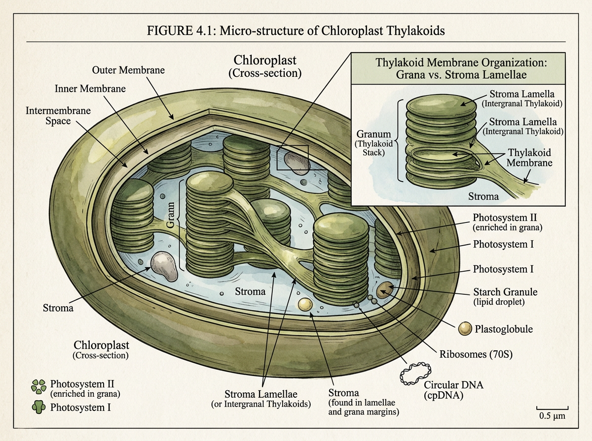</td>
  </tr>
</table>

**Prompt:**

```text
Create a scientific figure about: Plant chloroplast grana and stroma lamellae cross-view.
Visual style: Botanical Field Guide.
Requirements:
- publication-ready scientific quality
- clear labels and directional arrows where appropriate
- avoid cartoon style, avoid meme style, avoid stock-photo look
- avoid neon glow and over-sharpened CGI look unless explicitly requested
- composition optimized for research papers and academic slides
- category context: micro-structures
- field-guide illustration style with disciplined line work and restrained fill color
- taxonomic and anatomical callouts arranged for textbook readability
- natural pigment behavior and paper-friendly texture without painterly chaos
```

<a id="micro-structures-acfcdb1e"></a>

#### Case 081: Gram-positive versus gram-negative bacterial envelope comparison

<table>
  <tr>
    <th>Output</th>
  </tr>
  <tr>
    <td>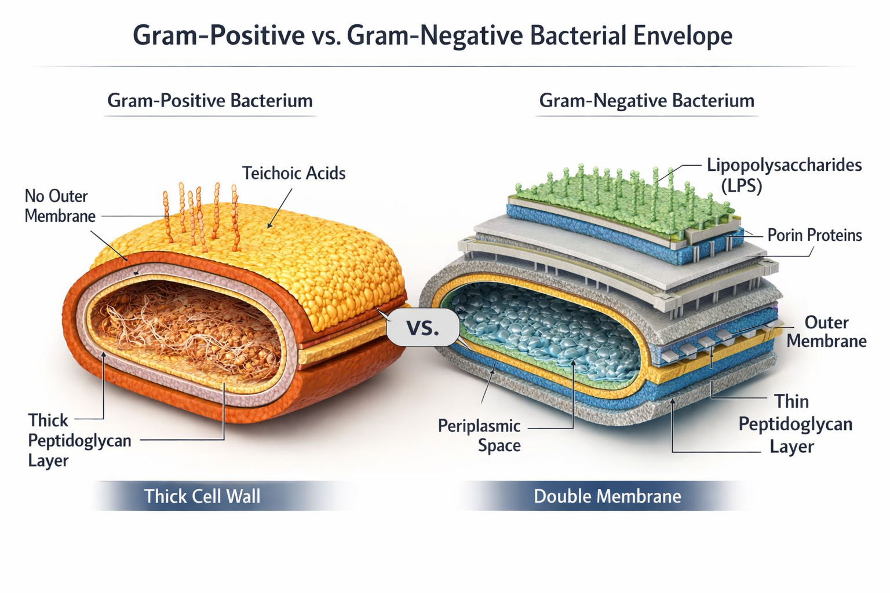</td>
  </tr>
</table>

**Prompt:**

```text
Create a scientific figure about: Gram-positive versus gram-negative bacterial envelope comparison.
Visual style: 3D Cutaway.
Requirements:
- publication-ready scientific quality
- clear labels and directional arrows where appropriate
- avoid cartoon style, avoid meme style, avoid stock-photo look
- avoid neon glow and over-sharpened CGI look unless explicitly requested
- composition optimized for research papers and academic slides
- category context: micro-structures
- semi-3D cutaway rendering with layered transparency
- clear sectional depth and internal component visibility
- avoid photoreal clutter and keep annotation zones clean
```

<a id="micro-structures-db44becf"></a>

#### Case 082: Kidney glomerulus filtration barrier microanatomy

<table>
  <tr>
    <th>Output</th>
  </tr>
  <tr>
    <td>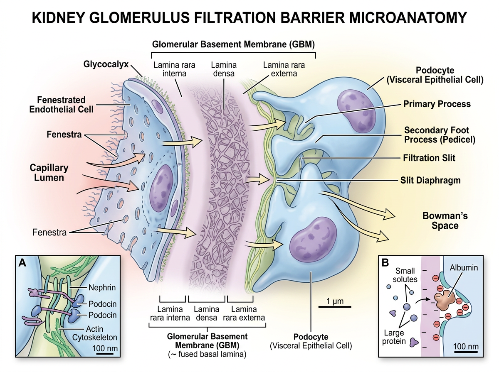</td>
  </tr>
</table>

**Prompt:**

```text
Create a scientific figure about: Kidney glomerulus filtration barrier microanatomy.
Visual style: Soft Biomedical.
Requirements:
- publication-ready scientific quality
- clear labels and directional arrows where appropriate
- avoid cartoon style, avoid meme style, avoid stock-photo look
- avoid neon glow and over-sharpened CGI look unless explicitly requested
- composition optimized for research papers and academic slides
- category context: micro-structures
- subtle soft-shaded biomedical rendering without cartoon style
- clean depth cues and organelle/material differentiation
- balanced pastel-accent palette while retaining scientific rigor
```

<a id="systems-networks"></a>

### システムとネットワーク

<a id="systems-networks-682dfd51"></a>

#### Case 083: Transformer model architecture with attention and feed-forward blocks

<table>
  <tr>
    <th>Output</th>
  </tr>
  <tr>
    <td></td>
  </tr>
</table>

**Prompt:**

```text
Create a scientific figure about: Transformer model architecture with attention and feed-forward blocks.
Visual style: Schematic Minimal.
Requirements:
- publication-ready scientific quality
- clear labels and directional arrows where appropriate
- avoid cartoon style, avoid meme style, avoid stock-photo look
- avoid neon glow and over-sharpened CGI look unless explicitly requested
- composition optimized for research papers and academic slides
- category context: systems-networks
- minimal schematic style with reduced visual noise
- strong information hierarchy using line weight and spacing
- few but meaningful colors for process emphasis
```

<a id="systems-networks-4b6012a0"></a>

#### Case 084: Protein-protein interaction network with modular hubs

<table>
  <tr>
    <th>Output</th>
  </tr>
  <tr>
    <td></td>
  </tr>
</table>

**Prompt:**

```text
Create a scientific figure about: Protein-protein interaction network with modular hubs.
Visual style: Clean Vector.
Requirements:
- publication-ready scientific quality
- clear labels and directional arrows where appropriate
- avoid cartoon style, avoid meme style, avoid stock-photo look
- avoid neon glow and over-sharpened CGI look unless explicitly requested
- composition optimized for research papers and academic slides
- category context: systems-networks
- flat vector look with crisp boundaries and minimal gradients
- white or very light background for publication clarity
- high legibility labels with consistent typography
```

<a id="systems-networks-cbc47c71"></a>

#### Case 085: Clinical data lakehouse architecture with ETL and feature store

<table>
  <tr>
    <th>Output</th>
  </tr>
  <tr>
    <td></td>
  </tr>
</table>

**Prompt:**

```text
Create a scientific figure about: Clinical data lakehouse architecture with ETL and feature store.
Visual style: Isometric Technical.
Requirements:
- publication-ready scientific quality
- clear labels and directional arrows where appropriate
- avoid cartoon style, avoid meme style, avoid stock-photo look
- avoid neon glow and over-sharpened CGI look unless explicitly requested
- composition optimized for research papers and academic slides
- category context: systems-networks
- isometric perspective with precise component geometry
- engineering-style callouts and measured spacing
- moderate blue-gray palette with restrained accent colors
```

<a id="systems-networks-74f9f30b"></a>

#### Case 086: Microservice system topology with gateway and async messaging

<table>
  <tr>
    <th>Output</th>
  </tr>
  <tr>
    <td>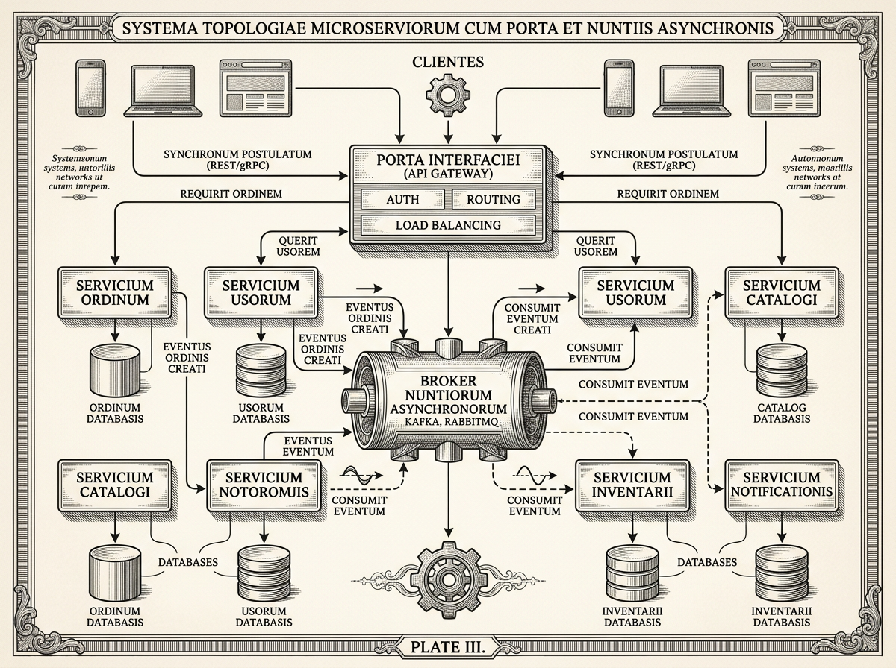</td>
  </tr>
</table>

**Prompt:**

```text
Create a scientific figure about: Microservice system topology with gateway and async messaging.
Visual style: Scientific Engraving Monochrome.
Requirements:
- publication-ready scientific quality
- clear labels and directional arrows where appropriate
- avoid cartoon style, avoid meme style, avoid stock-photo look
- avoid neon glow and over-sharpened CGI look unless explicitly requested
- composition optimized for research papers and academic slides
- category context: systems-networks
- vintage scientific engraving style with fine hatching and contour lines
- monochrome or near-monochrome gray palette with high structural clarity
- plate-like composition similar to historical scientific references
```

<a id="systems-networks-35f9f9bd"></a>

#### Case 087: Metabolic network map linking glycolysis and TCA cycle

<table>
  <tr>
    <th>Output</th>
  </tr>
  <tr>
    <td>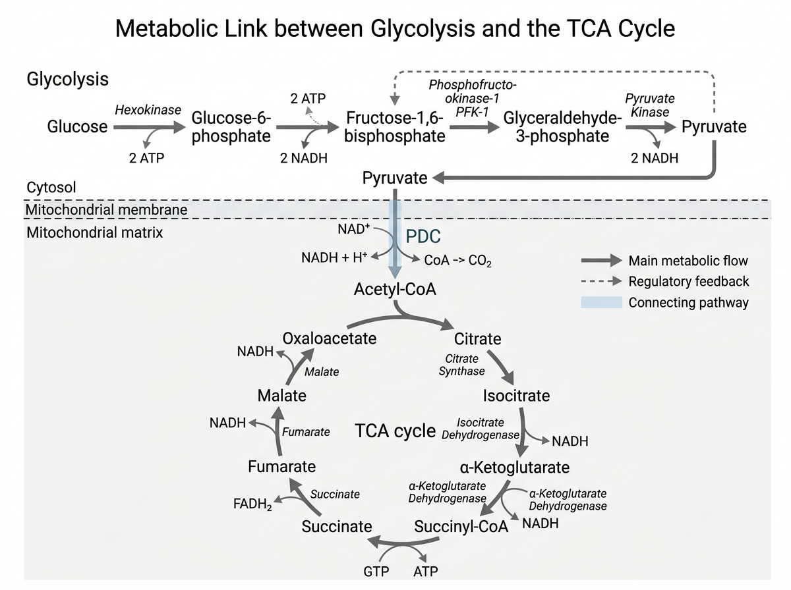</td>
  </tr>
</table>

**Prompt:**

```text
Create a scientific figure about: Metabolic network map linking glycolysis and TCA cycle.
Visual style: Schematic Minimal.
Requirements:
- publication-ready scientific quality
- clear labels and directional arrows where appropriate
- avoid cartoon style, avoid meme style, avoid stock-photo look
- avoid neon glow and over-sharpened CGI look unless explicitly requested
- composition optimized for research papers and academic slides
- category context: systems-networks
- minimal schematic style with reduced visual noise
- strong information hierarchy using line weight and spacing
- few but meaningful colors for process emphasis
```

<a id="systems-networks-7539a99a"></a>

#### Case 088: IoT monitoring architecture from edge sensors to cloud analytics

<table>
  <tr>
    <th>Output</th>
  </tr>
  <tr>
    <td>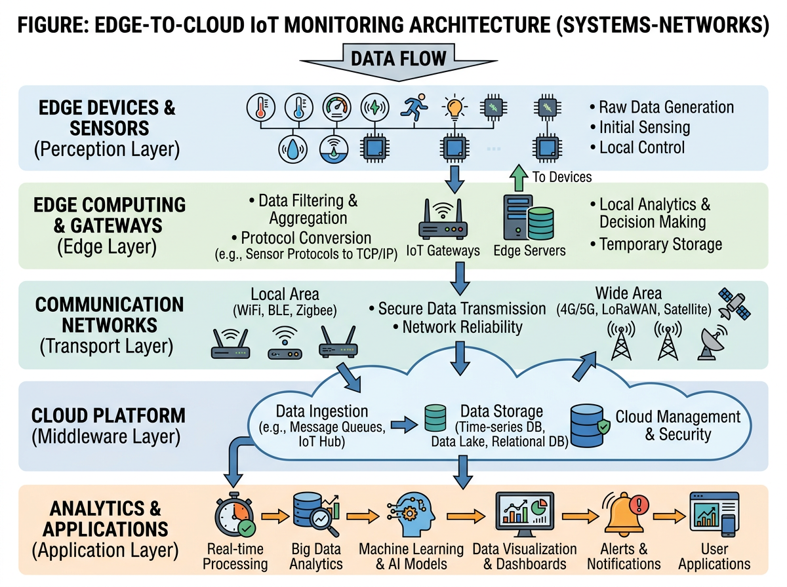</td>
  </tr>
</table>

**Prompt:**

```text
Create a scientific figure about: IoT monitoring architecture from edge sensors to cloud analytics.
Visual style: Clean Vector.
Requirements:
- publication-ready scientific quality
- clear labels and directional arrows where appropriate
- avoid cartoon style, avoid meme style, avoid stock-photo look
- avoid neon glow and over-sharpened CGI look unless explicitly requested
- composition optimized for research papers and academic slides
- category context: systems-networks
- flat vector look with crisp boundaries and minimal gradients
- white or very light background for publication clarity
- high legibility labels with consistent typography
```

<a id="systems-networks-294b6238"></a>

#### Case 089: Transformer model architecture with attention and feed-forward blocks

<table>
  <tr>
    <th>Output</th>
  </tr>
  <tr>
    <td>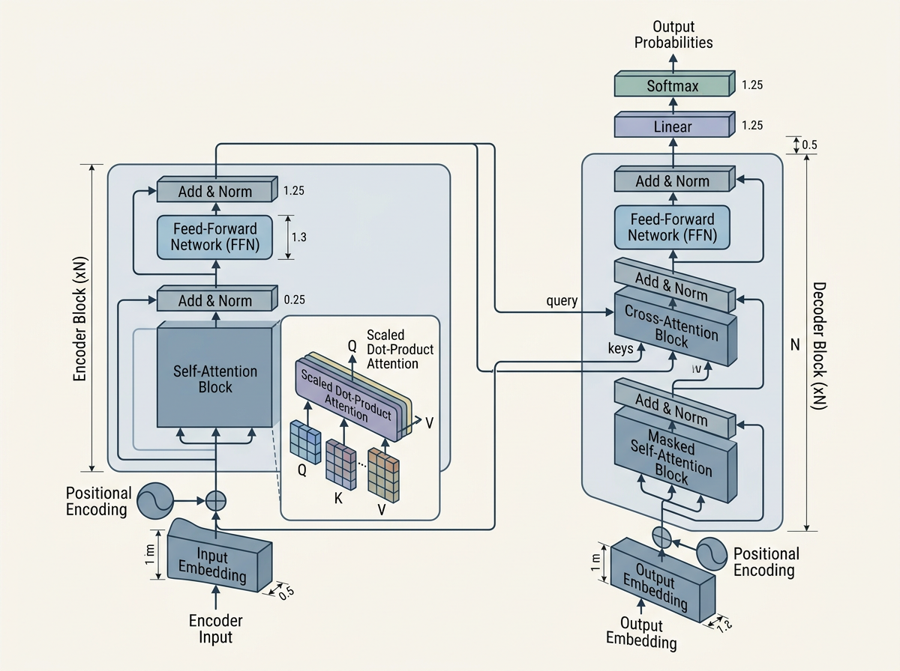</td>
  </tr>
</table>

**Prompt:**

```text
Create a scientific figure about: Transformer model architecture with attention and feed-forward blocks.
Visual style: Isometric Technical.
Requirements:
- publication-ready scientific quality
- clear labels and directional arrows where appropriate
- avoid cartoon style, avoid meme style, avoid stock-photo look
- avoid neon glow and over-sharpened CGI look unless explicitly requested
- composition optimized for research papers and academic slides
- category context: systems-networks
- isometric perspective with precise component geometry
- engineering-style callouts and measured spacing
- moderate blue-gray palette with restrained accent colors
```

<a id="systems-networks-1df4d41a"></a>

#### Case 090: Protein-protein interaction network with modular hubs

<table>
  <tr>
    <th>Output</th>
  </tr>
  <tr>
    <td>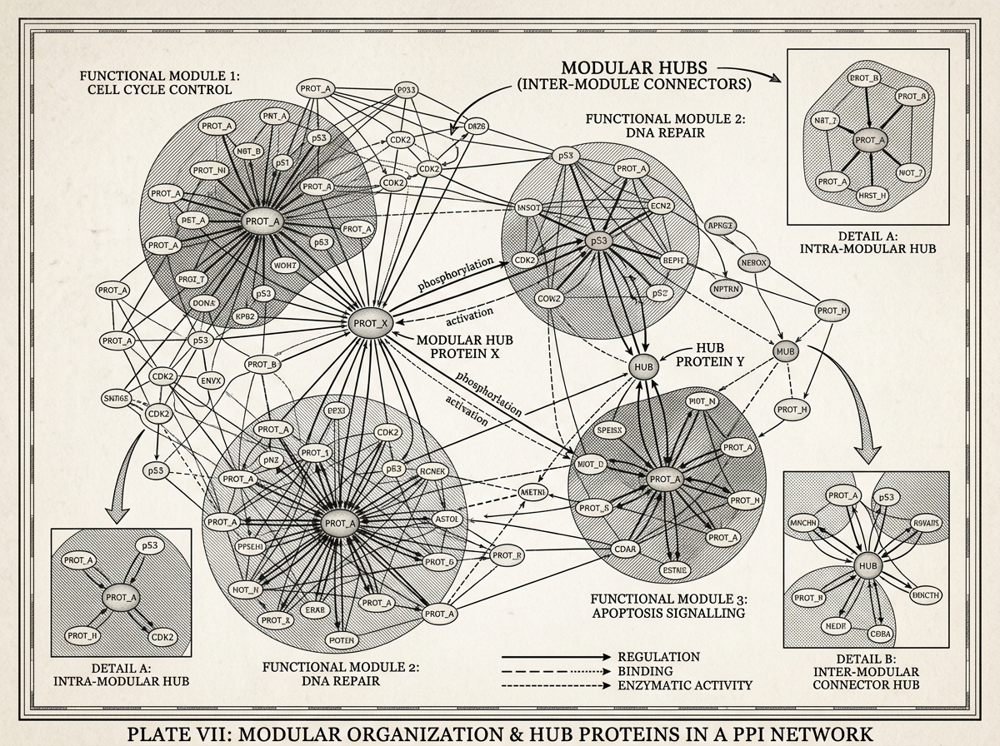</td>
  </tr>
</table>

**Prompt:**

```text
Create a scientific figure about: Protein-protein interaction network with modular hubs.
Visual style: Scientific Engraving Monochrome.
Requirements:
- publication-ready scientific quality
- clear labels and directional arrows where appropriate
- avoid cartoon style, avoid meme style, avoid stock-photo look
- avoid neon glow and over-sharpened CGI look unless explicitly requested
- composition optimized for research papers and academic slides
- category context: systems-networks
- vintage scientific engraving style with fine hatching and contour lines
- monochrome or near-monochrome gray palette with high structural clarity
- plate-like composition similar to historical scientific references
```

<a id="systems-networks-d2f2394e"></a>

#### Case 091: Clinical data lakehouse architecture with ETL and feature store

<table>
  <tr>
    <th>Output</th>
  </tr>
  <tr>
    <td>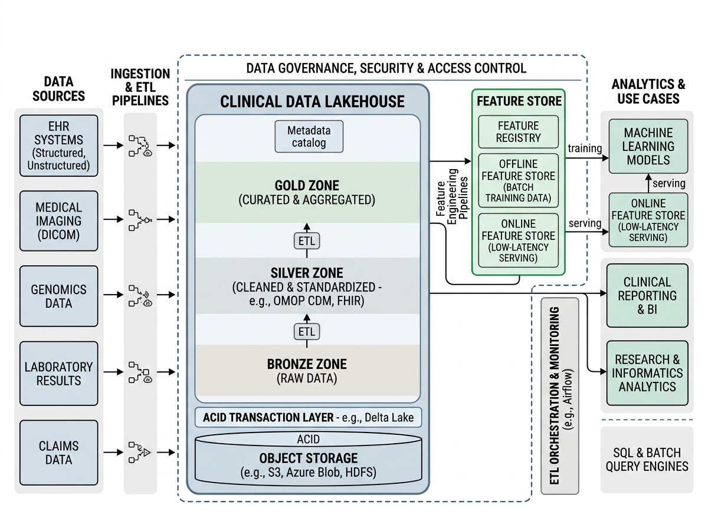</td>
  </tr>
</table>

**Prompt:**

```text
Create a scientific figure about: Clinical data lakehouse architecture with ETL and feature store.
Visual style: Schematic Minimal.
Requirements:
- publication-ready scientific quality
- clear labels and directional arrows where appropriate
- avoid cartoon style, avoid meme style, avoid stock-photo look
- avoid neon glow and over-sharpened CGI look unless explicitly requested
- composition optimized for research papers and academic slides
- category context: systems-networks
- minimal schematic style with reduced visual noise
- strong information hierarchy using line weight and spacing
- few but meaningful colors for process emphasis
```

<a id="systems-networks-f72831fb"></a>

#### Case 092: Microservice system topology with gateway and async messaging

<table>
  <tr>
    <th>Output</th>
  </tr>
  <tr>
    <td>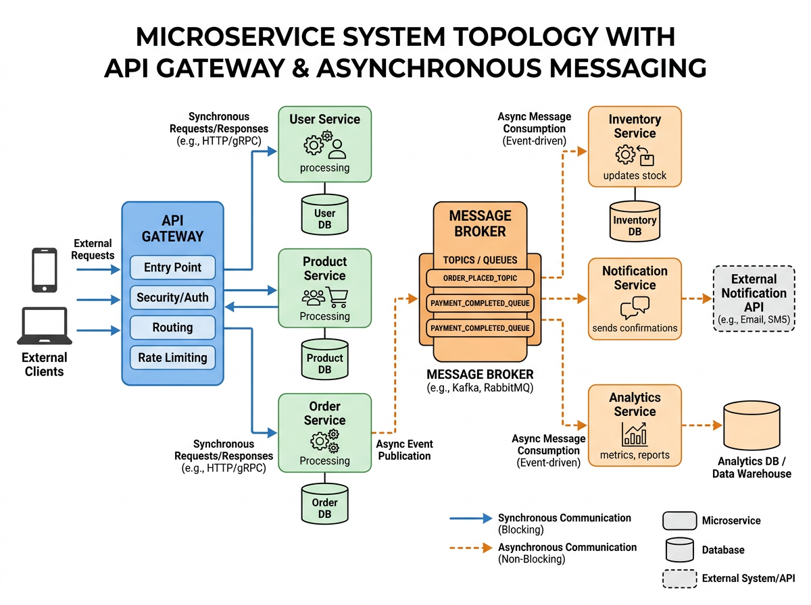</td>
  </tr>
</table>

**Prompt:**

```text
Create a scientific figure about: Microservice system topology with gateway and async messaging.
Visual style: Clean Vector.
Requirements:
- publication-ready scientific quality
- clear labels and directional arrows where appropriate
- avoid cartoon style, avoid meme style, avoid stock-photo look
- avoid neon glow and over-sharpened CGI look unless explicitly requested
- composition optimized for research papers and academic slides
- category context: systems-networks
- flat vector look with crisp boundaries and minimal gradients
- white or very light background for publication clarity
- high legibility labels with consistent typography
```

<a id="systems-networks-348188a1"></a>

#### Case 093: Transformer model architecture with attention and feed-forward blocks

<table>
  <tr>
    <th>Output</th>
  </tr>
  <tr>
    <td>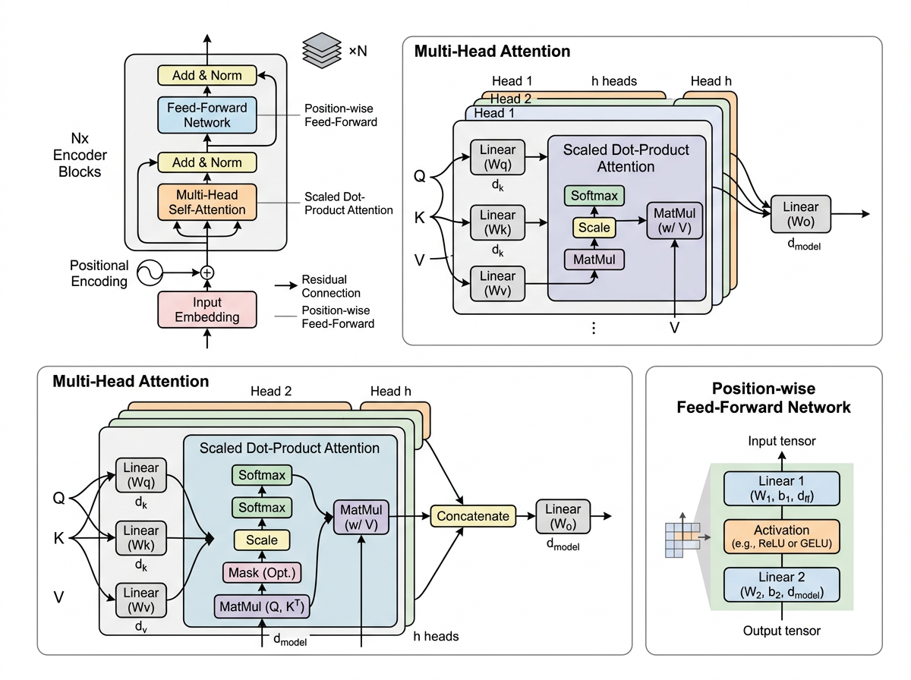</td>
  </tr>
</table>

**Prompt:**

```text
Create a scientific figure about: Transformer model architecture with attention and feed-forward blocks.
Visual style: Schematic Minimal.
Requirements:
- publication-ready scientific quality
- clear labels and directional arrows where appropriate
- avoid cartoon style, avoid meme style, avoid stock-photo look
- avoid neon glow and over-sharpened CGI look unless explicitly requested
- composition optimized for research papers and academic slides
- category context: systems-networks
- minimal schematic style with reduced visual noise
- strong information hierarchy using line weight and spacing
- few but meaningful colors for process emphasis
```

<a id="systems-networks-525fb40f"></a>

#### Case 094: Protein-protein interaction network with modular hubs

<table>
  <tr>
    <th>Output</th>
  </tr>
  <tr>
    <td>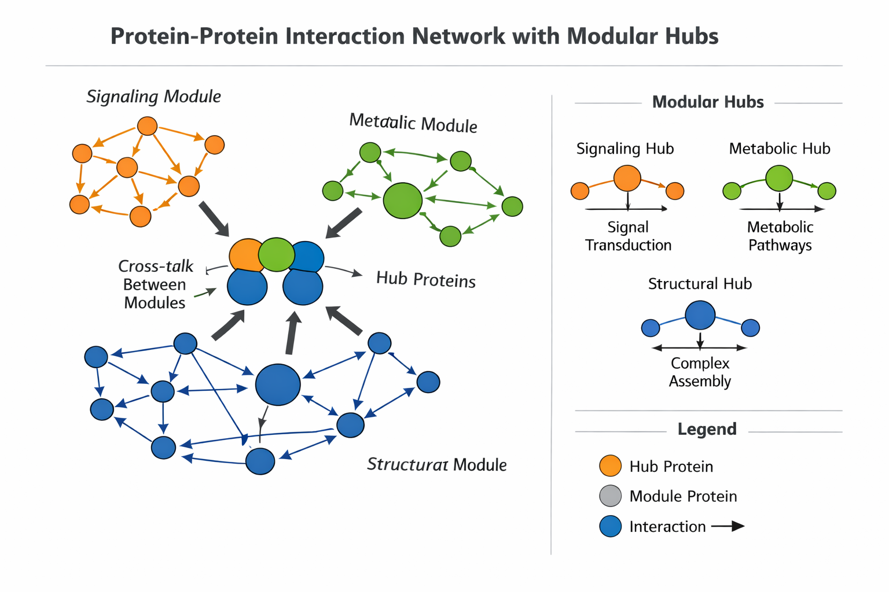</td>
  </tr>
</table>

**Prompt:**

```text
Create a scientific figure about: Protein-protein interaction network with modular hubs.
Visual style: Clean Vector.
Requirements:
- publication-ready scientific quality
- clear labels and directional arrows where appropriate
- avoid cartoon style, avoid meme style, avoid stock-photo look
- avoid neon glow and over-sharpened CGI look unless explicitly requested
- composition optimized for research papers and academic slides
- category context: systems-networks
- flat vector look with crisp boundaries and minimal gradients
- white or very light background for publication clarity
- high legibility labels with consistent typography
```

<a id="systems-networks-1bd885a5"></a>

#### Case 095: Clinical data lakehouse architecture with ETL and feature store

<table>
  <tr>
    <th>Output</th>
  </tr>
  <tr>
    <td>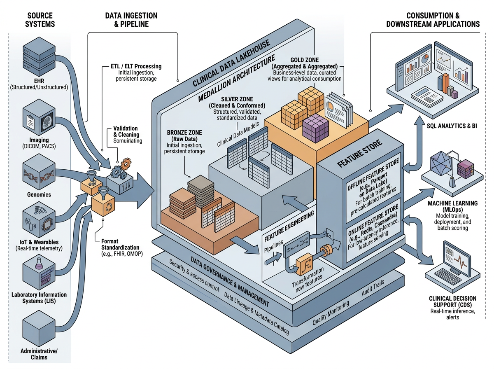</td>
  </tr>
</table>

**Prompt:**

```text
Create a scientific figure about: Clinical data lakehouse architecture with ETL and feature store.
Visual style: Isometric Technical.
Requirements:
- publication-ready scientific quality
- clear labels and directional arrows where appropriate
- avoid cartoon style, avoid meme style, avoid stock-photo look
- avoid neon glow and over-sharpened CGI look unless explicitly requested
- composition optimized for research papers and academic slides
- category context: systems-networks
- isometric perspective with precise component geometry
- engineering-style callouts and measured spacing
- moderate blue-gray palette with restrained accent colors
```

<a id="systems-networks-65d7a14e"></a>

#### Case 096: Microservice system topology with gateway and async messaging

<table>
  <tr>
    <th>Output</th>
  </tr>
  <tr>
    <td>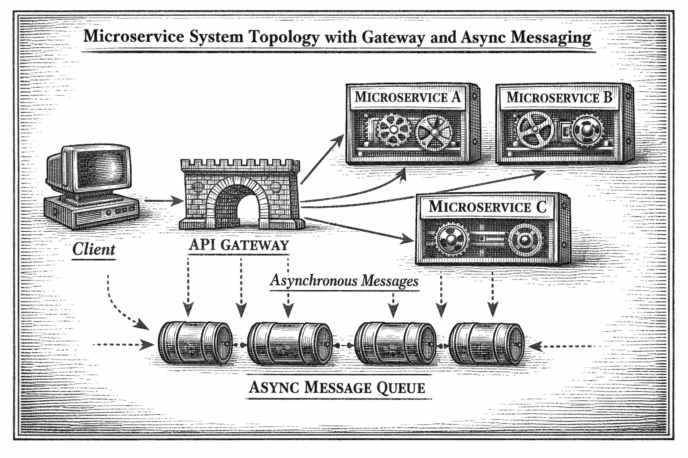</td>
  </tr>
</table>

**Prompt:**

```text
Create a scientific figure about: Microservice system topology with gateway and async messaging.
Visual style: Scientific Engraving Monochrome.
Requirements:
- publication-ready scientific quality
- clear labels and directional arrows where appropriate
- avoid cartoon style, avoid meme style, avoid stock-photo look
- avoid neon glow and over-sharpened CGI look unless explicitly requested
- composition optimized for research papers and academic slides
- category context: systems-networks
- vintage scientific engraving style with fine hatching and contour lines
- monochrome or near-monochrome gray palette with high structural clarity
- plate-like composition similar to historical scientific references
```

<a id="systems-networks-6e7ca7f4"></a>

#### Case 097: Metabolic network map linking glycolysis and TCA cycle

<table>
  <tr>
    <th>Output</th>
  </tr>
  <tr>
    <td>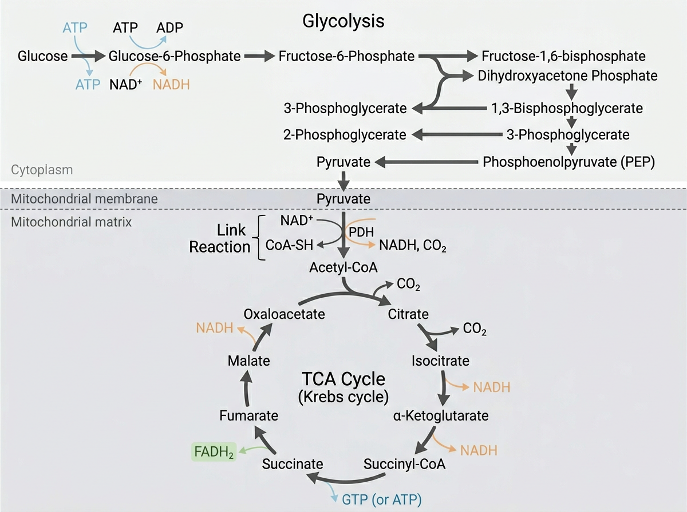</td>
  </tr>
</table>

**Prompt:**

```text
Create a scientific figure about: Metabolic network map linking glycolysis and TCA cycle.
Visual style: Schematic Minimal.
Requirements:
- publication-ready scientific quality
- clear labels and directional arrows where appropriate
- avoid cartoon style, avoid meme style, avoid stock-photo look
- avoid neon glow and over-sharpened CGI look unless explicitly requested
- composition optimized for research papers and academic slides
- category context: systems-networks
- minimal schematic style with reduced visual noise
- strong information hierarchy using line weight and spacing
- few but meaningful colors for process emphasis
```

<a id="journal-covers"></a>

### ジャーナルカバー

<a id="journal-covers-aa31d030"></a>

#### Case 098: DNA helicase unwinding chromatin under dramatic molecular lighting

<table>
  <tr>
    <th>Output</th>
  </tr>
  <tr>
    <td></td>
  </tr>
</table>

**Prompt:**

```text
Create a scientific figure about: DNA helicase unwinding chromatin under dramatic molecular lighting.
Visual style: Journal Cover Cinematic.
Requirements:
- publication-ready scientific quality
- clear labels and directional arrows where appropriate
- avoid cartoon style, avoid meme style, avoid stock-photo look
- avoid neon glow and over-sharpened CGI look unless explicitly requested
- composition optimized for research papers and academic slides
- category context: journal-covers
- high-impact cinematic lighting with strong focal hierarchy
- dark-to-bright gradient atmosphere and publication cover composition
- scientifically plausible structures and anatomically coherent details
```

<a id="journal-covers-ae51b74d"></a>

#### Case 099: Brain-wide connectome rendered as luminous neural constellations

<table>
  <tr>
    <th>Output</th>
  </tr>
  <tr>
    <td></td>
  </tr>
</table>

**Prompt:**

```text
Create a scientific figure about: Brain-wide connectome rendered as luminous neural constellations.
Visual style: Watercolor Texture & Ink Line Atlas.
Requirements:
- publication-ready scientific quality
- clear labels and directional arrows where appropriate
- avoid cartoon style, avoid meme style, avoid stock-photo look
- avoid neon glow and over-sharpened CGI look unless explicitly requested
- composition optimized for research papers and academic slides
- category context: journal-covers
- watercolor texture with precise ink line art, hand-drawn but technically accurate
- muted tones and matte color palette, avoid harsh saturated 3D rendering
- natural science atlas / textbook style with rigorous scientific annotation
- subtle cream paper texture background to achieve premium archival look
```

<a id="journal-covers-0d787d80"></a>

#### Case 100: Deep-sea hydrothermal vent ecosystem with bioluminescent species

<table>
  <tr>
    <th>Output</th>
  </tr>
  <tr>
    <td></td>
  </tr>
</table>

**Prompt:**

```text
Create a scientific figure about: Deep-sea hydrothermal vent ecosystem with bioluminescent species.
Visual style: Soft Biomedical.
Requirements:
- publication-ready scientific quality
- clear labels and directional arrows where appropriate
- avoid cartoon style, avoid meme style, avoid stock-photo look
- avoid neon glow and over-sharpened CGI look unless explicitly requested
- composition optimized for research papers and academic slides
- category context: journal-covers
- subtle soft-shaded biomedical rendering without cartoon style
- clean depth cues and organelle/material differentiation
- balanced pastel-accent palette while retaining scientific rigor
```

<a id="journal-covers-b68acc70"></a>

#### Case 101: Stem-cell differentiation tree radiating into organ lineages

<table>
  <tr>
    <th>Output</th>
  </tr>
  <tr>
    <td>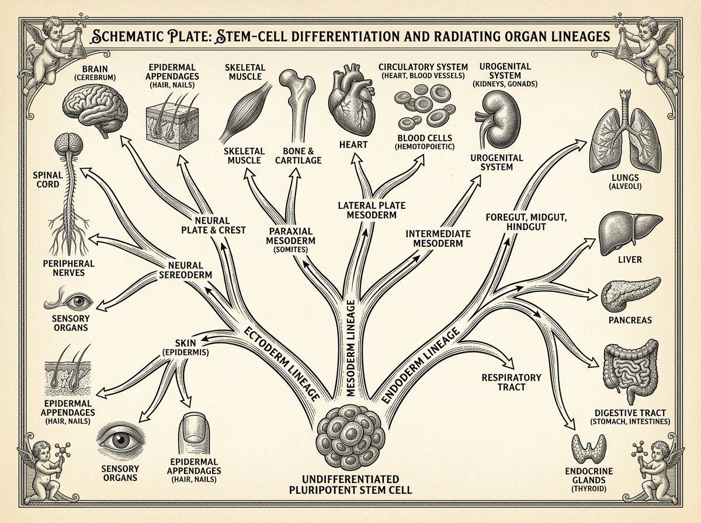</td>
  </tr>
</table>

**Prompt:**

```text
Create a scientific figure about: Stem-cell differentiation tree radiating into organ lineages.
Visual style: Scientific Engraving Monochrome.
Requirements:
- publication-ready scientific quality
- clear labels and directional arrows where appropriate
- avoid cartoon style, avoid meme style, avoid stock-photo look
- avoid neon glow and over-sharpened CGI look unless explicitly requested
- composition optimized for research papers and academic slides
- category context: journal-covers
- vintage scientific engraving style with fine hatching and contour lines
- monochrome or near-monochrome gray palette with high structural clarity
- plate-like composition similar to historical scientific references
```

<a id="journal-covers-16e6845e"></a>

#### Case 102: Nanorobots targeting tumor microenvironment inside blood vessels

<table>
  <tr>
    <th>Output</th>
  </tr>
  <tr>
    <td>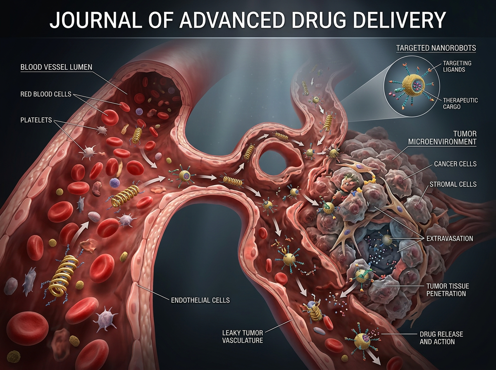</td>
  </tr>
</table>

**Prompt:**

```text
Create a scientific figure about: Nanorobots targeting tumor microenvironment inside blood vessels.
Visual style: Journal Cover Cinematic.
Requirements:
- publication-ready scientific quality
- clear labels and directional arrows where appropriate
- avoid cartoon style, avoid meme style, avoid stock-photo look
- avoid neon glow and over-sharpened CGI look unless explicitly requested
- composition optimized for research papers and academic slides
- category context: journal-covers
- high-impact cinematic lighting with strong focal hierarchy
- dark-to-bright gradient atmosphere and publication cover composition
- scientifically plausible structures and anatomically coherent details
```

<a id="journal-covers-f9cb4fe4"></a>

#### Case 103: Quantum-inspired molecular orbitals over abstract crystal lattice

<table>
  <tr>
    <th>Output</th>
  </tr>
  <tr>
    <td>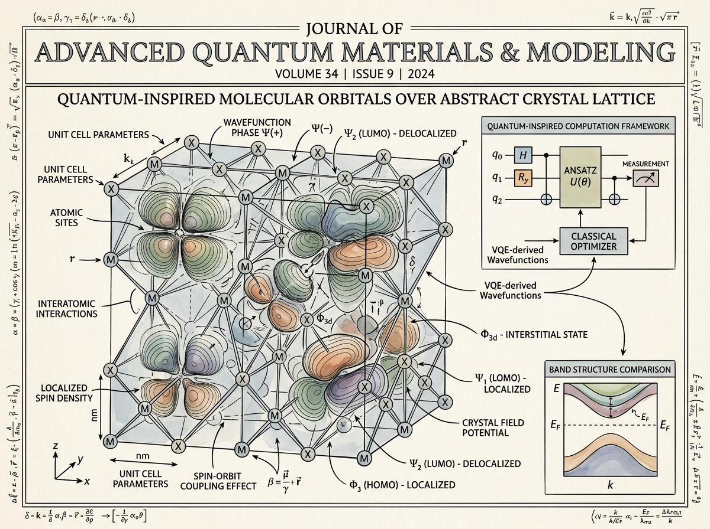</td>
  </tr>
</table>

**Prompt:**

```text
Create a scientific figure about: Quantum-inspired molecular orbitals over abstract crystal lattice.
Visual style: Watercolor Texture & Ink Line Atlas.
Requirements:
- publication-ready scientific quality
- clear labels and directional arrows where appropriate
- avoid cartoon style, avoid meme style, avoid stock-photo look
- avoid neon glow and over-sharpened CGI look unless explicitly requested
- composition optimized for research papers and academic slides
- category context: journal-covers
- watercolor texture with precise ink line art, hand-drawn but technically accurate
- muted tones and matte color palette, avoid harsh saturated 3D rendering
- natural science atlas / textbook style with rigorous scientific annotation
- subtle cream paper texture background to achieve premium archival look
```

<a id="journal-covers-4cbd0b8b"></a>

#### Case 104: DNA helicase unwinding chromatin under dramatic molecular lighting

<table>
  <tr>
    <th>Output</th>
  </tr>
  <tr>
    <td>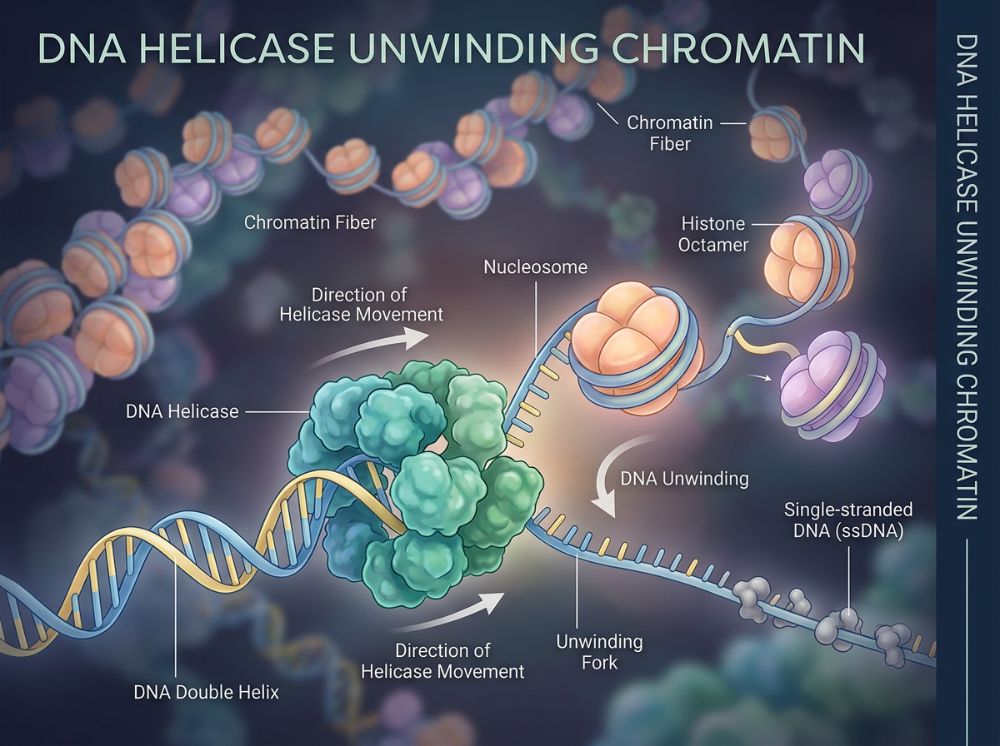</td>
  </tr>
</table>

**Prompt:**

```text
Create a scientific figure about: DNA helicase unwinding chromatin under dramatic molecular lighting.
Visual style: Soft Biomedical.
Requirements:
- publication-ready scientific quality
- clear labels and directional arrows where appropriate
- avoid cartoon style, avoid meme style, avoid stock-photo look
- avoid neon glow and over-sharpened CGI look unless explicitly requested
- composition optimized for research papers and academic slides
- category context: journal-covers
- subtle soft-shaded biomedical rendering without cartoon style
- clean depth cues and organelle/material differentiation
- balanced pastel-accent palette while retaining scientific rigor
```

<a id="journal-covers-ece8f026"></a>

#### Case 105: Brain-wide connectome rendered as luminous neural constellations

<table>
  <tr>
    <th>Output</th>
  </tr>
  <tr>
    <td>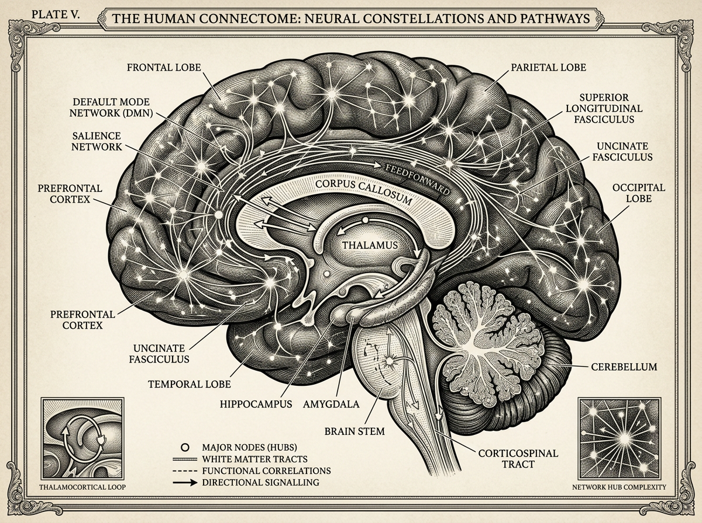</td>
  </tr>
</table>

**Prompt:**

```text
Create a scientific figure about: Brain-wide connectome rendered as luminous neural constellations.
Visual style: Scientific Engraving Monochrome.
Requirements:
- publication-ready scientific quality
- clear labels and directional arrows where appropriate
- avoid cartoon style, avoid meme style, avoid stock-photo look
- avoid neon glow and over-sharpened CGI look unless explicitly requested
- composition optimized for research papers and academic slides
- category context: journal-covers
- vintage scientific engraving style with fine hatching and contour lines
- monochrome or near-monochrome gray palette with high structural clarity
- plate-like composition similar to historical scientific references
```

<a id="journal-covers-3cd6c265"></a>

#### Case 106: Deep-sea hydrothermal vent ecosystem with bioluminescent species

<table>
  <tr>
    <th>Output</th>
  </tr>
  <tr>
    <td>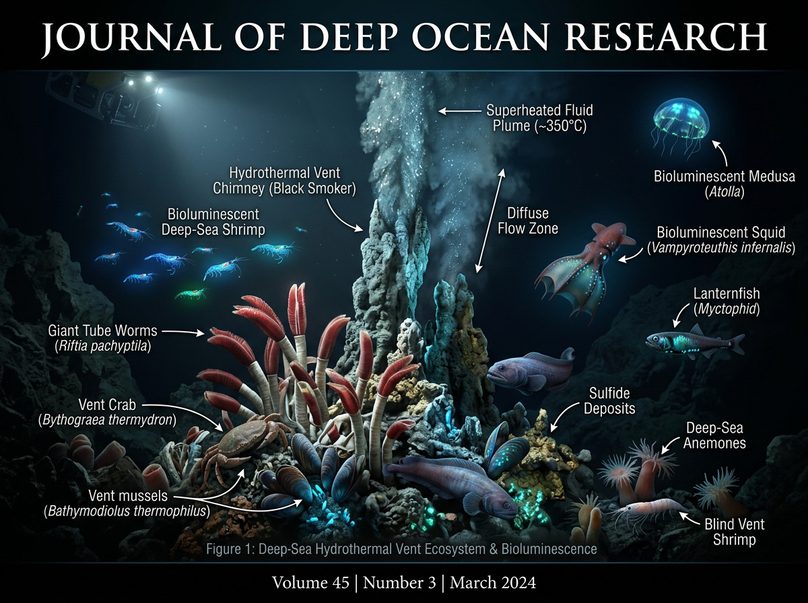</td>
  </tr>
</table>

**Prompt:**

```text
Create a scientific figure about: Deep-sea hydrothermal vent ecosystem with bioluminescent species.
Visual style: Journal Cover Cinematic.
Requirements:
- publication-ready scientific quality
- clear labels and directional arrows where appropriate
- avoid cartoon style, avoid meme style, avoid stock-photo look
- avoid neon glow and over-sharpened CGI look unless explicitly requested
- composition optimized for research papers and academic slides
- category context: journal-covers
- high-impact cinematic lighting with strong focal hierarchy
- dark-to-bright gradient atmosphere and publication cover composition
- scientifically plausible structures and anatomically coherent details
```

<a id="journal-covers-1b3dd600"></a>

#### Case 107: Stem-cell differentiation tree radiating into organ lineages

<table>
  <tr>
    <th>Output</th>
  </tr>
  <tr>
    <td>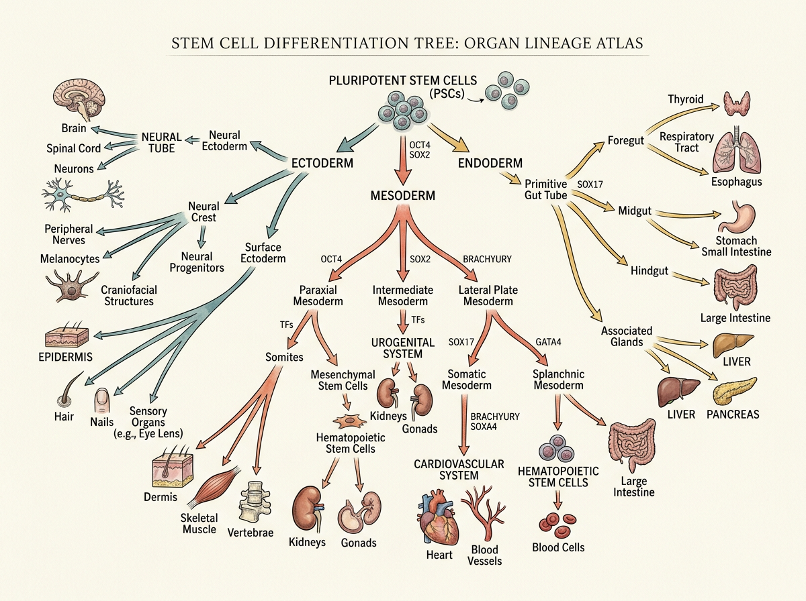</td>
  </tr>
</table>

**Prompt:**

```text
Create a scientific figure about: Stem-cell differentiation tree radiating into organ lineages.
Visual style: Watercolor Texture & Ink Line Atlas.
Requirements:
- publication-ready scientific quality
- clear labels and directional arrows where appropriate
- avoid cartoon style, avoid meme style, avoid stock-photo look
- avoid neon glow and over-sharpened CGI look unless explicitly requested
- composition optimized for research papers and academic slides
- category context: journal-covers
- watercolor texture with precise ink line art, hand-drawn but technically accurate
- muted tones and matte color palette, avoid harsh saturated 3D rendering
- natural science atlas / textbook style with rigorous scientific annotation
- subtle cream paper texture background to achieve premium archival look
```

<a id="journal-covers-776943c1"></a>

#### Case 108: DNA helicase unwinding chromatin under dramatic molecular lighting

<table>
  <tr>
    <th>Output</th>
  </tr>
  <tr>
    <td>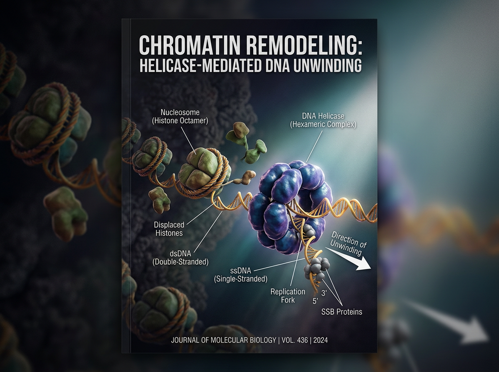</td>
  </tr>
</table>

**Prompt:**

```text
Create a scientific figure about: DNA helicase unwinding chromatin under dramatic molecular lighting.
Visual style: Journal Cover Cinematic.
Requirements:
- publication-ready scientific quality
- clear labels and directional arrows where appropriate
- avoid cartoon style, avoid meme style, avoid stock-photo look
- avoid neon glow and over-sharpened CGI look unless explicitly requested
- composition optimized for research papers and academic slides
- category context: journal-covers
- high-impact cinematic lighting with strong focal hierarchy
- dark-to-bright gradient atmosphere and publication cover composition
- scientifically plausible structures and anatomically coherent details
```

<a id="journal-covers-38ea3a7a"></a>

#### Case 109: Brain-wide connectome rendered as luminous neural constellations

<table>
  <tr>
    <th>Output</th>
  </tr>
  <tr>
    <td>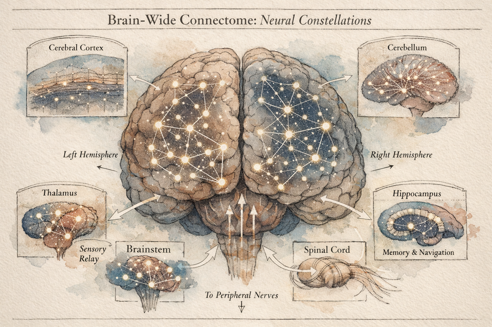</td>
  </tr>
</table>

**Prompt:**

```text
Create a scientific figure about: Brain-wide connectome rendered as luminous neural constellations.
Visual style: Watercolor Texture & Ink Line Atlas.
Requirements:
- publication-ready scientific quality
- clear labels and directional arrows where appropriate
- avoid cartoon style, avoid meme style, avoid stock-photo look
- avoid neon glow and over-sharpened CGI look unless explicitly requested
- composition optimized for research papers and academic slides
- category context: journal-covers
- watercolor texture with precise ink line art, hand-drawn but technically accurate
- muted tones and matte color palette, avoid harsh saturated 3D rendering
- natural science atlas / textbook style with rigorous scientific annotation
- subtle cream paper texture background to achieve premium archival look
```

<a id="journal-covers-09b8c4ce"></a>

#### Case 110: Deep-sea hydrothermal vent ecosystem with bioluminescent species

<table>
  <tr>
    <th>Output</th>
  </tr>
  <tr>
    <td>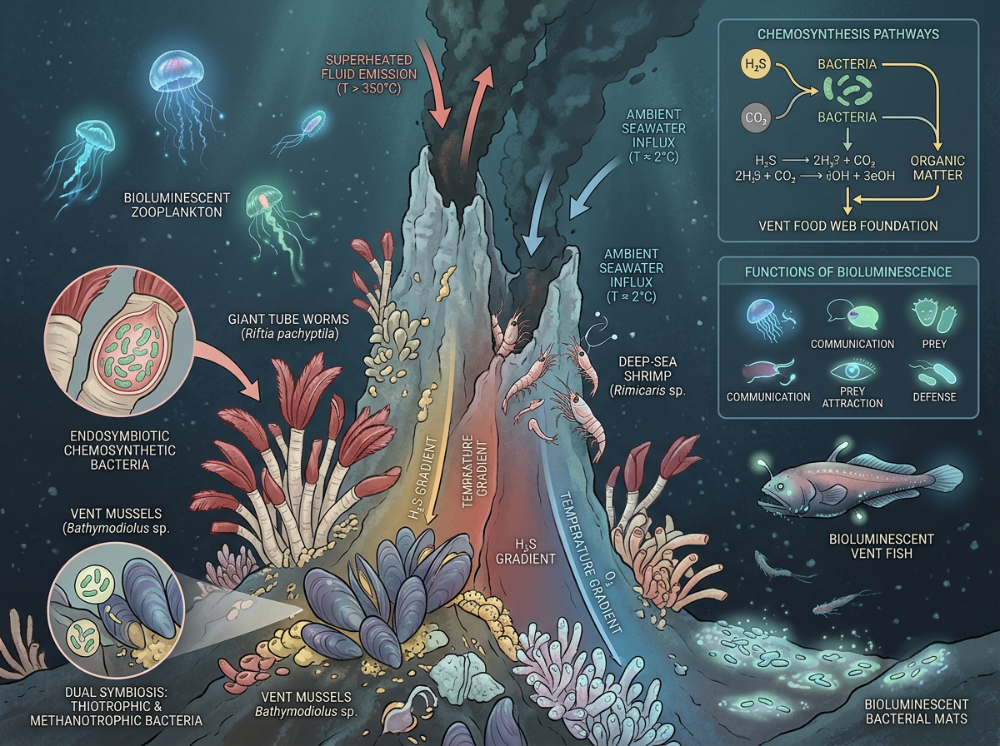</td>
  </tr>
</table>

**Prompt:**

```text
Create a scientific figure about: Deep-sea hydrothermal vent ecosystem with bioluminescent species.
Visual style: Soft Biomedical.
Requirements:
- publication-ready scientific quality
- clear labels and directional arrows where appropriate
- avoid cartoon style, avoid meme style, avoid stock-photo look
- avoid neon glow and over-sharpened CGI look unless explicitly requested
- composition optimized for research papers and academic slides
- category context: journal-covers
- subtle soft-shaded biomedical rendering without cartoon style
- clean depth cues and organelle/material differentiation
- balanced pastel-accent palette while retaining scientific rigor
```

<a id="journal-covers-576361fe"></a>

#### Case 111: Stem-cell differentiation tree radiating into organ lineages

<table>
  <tr>
    <th>Output</th>
  </tr>
  <tr>
    <td>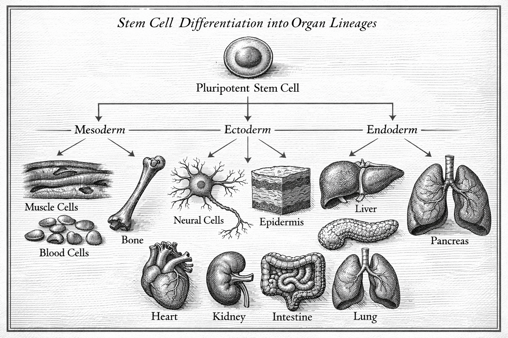</td>
  </tr>
</table>

**Prompt:**

```text
Create a scientific figure about: Stem-cell differentiation tree radiating into organ lineages.
Visual style: Scientific Engraving Monochrome.
Requirements:
- publication-ready scientific quality
- clear labels and directional arrows where appropriate
- avoid cartoon style, avoid meme style, avoid stock-photo look
- avoid neon glow and over-sharpened CGI look unless explicitly requested
- composition optimized for research papers and academic slides
- category context: journal-covers
- vintage scientific engraving style with fine hatching and contour lines
- monochrome or near-monochrome gray palette with high structural clarity
- plate-like composition similar to historical scientific references
```

<a id="journal-covers-05e70764"></a>

#### Case 112: Nanorobots targeting tumor microenvironment inside blood vessels

<table>
  <tr>
    <th>Output</th>
  </tr>
  <tr>
    <td>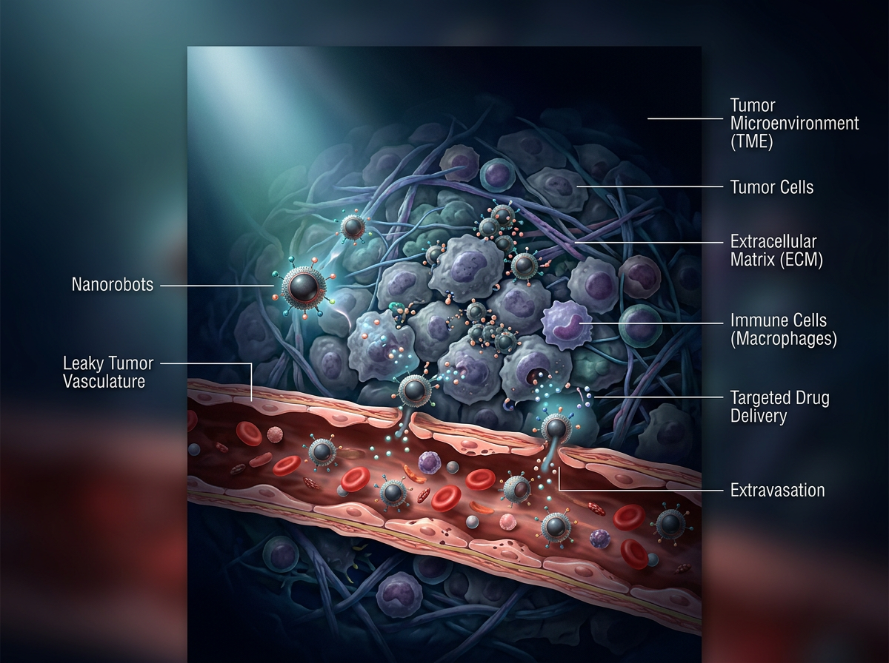</td>
  </tr>
</table>

**Prompt:**

```text
Create a scientific figure about: Nanorobots targeting tumor microenvironment inside blood vessels.
Visual style: Journal Cover Cinematic.
Requirements:
- publication-ready scientific quality
- clear labels and directional arrows where appropriate
- avoid cartoon style, avoid meme style, avoid stock-photo look
- avoid neon glow and over-sharpened CGI look unless explicitly requested
- composition optimized for research papers and academic slides
- category context: journal-covers
- high-impact cinematic lighting with strong focal hierarchy
- dark-to-bright gradient atmosphere and publication cover composition
- scientifically plausible structures and anatomically coherent details
```

<a id="cross-sections-layers"></a>

### 断面とレイヤー

<a id="cross-sections-layers-e3bc5561"></a>

#### Case 113: Human skin cross-section with epidermis, dermis, and appendages

<table>
  <tr>
    <th>Output</th>
  </tr>
  <tr>
    <td></td>
  </tr>
</table>

**Prompt:**

```text
Create a scientific figure about: Human skin cross-section with epidermis, dermis, and appendages.
Visual style: 3D Cutaway.
Requirements:
- publication-ready scientific quality
- clear labels and directional arrows where appropriate
- avoid cartoon style, avoid meme style, avoid stock-photo look
- avoid neon glow and over-sharpened CGI look unless explicitly requested
- composition optimized for research papers and academic slides
- category context: cross-sections-layers
- semi-3D cutaway rendering with layered transparency
- clear sectional depth and internal component visibility
- avoid photoreal clutter and keep annotation zones clean
```

<a id="cross-sections-layers-7502feef"></a>

#### Case 114: Perovskite-silicon tandem solar cell layered stack

<table>
  <tr>
    <th>Output</th>
  </tr>
  <tr>
    <td></td>
  </tr>
</table>

**Prompt:**

```text
Create a scientific figure about: Perovskite-silicon tandem solar cell layered stack.
Visual style: Watercolor Texture & Ink Line Atlas.
Requirements:
- publication-ready scientific quality
- clear labels and directional arrows where appropriate
- avoid cartoon style, avoid meme style, avoid stock-photo look
- avoid neon glow and over-sharpened CGI look unless explicitly requested
- composition optimized for research papers and academic slides
- category context: cross-sections-layers
- watercolor texture with precise ink line art, hand-drawn but technically accurate
- muted tones and matte color palette, avoid harsh saturated 3D rendering
- natural science atlas / textbook style with rigorous scientific annotation
- subtle cream paper texture background to achieve premium archival look
```

<a id="cross-sections-layers-91f406a1"></a>

#### Case 115: Earth interior with mantle convection and core boundaries

<table>
  <tr>
    <th>Output</th>
  </tr>
  <tr>
    <td></td>
  </tr>
</table>

**Prompt:**

```text
Create a scientific figure about: Earth interior with mantle convection and core boundaries.
Visual style: Botanical Field Guide.
Requirements:
- publication-ready scientific quality
- clear labels and directional arrows where appropriate
- avoid cartoon style, avoid meme style, avoid stock-photo look
- avoid neon glow and over-sharpened CGI look unless explicitly requested
- composition optimized for research papers and academic slides
- category context: cross-sections-layers
- field-guide illustration style with disciplined line work and restrained fill color
- taxonomic and anatomical callouts arranged for textbook readability
- natural pigment behavior and paper-friendly texture without painterly chaos
```

<a id="cross-sections-layers-63f0ead7"></a>

#### Case 116: Leaf anatomy cross-section with vascular bundles and stomata

<table>
  <tr>
    <th>Output</th>
  </tr>
  <tr>
    <td>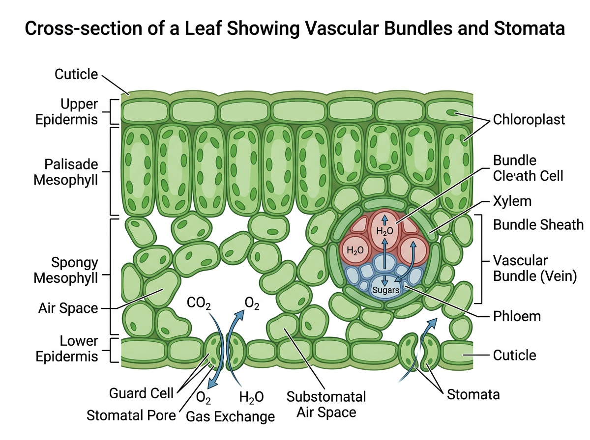</td>
  </tr>
</table>

**Prompt:**

```text
Create a scientific figure about: Leaf anatomy cross-section with vascular bundles and stomata.
Visual style: Clean Vector.
Requirements:
- publication-ready scientific quality
- clear labels and directional arrows where appropriate
- avoid cartoon style, avoid meme style, avoid stock-photo look
- avoid neon glow and over-sharpened CGI look unless explicitly requested
- composition optimized for research papers and academic slides
- category context: cross-sections-layers
- flat vector look with crisp boundaries and minimal gradients
- white or very light background for publication clarity
- high legibility labels with consistent typography
```

<a id="cross-sections-layers-767fd931"></a>

#### Case 117: Retina layered organization from photoreceptors to ganglion cells

<table>
  <tr>
    <th>Output</th>
  </tr>
  <tr>
    <td>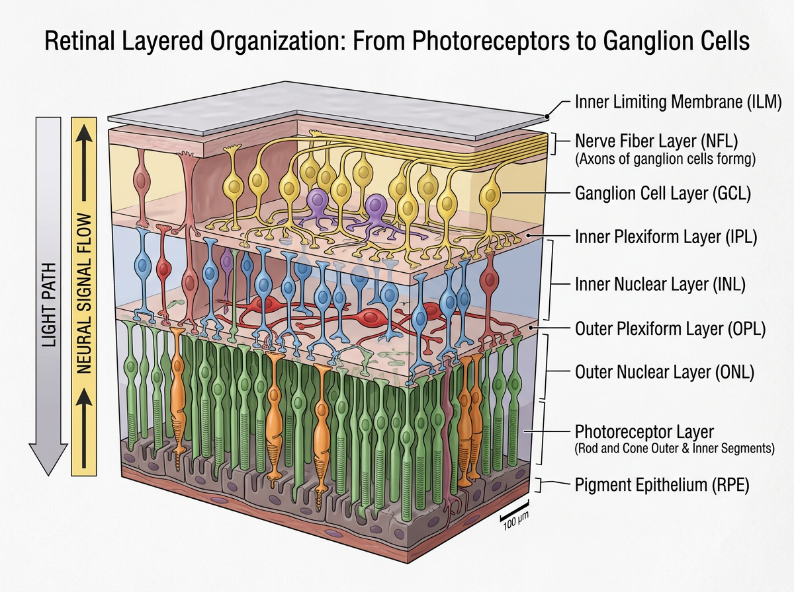</td>
  </tr>
</table>

**Prompt:**

```text
Create a scientific figure about: Retina layered organization from photoreceptors to ganglion cells.
Visual style: 3D Cutaway.
Requirements:
- publication-ready scientific quality
- clear labels and directional arrows where appropriate
- avoid cartoon style, avoid meme style, avoid stock-photo look
- avoid neon glow and over-sharpened CGI look unless explicitly requested
- composition optimized for research papers and academic slides
- category context: cross-sections-layers
- semi-3D cutaway rendering with layered transparency
- clear sectional depth and internal component visibility
- avoid photoreal clutter and keep annotation zones clean
```

<a id="cross-sections-layers-50205ddf"></a>

#### Case 118: Lithium-ion battery cross-sectional transport pathways

<table>
  <tr>
    <th>Output</th>
  </tr>
  <tr>
    <td>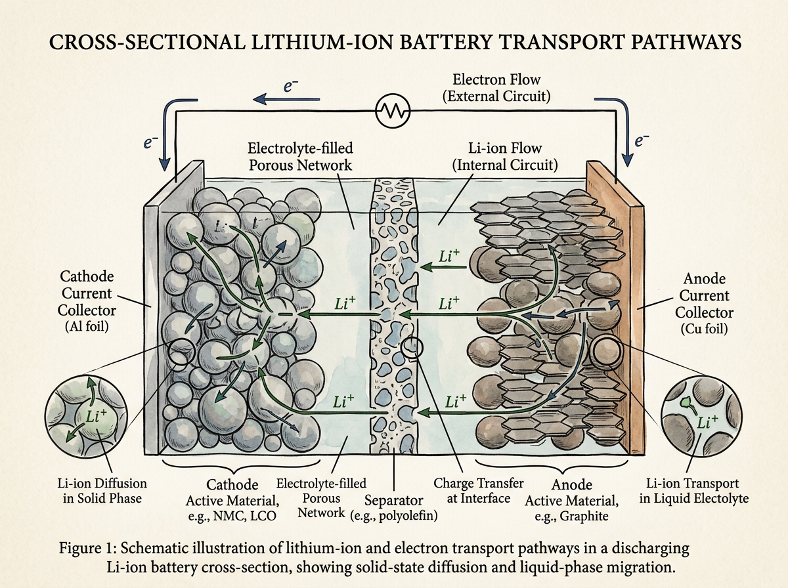</td>
  </tr>
</table>

**Prompt:**

```text
Create a scientific figure about: Lithium-ion battery cross-sectional transport pathways.
Visual style: Watercolor Texture & Ink Line Atlas.
Requirements:
- publication-ready scientific quality
- clear labels and directional arrows where appropriate
- avoid cartoon style, avoid meme style, avoid stock-photo look
- avoid neon glow and over-sharpened CGI look unless explicitly requested
- composition optimized for research papers and academic slides
- category context: cross-sections-layers
- watercolor texture with precise ink line art, hand-drawn but technically accurate
- muted tones and matte color palette, avoid harsh saturated 3D rendering
- natural science atlas / textbook style with rigorous scientific annotation
- subtle cream paper texture background to achieve premium archival look
```

<a id="cross-sections-layers-5876c066"></a>

#### Case 119: Human skin cross-section with epidermis, dermis, and appendages

<table>
  <tr>
    <th>Output</th>
  </tr>
  <tr>
    <td>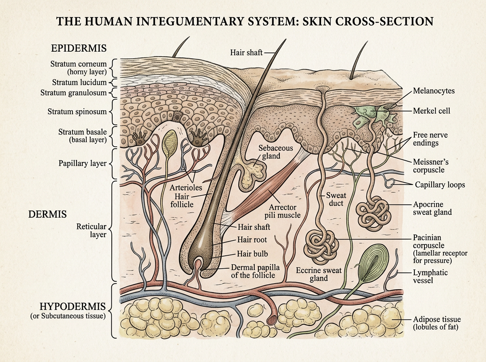</td>
  </tr>
</table>

**Prompt:**

```text
Create a scientific figure about: Human skin cross-section with epidermis, dermis, and appendages.
Visual style: Botanical Field Guide.
Requirements:
- publication-ready scientific quality
- clear labels and directional arrows where appropriate
- avoid cartoon style, avoid meme style, avoid stock-photo look
- avoid neon glow and over-sharpened CGI look unless explicitly requested
- composition optimized for research papers and academic slides
- category context: cross-sections-layers
- field-guide illustration style with disciplined line work and restrained fill color
- taxonomic and anatomical callouts arranged for textbook readability
- natural pigment behavior and paper-friendly texture without painterly chaos
```

<a id="cross-sections-layers-6132a48d"></a>

#### Case 120: Perovskite-silicon tandem solar cell layered stack

<table>
  <tr>
    <th>Output</th>
  </tr>
  <tr>
    <td>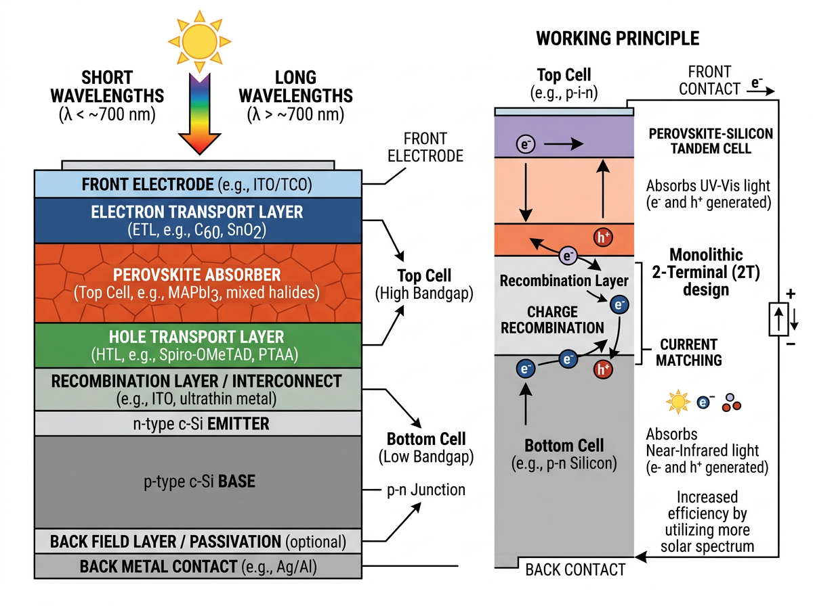</td>
  </tr>
</table>

**Prompt:**

```text
Create a scientific figure about: Perovskite-silicon tandem solar cell layered stack.
Visual style: Clean Vector.
Requirements:
- publication-ready scientific quality
- clear labels and directional arrows where appropriate
- avoid cartoon style, avoid meme style, avoid stock-photo look
- avoid neon glow and over-sharpened CGI look unless explicitly requested
- composition optimized for research papers and academic slides
- category context: cross-sections-layers
- flat vector look with crisp boundaries and minimal gradients
- white or very light background for publication clarity
- high legibility labels with consistent typography
```

<a id="cross-sections-layers-35d7c07d"></a>

#### Case 121: Earth interior with mantle convection and core boundaries

<table>
  <tr>
    <th>Output</th>
  </tr>
  <tr>
    <td>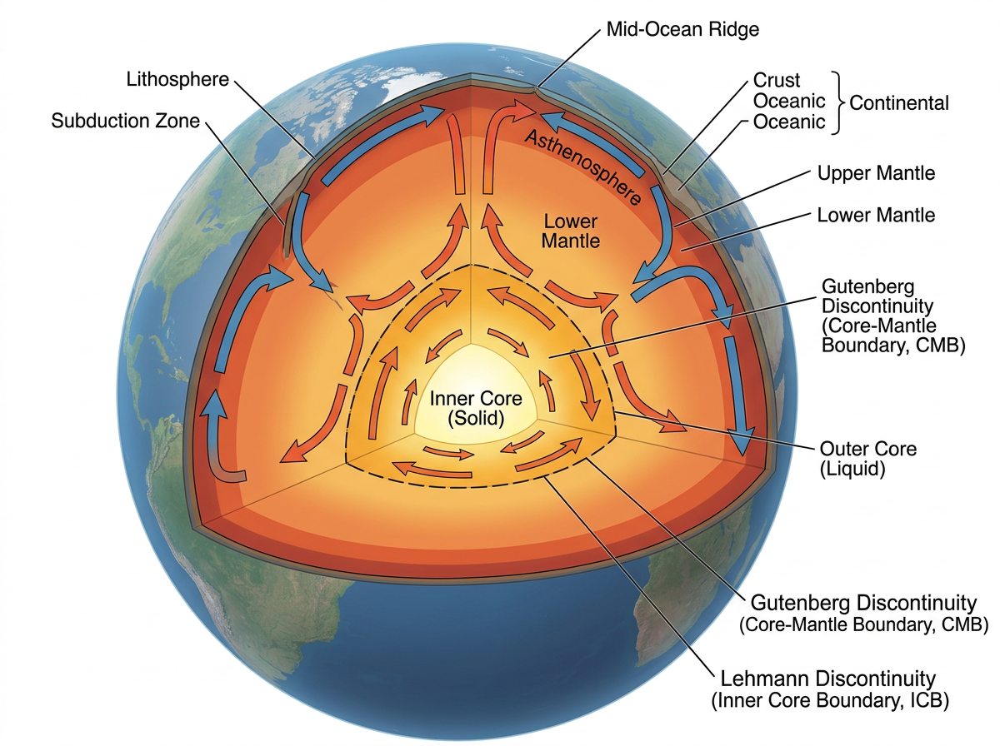</td>
  </tr>
</table>

**Prompt:**

```text
Create a scientific figure about: Earth interior with mantle convection and core boundaries.
Visual style: 3D Cutaway.
Requirements:
- publication-ready scientific quality
- clear labels and directional arrows where appropriate
- avoid cartoon style, avoid meme style, avoid stock-photo look
- avoid neon glow and over-sharpened CGI look unless explicitly requested
- composition optimized for research papers and academic slides
- category context: cross-sections-layers
- semi-3D cutaway rendering with layered transparency
- clear sectional depth and internal component visibility
- avoid photoreal clutter and keep annotation zones clean
```

<a id="cross-sections-layers-df7eaa7a"></a>

#### Case 122: Leaf anatomy cross-section with vascular bundles and stomata

<table>
  <tr>
    <th>Output</th>
  </tr>
  <tr>
    <td>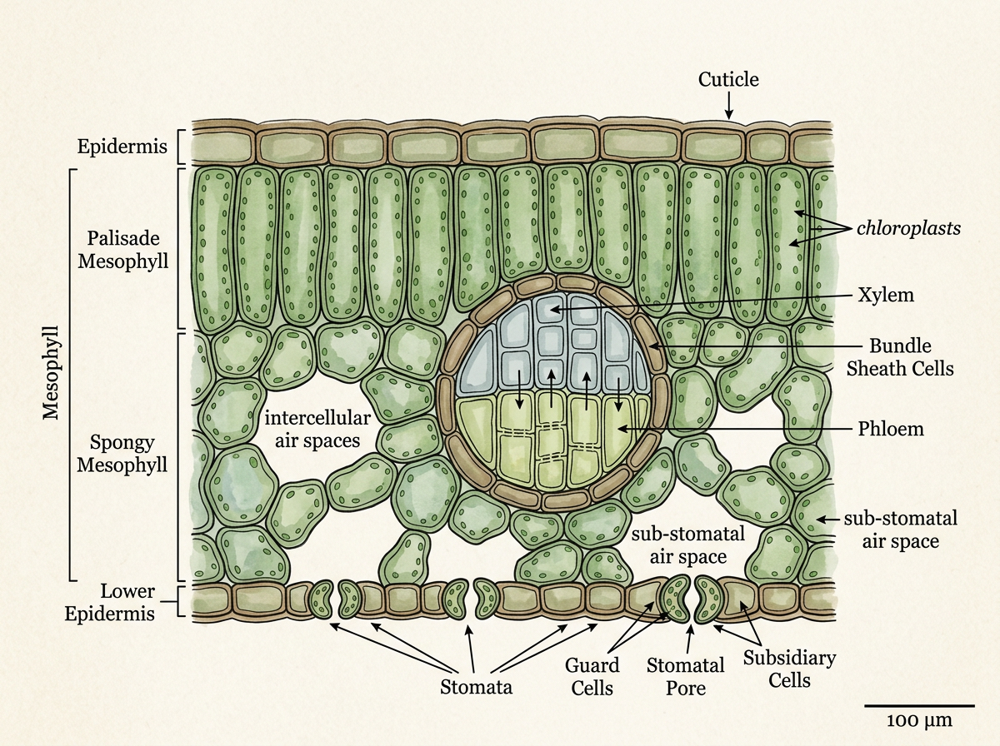</td>
  </tr>
</table>

**Prompt:**

```text
Create a scientific figure about: Leaf anatomy cross-section with vascular bundles and stomata.
Visual style: Watercolor Texture & Ink Line Atlas.
Requirements:
- publication-ready scientific quality
- clear labels and directional arrows where appropriate
- avoid cartoon style, avoid meme style, avoid stock-photo look
- avoid neon glow and over-sharpened CGI look unless explicitly requested
- composition optimized for research papers and academic slides
- category context: cross-sections-layers
- watercolor texture with precise ink line art, hand-drawn but technically accurate
- muted tones and matte color palette, avoid harsh saturated 3D rendering
- natural science atlas / textbook style with rigorous scientific annotation
- subtle cream paper texture background to achieve premium archival look
```

<a id="cross-sections-layers-82162992"></a>

#### Case 123: Human skin cross-section with epidermis, dermis, and appendages

<table>
  <tr>
    <th>Output</th>
  </tr>
  <tr>
    <td>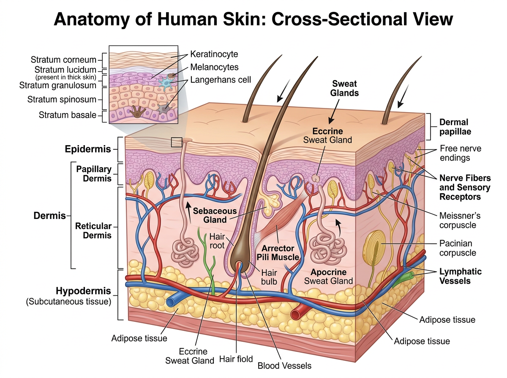</td>
  </tr>
</table>

**Prompt:**

```text
Create a scientific figure about: Human skin cross-section with epidermis, dermis, and appendages.
Visual style: 3D Cutaway.
Requirements:
- publication-ready scientific quality
- clear labels and directional arrows where appropriate
- avoid cartoon style, avoid meme style, avoid stock-photo look
- avoid neon glow and over-sharpened CGI look unless explicitly requested
- composition optimized for research papers and academic slides
- category context: cross-sections-layers
- semi-3D cutaway rendering with layered transparency
- clear sectional depth and internal component visibility
- avoid photoreal clutter and keep annotation zones clean
```

<a id="cross-sections-layers-f8c35e9a"></a>

#### Case 124: Perovskite-silicon tandem solar cell layered stack

<table>
  <tr>
    <th>Output</th>
  </tr>
  <tr>
    <td>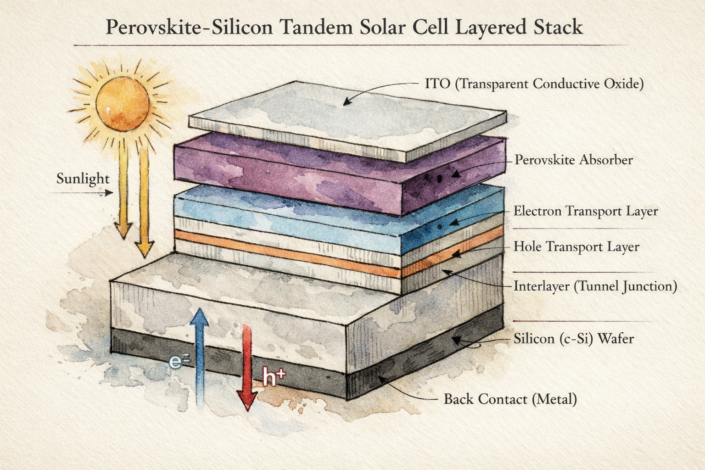</td>
  </tr>
</table>

**Prompt:**

```text
Create a scientific figure about: Perovskite-silicon tandem solar cell layered stack.
Visual style: Watercolor Texture & Ink Line Atlas.
Requirements:
- publication-ready scientific quality
- clear labels and directional arrows where appropriate
- avoid cartoon style, avoid meme style, avoid stock-photo look
- avoid neon glow and over-sharpened CGI look unless explicitly requested
- composition optimized for research papers and academic slides
- category context: cross-sections-layers
- watercolor texture with precise ink line art, hand-drawn but technically accurate
- muted tones and matte color palette, avoid harsh saturated 3D rendering
- natural science atlas / textbook style with rigorous scientific annotation
- subtle cream paper texture background to achieve premium archival look
```

<a id="cross-sections-layers-d7312bc5"></a>

#### Case 125: Earth interior with mantle convection and core boundaries

<table>
  <tr>
    <th>Output</th>
  </tr>
  <tr>
    <td>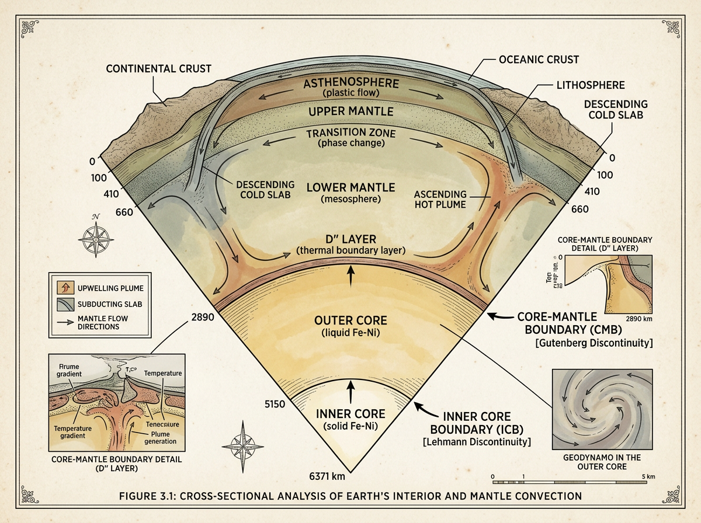</td>
  </tr>
</table>

**Prompt:**

```text
Create a scientific figure about: Earth interior with mantle convection and core boundaries.
Visual style: Botanical Field Guide.
Requirements:
- publication-ready scientific quality
- clear labels and directional arrows where appropriate
- avoid cartoon style, avoid meme style, avoid stock-photo look
- avoid neon glow and over-sharpened CGI look unless explicitly requested
- composition optimized for research papers and academic slides
- category context: cross-sections-layers
- field-guide illustration style with disciplined line work and restrained fill color
- taxonomic and anatomical callouts arranged for textbook readability
- natural pigment behavior and paper-friendly texture without painterly chaos
```

<a id="cross-sections-layers-5a498587"></a>

#### Case 126: Leaf anatomy cross-section with vascular bundles and stomata

<table>
  <tr>
    <th>Output</th>
  </tr>
  <tr>
    <td>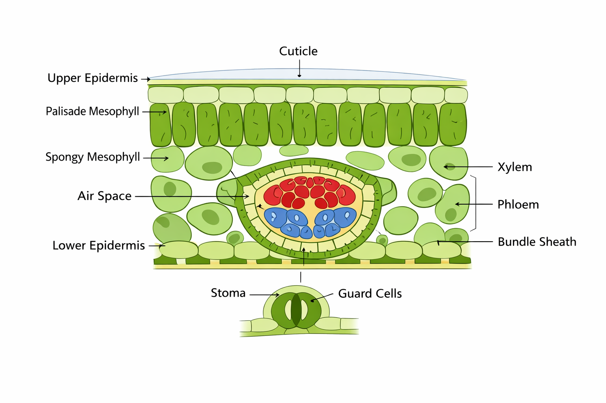</td>
  </tr>
</table>

**Prompt:**

```text
Create a scientific figure about: Leaf anatomy cross-section with vascular bundles and stomata.
Visual style: Clean Vector.
Requirements:
- publication-ready scientific quality
- clear labels and directional arrows where appropriate
- avoid cartoon style, avoid meme style, avoid stock-photo look
- avoid neon glow and over-sharpened CGI look unless explicitly requested
- composition optimized for research papers and academic slides
- category context: cross-sections-layers
- flat vector look with crisp boundaries and minimal gradients
- white or very light background for publication clarity
- high legibility labels with consistent typography
```

<a id="cross-sections-layers-a35294a8"></a>

#### Case 127: Retina layered organization from photoreceptors to ganglion cells

<table>
  <tr>
    <th>Output</th>
  </tr>
  <tr>
    <td>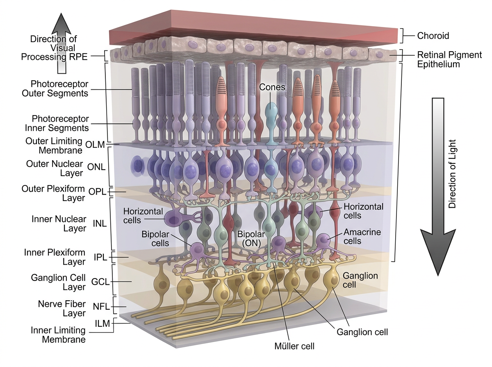</td>
  </tr>
</table>

**Prompt:**

```text
Create a scientific figure about: Retina layered organization from photoreceptors to ganglion cells.
Visual style: 3D Cutaway.
Requirements:
- publication-ready scientific quality
- clear labels and directional arrows where appropriate
- avoid cartoon style, avoid meme style, avoid stock-photo look
- avoid neon glow and over-sharpened CGI look unless explicitly requested
- composition optimized for research papers and academic slides
- category context: cross-sections-layers
- semi-3D cutaway rendering with layered transparency
- clear sectional depth and internal component visibility
- avoid photoreal clutter and keep annotation zones clean
```

<a id="environments-ecologies"></a>

### 環境と生態系

<a id="environments-ecologies-365b9045"></a>

#### Case 128: Global carbon cycle with atmospheric, oceanic, and terrestrial fluxes

<table>
  <tr>
    <th>Output</th>
  </tr>
  <tr>
    <td></td>
  </tr>
</table>

**Prompt:**

```text
Create a scientific figure about: Global carbon cycle with atmospheric, oceanic, and terrestrial fluxes.
Visual style: Watercolor Texture & Ink Line Atlas.
Requirements:
- publication-ready scientific quality
- clear labels and directional arrows where appropriate
- avoid cartoon style, avoid meme style, avoid stock-photo look
- avoid neon glow and over-sharpened CGI look unless explicitly requested
- composition optimized for research papers and academic slides
- category context: environments-ecologies
- watercolor texture with precise ink line art, hand-drawn but technically accurate
- muted tones and matte color palette, avoid harsh saturated 3D rendering
- natural science atlas / textbook style with rigorous scientific annotation
- subtle cream paper texture background to achieve premium archival look
```

<a id="environments-ecologies-cc61620a"></a>

#### Case 129: Coral reef ecosystem interactions under bleaching stress

<table>
  <tr>
    <th>Output</th>
  </tr>
  <tr>
    <td></td>
  </tr>
</table>

**Prompt:**

```text
Create a scientific figure about: Coral reef ecosystem interactions under bleaching stress.
Visual style: Botanical Field Guide.
Requirements:
- publication-ready scientific quality
- clear labels and directional arrows where appropriate
- avoid cartoon style, avoid meme style, avoid stock-photo look
- avoid neon glow and over-sharpened CGI look unless explicitly requested
- composition optimized for research papers and academic slides
- category context: environments-ecologies
- field-guide illustration style with disciplined line work and restrained fill color
- taxonomic and anatomical callouts arranged for textbook readability
- natural pigment behavior and paper-friendly texture without painterly chaos
```

<a id="environments-ecologies-a36c7480"></a>

#### Case 130: Urban heat island cross-section with mitigation interventions

<table>
  <tr>
    <th>Output</th>
  </tr>
  <tr>
    <td></td>
  </tr>
</table>

**Prompt:**

```text
Create a scientific figure about: Urban heat island cross-section with mitigation interventions.
Visual style: Soft Biomedical.
Requirements:
- publication-ready scientific quality
- clear labels and directional arrows where appropriate
- avoid cartoon style, avoid meme style, avoid stock-photo look
- avoid neon glow and over-sharpened CGI look unless explicitly requested
- composition optimized for research papers and academic slides
- category context: environments-ecologies
- subtle soft-shaded biomedical rendering without cartoon style
- clean depth cues and organelle/material differentiation
- balanced pastel-accent palette while retaining scientific rigor
```

<a id="environments-ecologies-b976bcd9"></a>

#### Case 131: Wetland nutrient cycling with hydrology and microbial processes

<table>
  <tr>
    <th>Output</th>
  </tr>
  <tr>
    <td>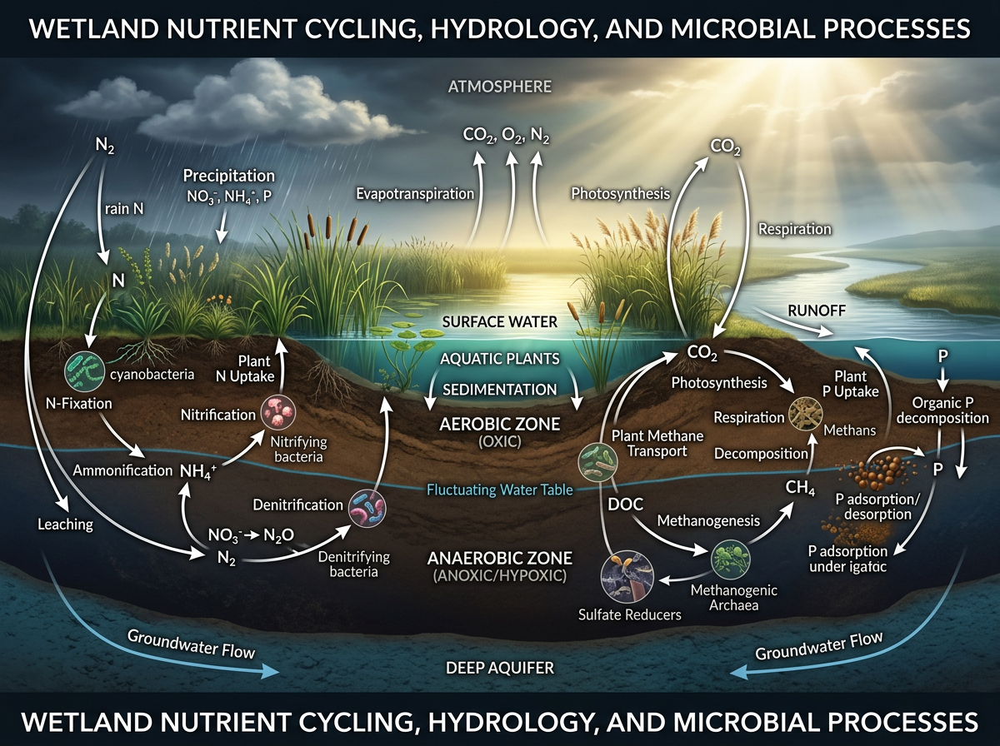</td>
  </tr>
</table>

**Prompt:**

```text
Create a scientific figure about: Wetland nutrient cycling with hydrology and microbial processes.
Visual style: Journal Cover Cinematic.
Requirements:
- publication-ready scientific quality
- clear labels and directional arrows where appropriate
- avoid cartoon style, avoid meme style, avoid stock-photo look
- avoid neon glow and over-sharpened CGI look unless explicitly requested
- composition optimized for research papers and academic slides
- category context: environments-ecologies
- high-impact cinematic lighting with strong focal hierarchy
- dark-to-bright gradient atmosphere and publication cover composition
- scientifically plausible structures and anatomically coherent details
```

<a id="environments-ecologies-e9f1311b"></a>

#### Case 132: Arctic tundra ecology with permafrost and trophic network

<table>
  <tr>
    <th>Output</th>
  </tr>
  <tr>
    <td>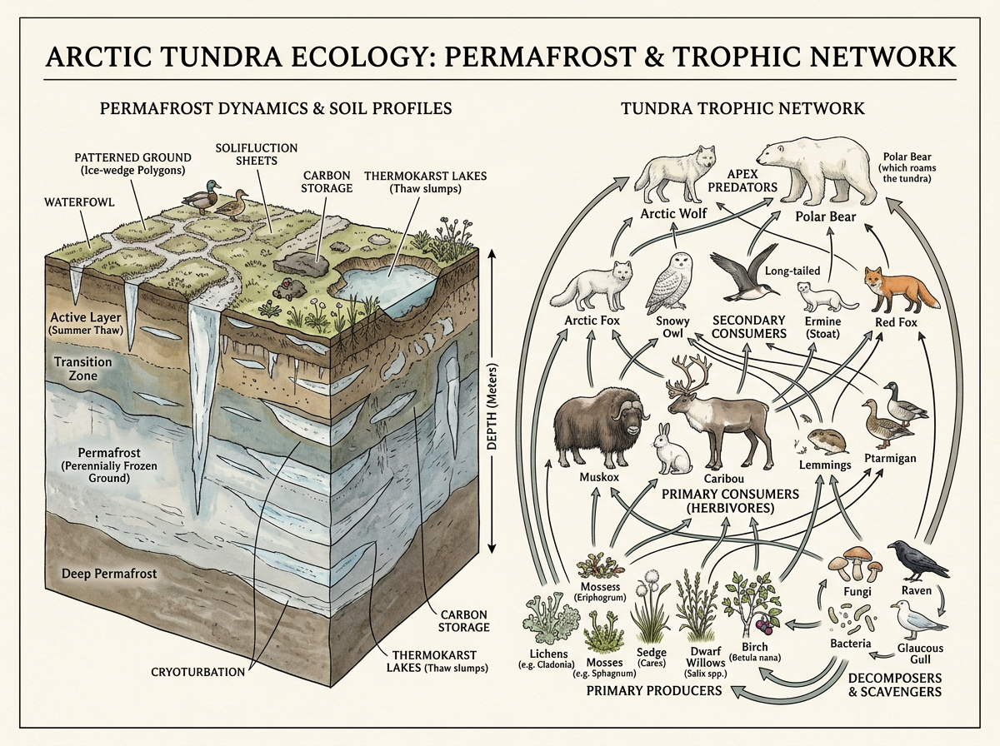</td>
  </tr>
</table>

**Prompt:**

```text
Create a scientific figure about: Arctic tundra ecology with permafrost and trophic network.
Visual style: Watercolor Texture & Ink Line Atlas.
Requirements:
- publication-ready scientific quality
- clear labels and directional arrows where appropriate
- avoid cartoon style, avoid meme style, avoid stock-photo look
- avoid neon glow and over-sharpened CGI look unless explicitly requested
- composition optimized for research papers and academic slides
- category context: environments-ecologies
- watercolor texture with precise ink line art, hand-drawn but technically accurate
- muted tones and matte color palette, avoid harsh saturated 3D rendering
- natural science atlas / textbook style with rigorous scientific annotation
- subtle cream paper texture background to achieve premium archival look
```

<a id="environments-ecologies-02a22f02"></a>

#### Case 133: Marine food web across trophic levels and energy flow

<table>
  <tr>
    <th>Output</th>
  </tr>
  <tr>
    <td>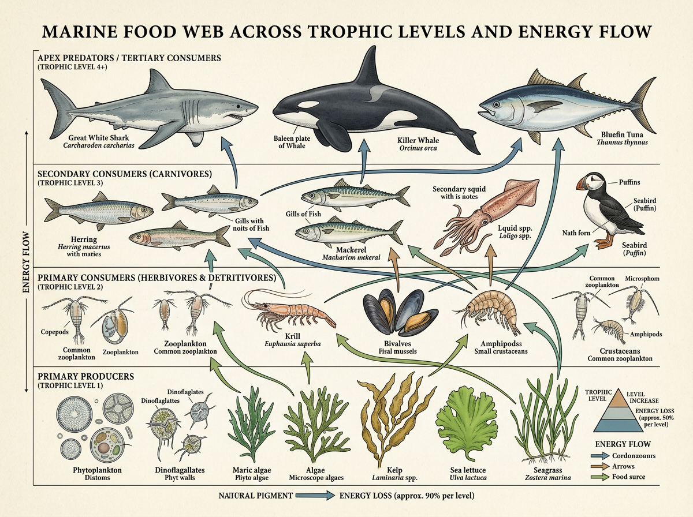</td>
  </tr>
</table>

**Prompt:**

```text
Create a scientific figure about: Marine food web across trophic levels and energy flow.
Visual style: Botanical Field Guide.
Requirements:
- publication-ready scientific quality
- clear labels and directional arrows where appropriate
- avoid cartoon style, avoid meme style, avoid stock-photo look
- avoid neon glow and over-sharpened CGI look unless explicitly requested
- composition optimized for research papers and academic slides
- category context: environments-ecologies
- field-guide illustration style with disciplined line work and restrained fill color
- taxonomic and anatomical callouts arranged for textbook readability
- natural pigment behavior and paper-friendly texture without painterly chaos
```

<a id="environments-ecologies-9e42c511"></a>

#### Case 134: Global carbon cycle with atmospheric, oceanic, and terrestrial fluxes

<table>
  <tr>
    <th>Output</th>
  </tr>
  <tr>
    <td>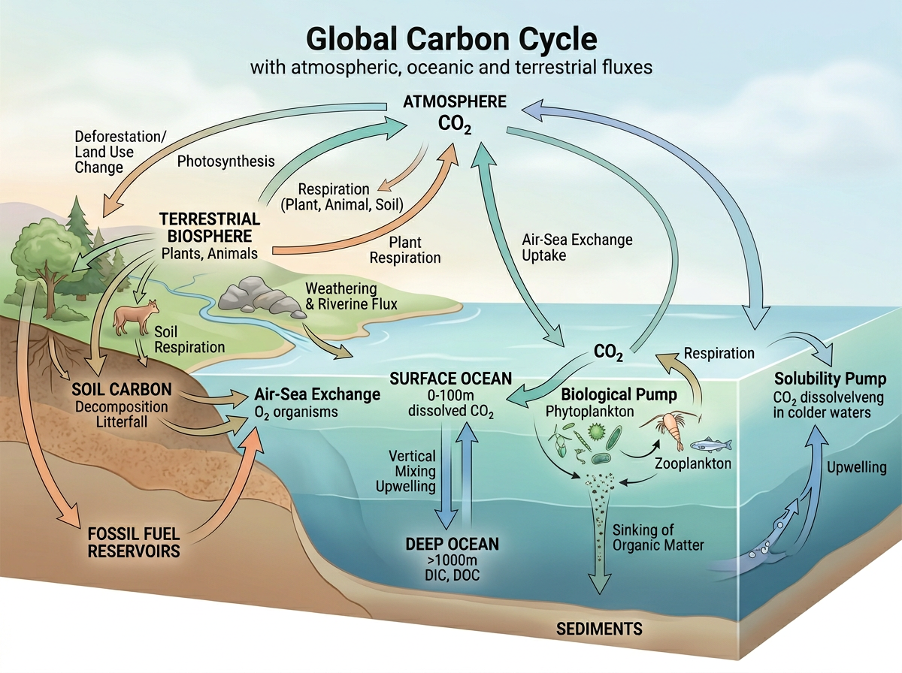</td>
  </tr>
</table>

**Prompt:**

```text
Create a scientific figure about: Global carbon cycle with atmospheric, oceanic, and terrestrial fluxes.
Visual style: Soft Biomedical.
Requirements:
- publication-ready scientific quality
- clear labels and directional arrows where appropriate
- avoid cartoon style, avoid meme style, avoid stock-photo look
- avoid neon glow and over-sharpened CGI look unless explicitly requested
- composition optimized for research papers and academic slides
- category context: environments-ecologies
- subtle soft-shaded biomedical rendering without cartoon style
- clean depth cues and organelle/material differentiation
- balanced pastel-accent palette while retaining scientific rigor
```

<a id="environments-ecologies-2a15ac2c"></a>

#### Case 135: Coral reef ecosystem interactions under bleaching stress

<table>
  <tr>
    <th>Output</th>
  </tr>
  <tr>
    <td>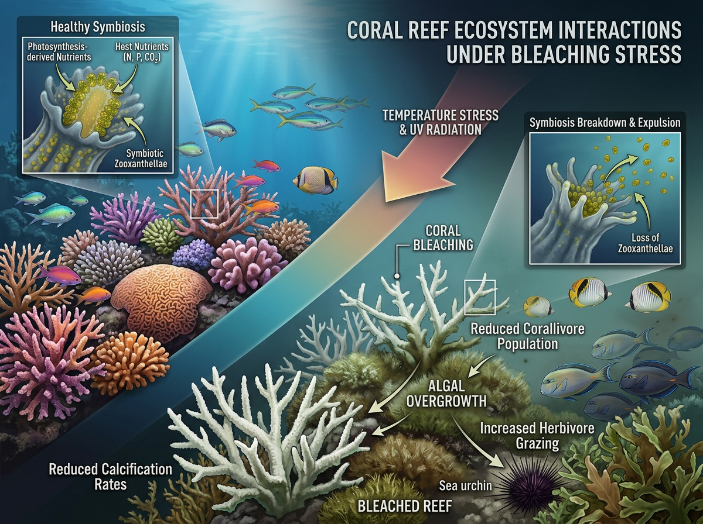</td>
  </tr>
</table>

**Prompt:**

```text
Create a scientific figure about: Coral reef ecosystem interactions under bleaching stress.
Visual style: Journal Cover Cinematic.
Requirements:
- publication-ready scientific quality
- clear labels and directional arrows where appropriate
- avoid cartoon style, avoid meme style, avoid stock-photo look
- avoid neon glow and over-sharpened CGI look unless explicitly requested
- composition optimized for research papers and academic slides
- category context: environments-ecologies
- high-impact cinematic lighting with strong focal hierarchy
- dark-to-bright gradient atmosphere and publication cover composition
- scientifically plausible structures and anatomically coherent details
```

<a id="environments-ecologies-d33b1af9"></a>

#### Case 136: Urban heat island cross-section with mitigation interventions

<table>
  <tr>
    <th>Output</th>
  </tr>
  <tr>
    <td>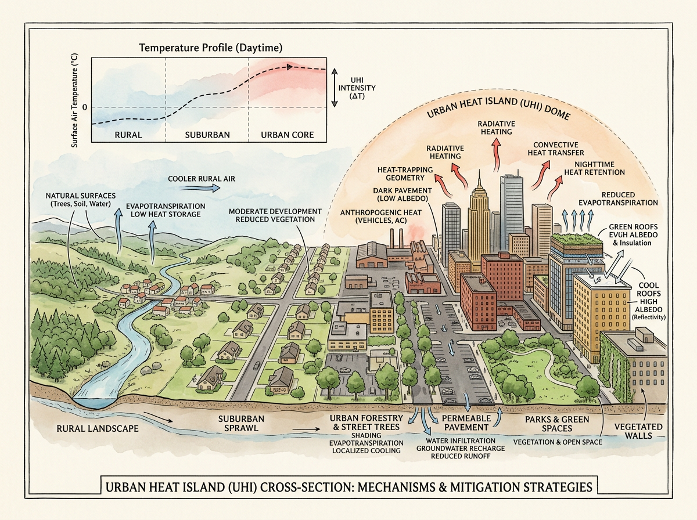</td>
  </tr>
</table>

**Prompt:**

```text
Create a scientific figure about: Urban heat island cross-section with mitigation interventions.
Visual style: Watercolor Texture & Ink Line Atlas.
Requirements:
- publication-ready scientific quality
- clear labels and directional arrows where appropriate
- avoid cartoon style, avoid meme style, avoid stock-photo look
- avoid neon glow and over-sharpened CGI look unless explicitly requested
- composition optimized for research papers and academic slides
- category context: environments-ecologies
- watercolor texture with precise ink line art, hand-drawn but technically accurate
- muted tones and matte color palette, avoid harsh saturated 3D rendering
- natural science atlas / textbook style with rigorous scientific annotation
- subtle cream paper texture background to achieve premium archival look
```

<a id="environments-ecologies-f392d831"></a>

#### Case 137: Wetland nutrient cycling with hydrology and microbial processes

<table>
  <tr>
    <th>Output</th>
  </tr>
  <tr>
    <td>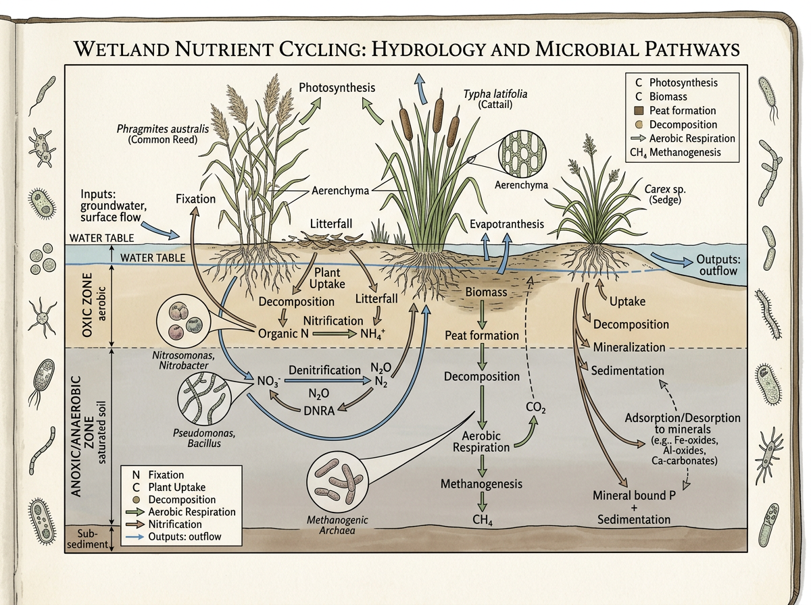</td>
  </tr>
</table>

**Prompt:**

```text
Create a scientific figure about: Wetland nutrient cycling with hydrology and microbial processes.
Visual style: Botanical Field Guide.
Requirements:
- publication-ready scientific quality
- clear labels and directional arrows where appropriate
- avoid cartoon style, avoid meme style, avoid stock-photo look
- avoid neon glow and over-sharpened CGI look unless explicitly requested
- composition optimized for research papers and academic slides
- category context: environments-ecologies
- field-guide illustration style with disciplined line work and restrained fill color
- taxonomic and anatomical callouts arranged for textbook readability
- natural pigment behavior and paper-friendly texture without painterly chaos
```

<a id="environments-ecologies-9c09f92d"></a>

#### Case 138: Global carbon cycle with atmospheric, oceanic, and terrestrial fluxes

<table>
  <tr>
    <th>Output</th>
  </tr>
  <tr>
    <td>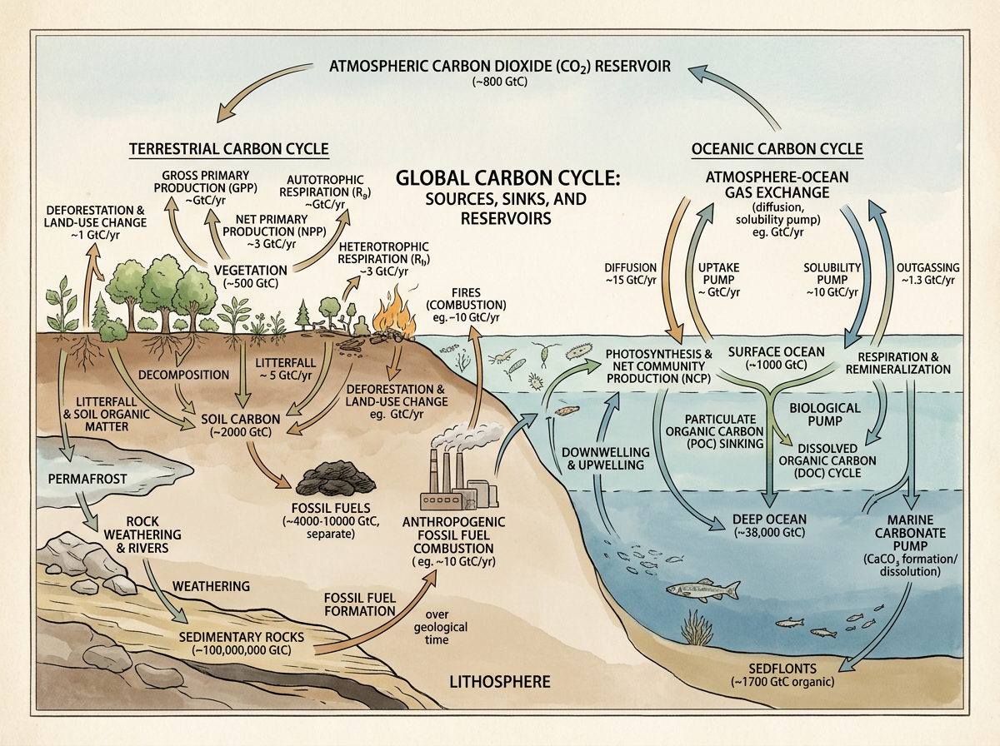</td>
  </tr>
</table>

**Prompt:**

```text
Create a scientific figure about: Global carbon cycle with atmospheric, oceanic, and terrestrial fluxes.
Visual style: Watercolor Texture & Ink Line Atlas.
Requirements:
- publication-ready scientific quality
- clear labels and directional arrows where appropriate
- avoid cartoon style, avoid meme style, avoid stock-photo look
- avoid neon glow and over-sharpened CGI look unless explicitly requested
- composition optimized for research papers and academic slides
- category context: environments-ecologies
- watercolor texture with precise ink line art, hand-drawn but technically accurate
- muted tones and matte color palette, avoid harsh saturated 3D rendering
- natural science atlas / textbook style with rigorous scientific annotation
- subtle cream paper texture background to achieve premium archival look
```

<a id="environments-ecologies-0cf966fb"></a>

#### Case 139: Coral reef ecosystem interactions under bleaching stress

<table>
  <tr>
    <th>Output</th>
  </tr>
  <tr>
    <td>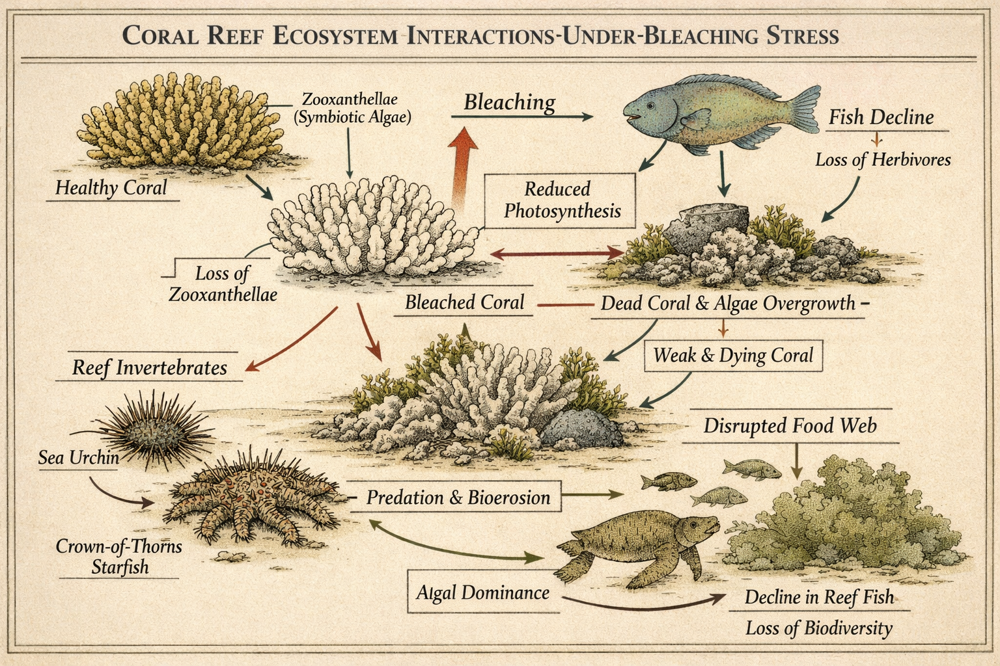</td>
  </tr>
</table>

**Prompt:**

```text
Create a scientific figure about: Coral reef ecosystem interactions under bleaching stress.
Visual style: Botanical Field Guide.
Requirements:
- publication-ready scientific quality
- clear labels and directional arrows where appropriate
- avoid cartoon style, avoid meme style, avoid stock-photo look
- avoid neon glow and over-sharpened CGI look unless explicitly requested
- composition optimized for research papers and academic slides
- category context: environments-ecologies
- field-guide illustration style with disciplined line work and restrained fill color
- taxonomic and anatomical callouts arranged for textbook readability
- natural pigment behavior and paper-friendly texture without painterly chaos
```

<a id="environments-ecologies-4d326ba8"></a>

#### Case 140: Urban heat island cross-section with mitigation interventions

<table>
  <tr>
    <th>Output</th>
  </tr>
  <tr>
    <td>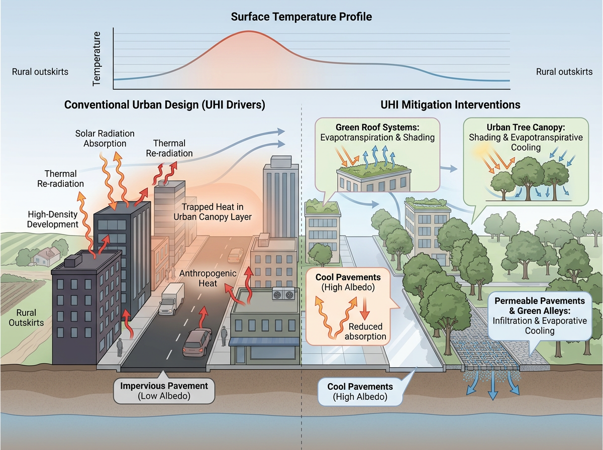</td>
  </tr>
</table>

**Prompt:**

```text
Create a scientific figure about: Urban heat island cross-section with mitigation interventions.
Visual style: Soft Biomedical.
Requirements:
- publication-ready scientific quality
- clear labels and directional arrows where appropriate
- avoid cartoon style, avoid meme style, avoid stock-photo look
- avoid neon glow and over-sharpened CGI look unless explicitly requested
- composition optimized for research papers and academic slides
- category context: environments-ecologies
- subtle soft-shaded biomedical rendering without cartoon style
- clean depth cues and organelle/material differentiation
- balanced pastel-accent palette while retaining scientific rigor
```

<a id="environments-ecologies-30c1f635"></a>

#### Case 141: Wetland nutrient cycling with hydrology and microbial processes

<table>
  <tr>
    <th>Output</th>
  </tr>
  <tr>
    <td>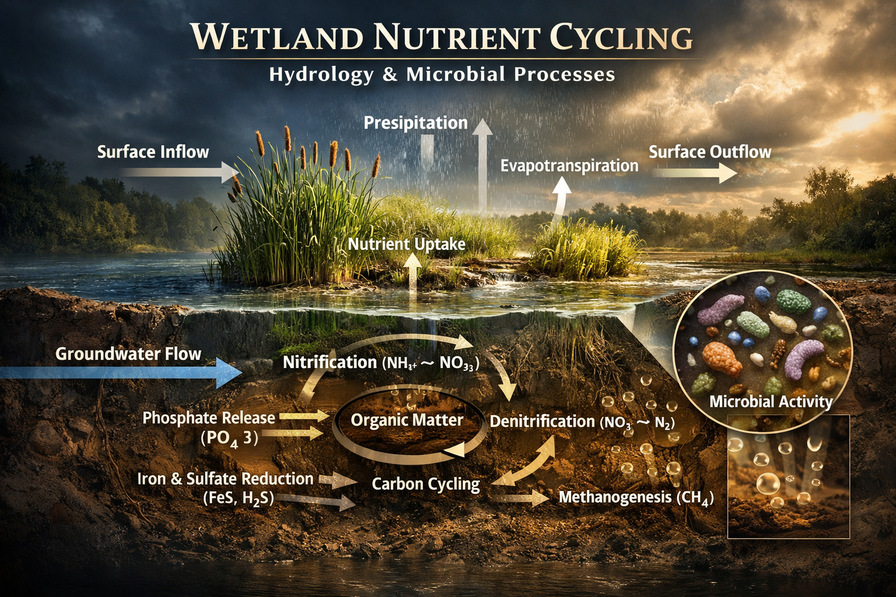</td>
  </tr>
</table>

**Prompt:**

```text
Create a scientific figure about: Wetland nutrient cycling with hydrology and microbial processes.
Visual style: Journal Cover Cinematic.
Requirements:
- publication-ready scientific quality
- clear labels and directional arrows where appropriate
- avoid cartoon style, avoid meme style, avoid stock-photo look
- avoid neon glow and over-sharpened CGI look unless explicitly requested
- composition optimized for research papers and academic slides
- category context: environments-ecologies
- high-impact cinematic lighting with strong focal hierarchy
- dark-to-bright gradient atmosphere and publication cover composition
- scientifically plausible structures and anatomically coherent details
```

<a id="environments-ecologies-98e6625a"></a>

#### Case 142: Arctic tundra ecology with permafrost and trophic network

<table>
  <tr>
    <th>Output</th>
  </tr>
  <tr>
    <td>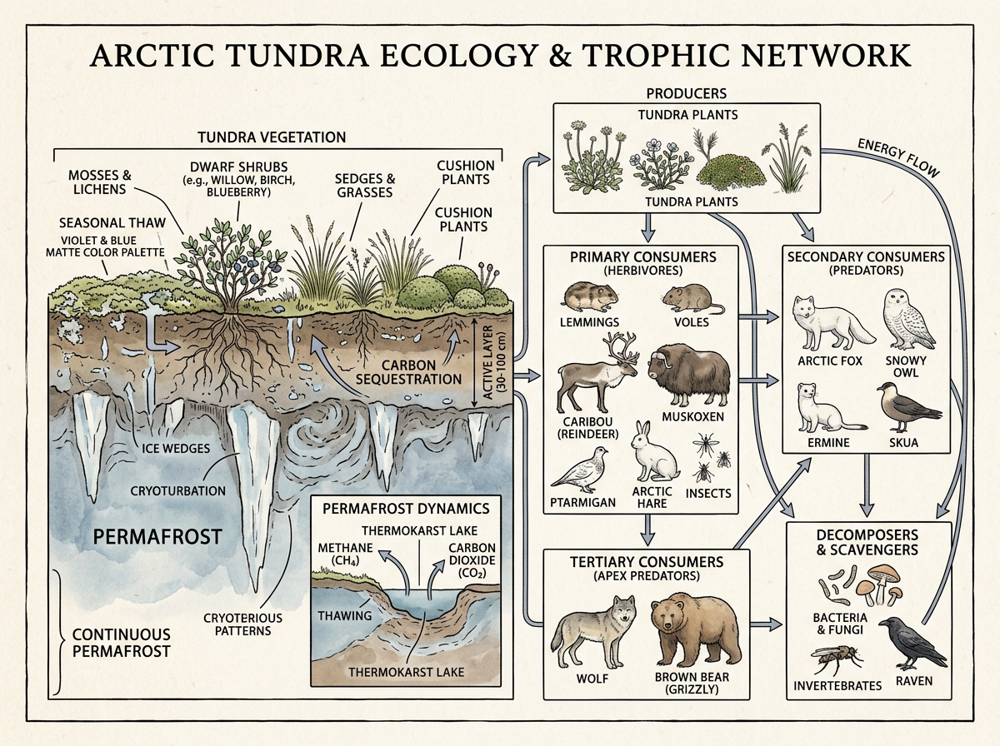</td>
  </tr>
</table>

**Prompt:**

```text
Create a scientific figure about: Arctic tundra ecology with permafrost and trophic network.
Visual style: Watercolor Texture & Ink Line Atlas.
Requirements:
- publication-ready scientific quality
- clear labels and directional arrows where appropriate
- avoid cartoon style, avoid meme style, avoid stock-photo look
- avoid neon glow and over-sharpened CGI look unless explicitly requested
- composition optimized for research papers and academic slides
- category context: environments-ecologies
- watercolor texture with precise ink line art, hand-drawn but technically accurate
- muted tones and matte color palette, avoid harsh saturated 3D rendering
- natural science atlas / textbook style with rigorous scientific annotation
- subtle cream paper texture background to achieve premium archival look
```

<a id="repository-layout"></a>

## リポジトリ構成

- `images/<category>/` にはダウンロードした図画像を保存します。
- `categories/<category>.md` には各カテゴリの画像とプロンプトをすべて含みます。
- `data/inspirations.json` は完全な機械可読データセットです。
- `data/categories.json` にはカテゴリ一覧と件数が含まれます。
- `scripts/sync-figpad-inspiration.mjs` で FigPad から静的ファイルを更新できます。

<a id="how-to-use"></a>

## 使い方

カテゴリを閲覧し、伝えたい科学的ストーリーに近い図を選んで、プロンプトをコピーして調整します。多くのプロンプトは具体的に書かれているため、レイアウト、ラベル、視覚品質の条件を保ちながら、対象、生物種、経路、装置、材料を置き換えられます。

<a id="sync"></a>

## 同期

```bash
node scripts/sync-figpad-inspiration.mjs
```

同期スクリプトは最新の FigPad inspiration 項目をダウンロードし、JSON メタデータを書き込み、カテゴリページとすべての言語 README を再生成します。

<a id="license"></a>

## ライセンス

このリポジトリのライセンスは [CC0 1.0 Universal](LICENSE) です。元の inspiration ライブラリは FigPad です。生成画像を自身のプロジェクト外でミラー公開する前に、再配布権を確認してください。
